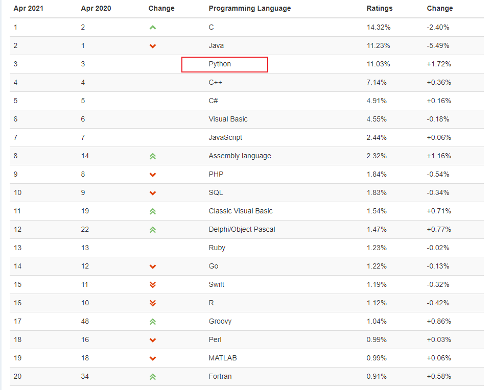

# 编程语言介绍

## 一、编程与编程语言

#### 什么是编程？

编程即程序员根据需求把自己的思想流程按照某种编程语言的语法风格编写下来，产出的结果就是包含一堆字符的文件。

强调：程序在未运行前跟普通文件无异，只有程序在运行时，文件内所写的字符才有特定的语法意义　

#### 编程的目的：

计算机的发明，是为了用机器取代/解放人力，而编程的目的则是将人类的思想流程按照某种能够被计算机识别的表达方式传递给计算机，从而达到让计算机能够像人脑/电脑一样自动执行的效果。

#### 什么是编程语言？

上面提及的能够被计算机所识别的表达方式即编程语言，语言是沟通的介质，而编程语言是程序员与计算机沟通的介质。在编程的世界里，计算机更像是人的奴隶，人类编程的目的就命令奴隶去工作。

## 二、编程语言分类

#### 编程的语言的发展经历了

- 机器语言：站在计算机(奴隶)的角度，说计算机能听懂的语言，那就是直接用二进制编程，直接操作硬件；

- 汇编语言：站在计算机(奴隶)的角度，简写的英文标识符取代二进制去编写程序，本质仍然是直接操作硬件；

- 高级语言：站在人(奴隶主)的角度，说人话，即用人类的字符去编写程序，屏蔽了硬件操作

高级语言更贴近人类语言，因而造成了：它必须被翻译成计算机能读懂二进制后，才能被执行，按照翻译方式分为

- 编译型（需要编译器，相当于用谷歌翻译）：如C，执行速度快，调试麻烦

- 解释型（需要解释器，相当于同声传译）：如python，执行速度慢，调试方便

**总结**：

> 机器语言
> 优点是最底层，执行速度最快
> 缺点是最复杂，开发效率最低
>
> 汇编语言
> 优点是比较底层，执行速度最快
> 缺点是复杂，开发效率最低
>
> 高级语言
> 编译型语言执行速度快，不依赖语言环境运行，跨平台差
> 解释型跨平台好，一份代码，到处使用，缺点是执行速度慢，依赖解释器运行

**ps：混合型语言**

> Java是一类特殊的编程语言，Java程序也需要编译，但是却没有直接编译为机器语言，而是编译为字节码，
> 然后在Java虚拟机上以解释方式执行字节码。

## 三、主流编程语言

世界上的编程语言有600多种，但真正大家主流在使用的最多二三十种，不同的语言有自己的特点和擅长领域，随着计算机的不断发展，新语言在不断诞生，也同时有很多老旧的语言慢慢无人用了。有个权威的语言排名网站，可以看到主流的编程语言是哪些

2021年4月数据(https://www.tiobe.com/tiobe-index/ )

