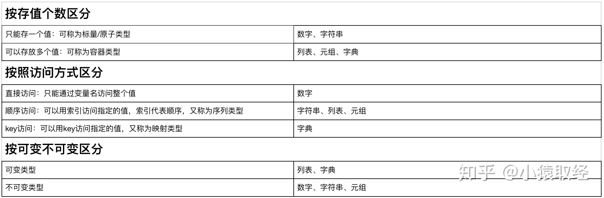

# Python数据类型

- 整型（int）：就是整数，-1、0、1、2、3

- 浮点型（float）：就是小数，1.1、2.345

- 字符串（str）：以单引号或双引号括起来的任意文本，'hello,world'、"my name is jack"

- 列表（list）：列表是写在方括号 **[]** 之间、用逗号分隔开的元素列表。列表中元素的类型可以不相同，它支持数字，字符串甚至可以包含列表（所谓嵌套）。

- 字典（dict）：字典是一种映射类型，字典用 **{ }** 标识，它是一个无序的 **键(key) : 值(value)** 的集合。其中value可以是任意类型，**但key必须是<u>不可变类型</u>。**

- 元组（tuple）：元组与列表类似，也是可以存多个任意类型的元素，不同之处在于元组的元素不能修改，即元组相当于不可变的列表，用于记录多个固定不允许修改的值，单纯用于取。

- 集合（set）：集合（set）是一个无序的不重复元素序列。

- 布尔（bool）：布尔值只有True、False两种值，要么是True，要么是False。

  - 显式布尔值：	True	Flase
  - 隐式布尔值：	所有的值都可以当成条件去用，例如 0 为Flase，1 为True。其中 0、None、空 代表的为Flase，其余的为True


## 一、整型、浮点型（int、float）

### 1、定义

- 整型（int）：就是整数，-1、0、1、2、3
- 浮点型（float）：就是小数，1.1、2.345

```
# 整型
age = 18

# 浮点型
height = 172.3
```

### 2、运算符的使用

```python
# 数学运算
>>> a = 1
>>> b = 3.2
>>> c = a + b
>>> c
4.2

# 比较运算
>>> x = 10
>>> y = 11.23
>>> x > y
False
```


>**整型和浮点型都支持数学运算符与比较运算符**，**具体运算符请看后面文章**。


## 二、字符串（str）

### 1、定义

- 字符串（str）：以单引号或双引号或三引号括起来的任意文本，'hello,world'、"my name is jack"

```python
# 定义：在单引号\双引号\三引号内包含一串字符

name1 = 'jason'  # 本质:name = str('任意形式内容')

name2 = "lili"  # 本质:name = str("任意形式内容")

name3 = """ricky"""  # 本质:name = str("""任意形式内容""")
```
1)、需要考虑引号嵌套的配对问题

```
msg = "My name is Tony , I'm 18 years old!"   #内层有单引号，外层就需要用双引号
```

2)、多引号可以写多行字符串

```
 msg = '''
      天下只有两种人。比如一串葡萄到手，一种人挑最好的先吃，另一种人把最好的留到最后吃。
      照例第一种人应该乐观，因为他每吃一颗都是吃剩的葡萄里最好的；第二种人应该悲观，因为他每吃一颗都是吃剩的葡萄里最坏的。
      不过事实却适得其反，缘故是第二种人还有希望，第一种人只有回忆。
       '''
```


### 2、运算符的使用

数字可以进行加减乘除等运算，字符串呢？也可以，但只能进行"相加"和"相乘"运算。

```python
>>> name = 'tony'
>>> age = '18'
>>> name + age #相加其实就是简单的字符串拼接
'tony18'
>>> name * 5 #相乘就相当于将字符串相加了5次
'tonytonytonytonytony'
```


## 三、列表（list）

### 1、定义

列表是写在[] 中间  用逗号分隔的元素

```python
>>> stu_names=['张三','李四','王五']
```

### 2、使用

1)、列表类型是用索引来对应值，索引代表的是数据的位置，从0开始计数。


```python
>>> stu_names=['张三','李四','王五']
>>> stu_names[0] 
'张三'
>>> stu_names[1]
'李四'
>>> stu_names[2]
'王五'
>>> stu_names[-1]		# -1为倒数第一个
'王五'
```

2)、列表可以嵌套，嵌套取值如下：

```
>>> students_info=[['tony',18,['basketball','game']],['jason',18,['play','sleep']]]
>>> students_info[0][2][0] #取出第一个学生的第一个爱好
'basketball'
```

3)、列表整个取反

```python
>>> stu_names=['张三','李四','王五']
>>> print(stu_names=[::-1])
['王五','李四','张三']
```


## 四、字典（dict）

### 1、定义

```python
>>> person_info={'name':'tony','age':18,'height':185.3}
```

#### 2、使用

1)、字典类型是用key来对应值，key可以对值有描述性的功能，通常为字符串类型，**key必须是<u>不可变类型</u>**。

```python
>>> person_info={'name':'tony','age':18,'height':185.3}
>>> person_info['name']
'tony'
>>> person_info['age']
18
>>> person_info['height']
185.3
```

2)、字典可以嵌套，嵌套取值如下：

```python
>>> students=[
... {'name':'tony','age':38,'hobbies':['play','sleep']},
... {'name':'jack','age':18,'hobbies':['read','sleep']},
... {'name':'rose','age':58,'hobbies':['music','read','sleep']},
... ]
>>> students[1]['hobbies'][1] #取第一个学生的第二个爱好
'sleep'
```


## 五、元组（tuple）

### 1、定义

在()内用逗号分隔开多个任意类型的值。

```python
>>> countries = ("中国"，"美国"，"英国")  # 本质:countries = tuple("中国"，"美国"，"英国")
```

**强调：如果元组内只有一个值，则必须加一个逗号，否则()就只是包含的意思而非定义元组。**

```
>>> countries = ("中国"，)  # 本质:countries = tuple("中国")
```


## 六、集合（set）

集合（set）是一个无序的不重复元素序列。

可以使用大括号 { } 或者 set() 函数创建集合，**注意：创建一个空集合必须用 set() 而不是 { }，因为 { } 是用来创建一个空字典。**

### 1、定义

在{}内用逗号分隔开多元素，每一个元素都是key:value的形式，其中value可以是任意类型，而key则必须是不可变类型，通常key应该是str类型，因为str类型会对value有描述性的功能。

```python
info={'name':'tony','age':18,'sex':'male'} #本质info=dict({....})
```

也可以这么定义字典

```python
info=dict(name='tony',age=18,sex='male') # info={'age': 18, 'sex': 'male', 'name': 'tony'}
```


## 七、布尔（bool）

- 布尔（bool）：布尔值只有True、False两种值，要么是True，要么是False。

	- 显式布尔值：	True	Flase
	- 隐式布尔值：	所有的值都可以当成条件去用，例如 0 为Flase，1 为True
	- 其中 0、None、空 代表的为Flase，其余的为True

```python
>>> a = True
>>> a = False
```

> 通常用来当作判断的条件，我们将在if判断中用到它


## 八、可变与不可变类型

可变类型：值改变，id不变，证明改的是原值，原值是可以被改变的

不可变类型：值改变，id也改变了，产生新的值，压根没有改变原值，证明原值是不可被修改的

**需要注意，可变类型通过方法改变数据才是修改内存中的数据，使用赋值”=”号并不是修改内存中的数据，而是开辟出一块新的空间来存放新的数据。**


## 九、数据类型总结



