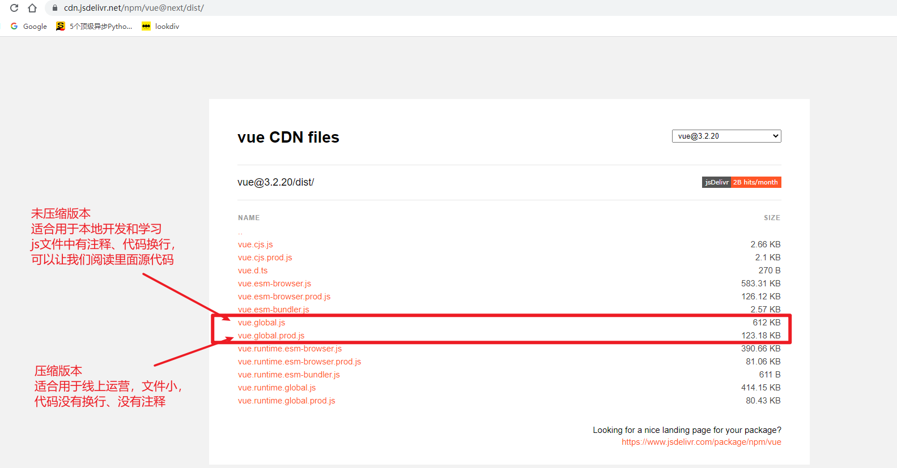
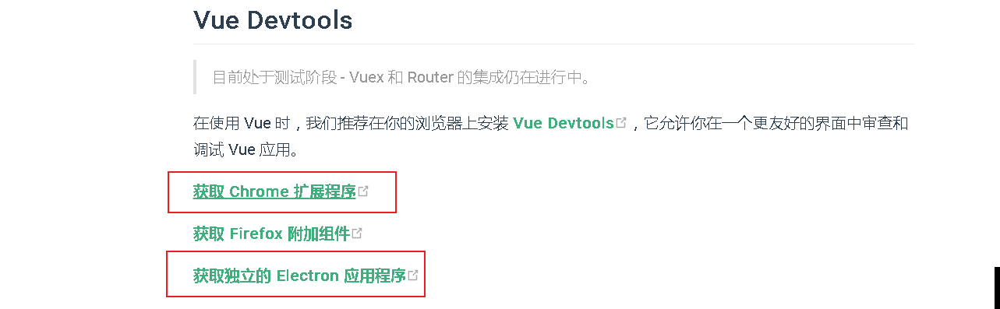
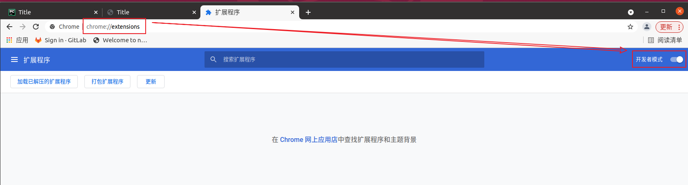
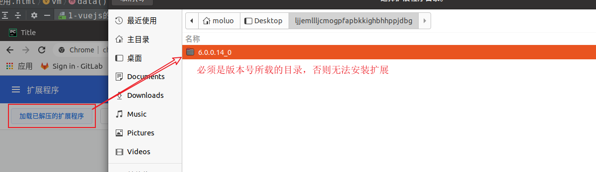
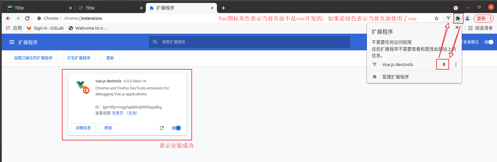
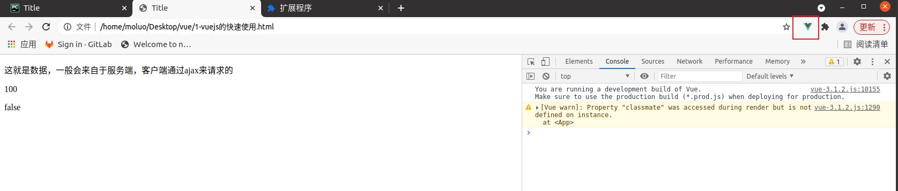
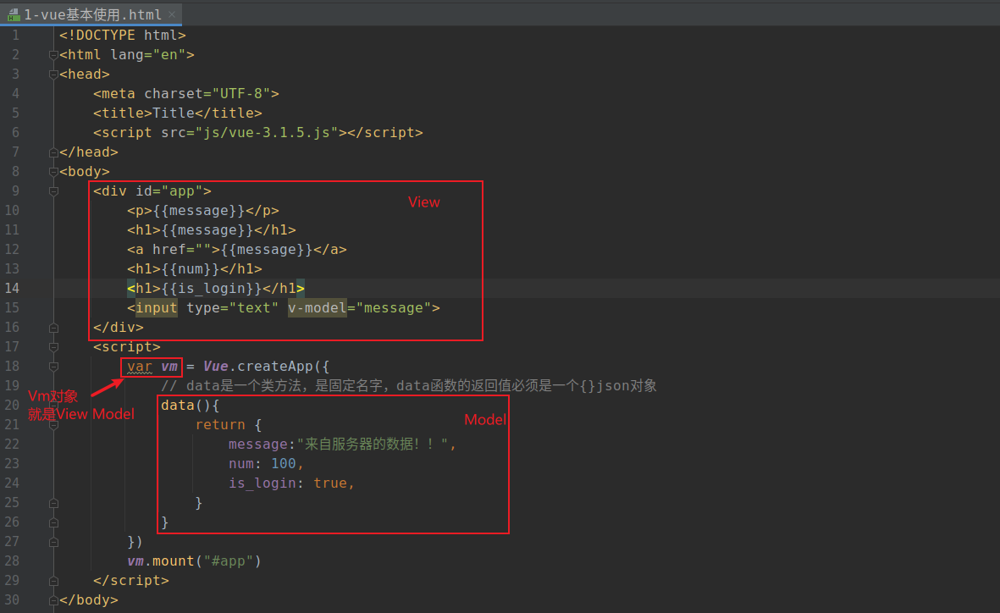
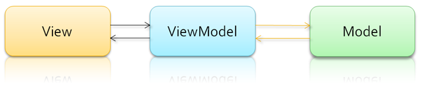

# 1. vue.js的快速入门使用

## 1.1 vue.js库的下载

vuejs是目前前端web开发最流行的工具库，由尤雨溪在2014年2月发布的。

另外几个常见的工具库：react.js、vue.js、angular.js/jQuery

官方网站：https://cn.vuejs.org/

官方文档：https://v3.cn.vuejs.org/guide/introduction.html

vuejs目前有1.x、2.x和3.x 版本，我们学习3.x版本的。

jQuery和vue的定位是不一样的。

```
jQuery的定位是获取元素和完成特效。
vuejs的定位是方便操作和控制数据和完成特效。
```


## 1.2 vuejs的使用

vuejs的使用官方提供了2种方式：

1. 基于脚本导入使用，下载vue.js文件，通过script标签引入到html网页。

2. 基于项目构建工具来进行使用，需要安装项目构建工具，自动构建成一个独立的项目。

   目前官方推荐的项目构建工具：vue-CLI，vite。

我们先通过vuejs的第1种方式来完成vue语法和基础内容的学习。这种方式的使用，vue的引入类似于jQuery，开发中可以使用开发版本vue-x.x.x.js，产品上线要换成vue.min.js。

github：https://github.com/vuejs/vue-next/tags

下载地址：https://v3.cn.vuejs.org/guide/introduction.html

​                  https://cdn.jsdelivr.net/npm/vue@next/dist/



```html
<!DOCTYPE html>
<html lang="en">
<head>
    <meta charset="UTF-8">
    <title>Title</title>
    <script src="js/vue.3.2.20.js"></script>
</head>
<body>

<div id="app">
    <!-- {{ message }} 表示把vue对象里面data选项的对应数据输出到页面中 -->
    <!-- 在双标签中显示数据要通过{{  }}来完成 -->
    <p>{{message}}</p>
    <p>{{num}}</p>
    <p>{{is_delete}}</p>
    <!-- 下面的classmate没有数据，就是因为没有在data里面预设 -->
    <p>{{classmate}}</p>
</div>

<script>
    // vuejs的所有代码全部开始于Vue对象
    // Vue.createApp可以创建一个vue的实例对象，通过这个实例对象，我们可以操作指定HTML的内容、数据、结构、特效等等
    // 一个HTML页面中， 可以创建多个vue的实例对象，但是这些实例对象的保存变量名，不能一样
    // 所以每次操作数据都要创建Vue实例对象开始。
    const vm = Vue.createApp({
        // data是将要展示到HTML标签元素中的数据。一般会在data这里预先设置vue要使用的变量数据,并给变量指定要一个默认值，
        // 当然最终data这里的数据都是来自服务器
        data(){
            return {
                message: "hello, python36",
                num: 200,
                is_delete: false,
            }
        }
    }).mount("#app");

    // 保存mount方法的直接结果就是一个vue的实例对象，里面可以直接发访问data选项里面的返回数据
    console.log(vm);
    console.log(vm.is_delete);  // 相当于获取vm对象的data选项里面的is_delete
    console.log(vm.message);
</script>
</body>
</html>
```


总结：

```javascript
//1. vue的使用要从创建Vue实例对象开始
   var vm = Vue.createApp({});
   
//2. 创建vue对象的时候，需要传递选项参数，选项参数就是json对象，json对象必须有data成员
   var vm = Vue.createApp({
         data(){
            return {}
         },
   }).mount("#app");
   
   //mount:设置vue可以操作的html内容范围，值一般就是css的id选择器。
   //data: 保存vue.js中要显示到html页面的数据。
   
//3. vue.js要控制的内容范围，必须先通过id来设置。
  <div id="app">
      <h1>{{message}}</h1>
      <p>{{message}}</p>
  </div>
```


### 1.2.1 调试工具Vue Devtools的安装

1. 官网地址：https://v3.cn.vuejs.org/guide/installation.html#%E5%8F%91%E5%B8%83%E7%89%88%E6%9C%AC%E8%AF%B4%E6%98%8E



2. 下载回来的压缩包，复制到ubuntu或者开发的系统下用户家目录下进行解压，然后打开谷歌浏览器，在地址栏上输入`chrome://extensions/`，勾选开发者模式。

   

3. 选择左边的加载已解压的扩展程序，就是刚才复制到ubuntu下的扩展目录，接着点击当前目录右上角的打开。

   

4. 完成了步骤以后，就可以看到谷歌浏览器已经成功安装了。效果如下：

   

5. 在使用vue的页面时，vue图标效果如下：

   

6. 最后！！！注意！当前vue插件的目录绝对不能删除！！删了这个目录，则插件也没有了。所以自己找一个保存文件的目录把插件放进去再安装到谷歌浏览器中。



## 1.3 vue.js的M-V-VM思想

MVVM 是Model-View-ViewModel 的缩写，它是一种基于前端开发的架构模式，是一种**代码分工**思想来的。

`Model` 指代的就是vue对象的data选项里面的数据。这里的数据要显示到HTML页面中。

`View`  指代的就是vue中数据要显示的HTML页面，也称之为“视图模板” 。

`ViewModel ` 指代的是vue.js中我们编写代码时的创建vue实例对象vm了，它是vue.js的核心，负责连接 View 和 Model，保证视图和数据的一致性，所以前面代码中，data选项里面的数据被显示中p标签中就是vm对象自动完成的。vm对象会时刻的监控View和Model的变化，并**保持双方数据的一致性**！！！有时候，这个特性也叫双向数据绑定



编写代码，让我们更加清晰的了解MVVM：

```html
<!DOCTYPE html>
<html lang="en">
<head>
    <meta charset="UTF-8">
    <title>Title</title>
    <script src="js/vue.3.2.20.js"></script>
</head>
<body>

<div id="app">
    <p>{{num}}</p>
    <input type="number" v-model="num">
</div>
<script>
    // 创建vue实例对象
    const vm = Vue.createApp({
        // data选项中声明的所有数据将来都会被vm对象进行"遍历循环"，赋值给vm对象作为属性的。我们要访问或操作data里面的数据直接通过this来访问。
        data(){ // 保存数据，这些数据将来都是用于输出到HTML页面的
            return {
                num: 100,
            }
        },
        mounted(){ // 会在vue加载html完成以后，自动执行mounted这里的代码
            setInterval(()=>{ // setInterval 原生js提供的多次定时器函数，参数1：是一个匿名函数，参数2：定时时间(毫秒)，表示间隔多久执行一次参数1对应的匿名函数
                this.num += 1;  // this.num = this.num+1;    // this相当于python里面的self，代表当前vm对象，this.num就是data选项中的num
                console.log(this.num);
            },1000);
        },
    }).mount("#app")
</script>
</body>
</html>
```


## VM常用属性操作

在浏览器中可以在 console.log通过 vm对象可以直接访问el和data属性,甚至可以访问data里面的数据

```vue
<!DOCTYPE html>
<html lang="en">
<head>
    <meta charset="UTF-8">
    <title>Title</title>
    <script src="js/vue.3.2.20.js"></script>
</head>
<body>

<div id="app">
    <p>{{num}}</p>
    <p>{{num}}</p>
    <p ref="p3">{{num}}</p>
    <p>{{num}}</p>
    <p>{{num}}</p>
    <p>{{num}}</p>
    <p>{{num}}</p>
</div>
<script>
    // 创建vue实例对象
    const vm = Vue.createApp({
        data(){
            return {
                num: 100,
            }
        },
    }).mount("#app")

    console.log(vm);
    console.log(vm.num);
    console.log(vm.$data.num);
    console.log(vm.$el);  // vm对象控制的内容范围
    console.log(vm.$el.parentElement);  // vm对象本身绑定的标签元素
    console.log(vm.$refs);
    console.log(vm.$refs.p3);
    vm.$refs.p3.style["background-color"]="red";
    // vm.$refs.p3.style.backgroundColor="yellow";
</script>
</body>
</html>
```


总结：

```
1. 如果要输出data里面的数据作为普通双标签的内容，需要使用{{  }}
   用法：
      vue对象的data属性：
          data(){
              return {
                  name:"小明",
              }
          }
      标签元素：
      		<h1>{{ name }}</h1>
2. 如果要输出data里面的数据作为表单元素的值，需要使用vuejs提供的元素属性v-model
   用法：
      vue对象的data属性：
          data(){
              return {
                  name:"小明",
              }
          }
      表单元素：
      		<input v-model="name">
      
   使用v-model把data里面的数据显示到表单元素以后，一旦用户修改表单元素的值，则data里面对应数据的值也会随之发生改变，甚至页面中凡是使用了这个数据都会发生变化。
```


## 1.4 显示数据

1. 在双标签中显示**纯文本数据**一般通过\{\{  \}\}来完成数据显示，双括号中还可以支持js表达式和符合js语法的代码，例如函数调用.
2. 在**表单输入框**中显示数据要使用v-model来完成数据显示
3. 如果双标签的内容要显示的**数据包含html代码**，则使用v-html来完成

```html
<!DOCTYPE html>
<html lang="en">
<head>
    <meta charset="UTF-8">
    <title>Title</title>
    <script src="./js/vue-3.1.2.js"></script>
</head>
<body>
    <div id="app">
        <p v-html="message"></p>
        <!-- 双括号内部可以调用js代码，但是必须以变量名开头 -->
        <!-- message.toUpperCase()，把数据中的字母转换大写 -->
        <!-- message.split("")，把数据中的字符按字符边界分割成单个字符组成的数组 -->
        <!-- array.reverse()，把数组的成员进行反转排序 -->
        <!-- array.join("")，把数组的成员使用字符边界进行合并，变成字符串。 -->
        <p>{{message.toUpperCase().split("").reverse().join("")}}</p>
        <p>&lt;img src=&quot;pic.png&quot;&gt;</p>
        <input type="text" v-model="message">
        <p>{{num}}</p>
        <p>{{num+1}}</p>
        <p>{{num>100?'大于100':'小鱼或等于100'}}</p>
        <p>{{(num+0.8).toFixed(2)}}</p>
        <p>{{(num+10000.8).toLocaleString()}}</p>
    </div>
    <script>
        var vm = Vue.createApp({
            data(){
                return {
                    num: 100,
                    message:``,
                }
            }
        }).mount("#app");
    </script>
</body>
</html>
```


双花括号仅用输出纯文本内容,如果要输出html代码,则不能使用这个.要使用v-html来输出.

v-html必须在html标签里面作为属性写出来，而且只能写在普通双标签中，单标签元素或者表单元素都不能使用v-html。


总结：

```
1. 可以在普通双标签中使用{{  }} 或者 v-html 来输出data里面的数据
   <h1>{{message}}</h1>
   <h1 v-html="message"></h1>
2. 可以在表单标签中使用v-model属性来输出data里面的数据，同时还可以修改data里面的数据
   <input type="text" v-model="username">
```

