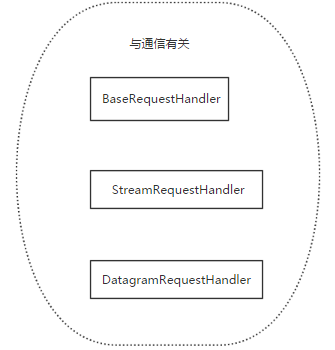
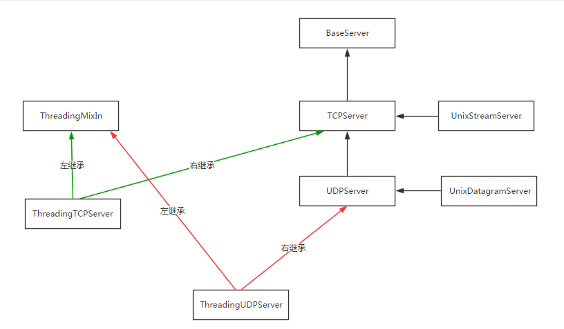
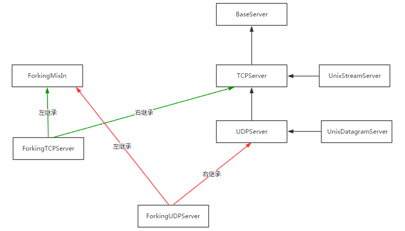
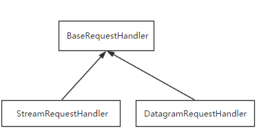

# socketserver

## 一、socketserver模块

基于tcp的套接字，关键就是两个循环，一个链接循环，一个通信循环

socketserver模块中分两大类：server类（解决链接问题）和request类（解决通信问题）

**Server类：**

[

**request类：**

[

**继承关系:**

[

[

[

以下述代码为例，分析socketserver源码：

```
ftpserver=socketserver.ThreadingTCPServer(('127.0.0.1',8080),FtpServer)
ftpserver.serve_forever()
```

**查找属性的顺序**：ThreadingTCPServer->ThreadingMixIn->TCPServer->BaseServer

1. 实例化得到ftpserver，先找类ThreadingTCPServer的__init__,在TCPServer中找到，进而执行server_bind,server_active
2. 找ftpserver下的serve_forever,在BaseServer中找到，进而执行self._handle_request_noblock()，该方法同样是在BaseServer中
3. 执行self._handle_request_noblock()进而执行request, client_address = self.get_request()（就是TCPServer中的self.socket.accept()），然后执行self.process_request(request, client_address)
4. 在ThreadingMixIn中找到process_request，开启多线程应对并发，进而执行process_request_thread，执行self.finish_request(request, client_address)
5. 上述四部分完成了链接循环，本部分开始进入处理通讯部分，在BaseServer中找到finish_request,触发我们自己定义的类的实例化，去找__init__方法，而我们自己定义的类没有该方法，则去它的父类也就是BaseRequestHandler中找....

### 1.1 源码分析总结：

**基于tcp的socketserver我们自己定义的类中的**

1. self.server即套接字对象
2. self.request即一个链接
3. 　　self.client_address即客户端地址

**基于udp的socketserver我们自己定义的类中的**

1. 　　self.request是一个元组（第一个元素是客户端发来的数据，第二部分是服务端的udp套接字对象），如(b'adsf', <socket.socket fd=200, family=AddressFamily.AF_INET, type=SocketKind.SOCK_DGRAM, proto=0, laddr=('127.0.0.1', 8080)>)
2. 　　self.client_address即客户端地址

## 二、基于TCP协议

服务端

```python
'''
-tcp的服务端
			-server=ThreadingTCPServer 创建对象
			-server.serve_forever	开线程进行连接循环
			-写一个类(继承BaseRequestHandler类),类里重写handle,方法内收发数据(并发起来了)
'''

#使用socketserver写服务端
import socketserver

HOST = "127.0.0.1"
PORT = 8080

#自己定义一个类,必须继承BaseRequestHandler
class MyTcp(socketserver.BaseRequestHandler):
    # 必须重写handle方法
    def handle(self):
        try:
            while 1:
                # conn对象就是request
                # 接收数据
                print(self.client_address)  # 客户机地址
                data = self.request.recv(1024)
                print(data.decode("utf8"))
                if len(data) == 0:
                    return
                # 发送数据
                self.request.send(data.upper())
        except:
            print("出错了")


if __name__ == '__main__':
    # 实例化得到一个tcp连接的对象
    server = socketserver.ThreadingTCPServer((HOST,PORT),MyTcp)
    # 这里开的线程，获取连接
    server.serve_forever()
```

客户端

```python
import socket
soc=socket.socket()

soc.connect(('127.0.0.1',8080))
while True:
    soc.send('你好'.encode('utf-8'))
    print(soc.recv(1024).decode("utf8"))
```

## 三、基于UDP协议

服务端

```python
import socketserver

HOST = "127.0.0.1"
PORT = 8081

class MyUDP(socketserver.BaseRequestHandler):
    def handle(self):

        print(self) #  UDP连接对象
        # 数据
        print(self.request[0])	# 数据
        print(self.request[1])	# 
        print(type(self.request[1]))

if __name__ == '__main__':
    # 实例化得到一个tcp连接的对象,Threading意思是说,只要来了请求,它自动的开线程来处理连接跟交互数据
    server = socketserver.ThreadingUDPServer((HOST,PORT),MyUDP)
    # 一直在等待发送数据来
    server.serve_forever()
```

客户端

```python
import socket

HOST = "127.0.0.1"
PORT = 8081

if __name__ == '__main__':
    # 创建对象
    client = socket.socket(socket.AF_INET,socket.SOCK_DGRAM)
    while 1:
        # 发数据
        client.sendto("123123".encode("utf8"),(HOST,PORT))
        # 接收数据
        print(client.recvfrom(1024)[0].decode("utf8"))
```