## 基本概念

## 概述

计算机有硬件和软件组成，操作系统就是硬件上面的第一层软件，它是硬件和其它软件沟通的桥梁。

### Unix

1965 年，MIT、Bell（贝尔实验室）和GE（美国通用电气公司）合作准备搞个超级操作系统，取了个霸气的名字：Multics (Multiplexed Information and Computing System），多路复用信息和计算机系统。能让多个人可以同时干很多事，也叫多用户多任务操作系统。

1969 年，Multics 项目进展缓慢，被迫停止，参与项目的两个人 Ken Thompson（肯·汤普森）和 Dennis Ritchie（丹尼斯·里奇） 也闲了下来。他们都是贝尔实验室的人。没活干了，就打游戏。他们俩找了一台破电脑（PDP-7）准备玩以前开发的一个游戏（travel space：遨游太空），为了能在PDP-7 计算机上运行他的游戏，于是在1969 年夏天Ken Thompson（肯·汤普森）趁他夫人回家乡加利福尼亚渡假期间，在一个月内开发出了UNIX 操作系统的原型，UNIX于是就在1970年正式问世了，这就是Unix元年。自 1970 年后，UNIX 系统在贝尔实验室内部的程序员之间逐渐流行起来，当时使用的是BCPL 语言（基本组合编程语言），后经Dennis Ritchie 于1973 年用移植性很强的C语言进行了改写。

UNIX 的出现是由 Ken Thompson（肯·汤普森）和 Dennis Ritchie（丹尼斯·里奇）在贝尔实验室工作期间开发出来的，自然版权属于贝尔实验室所有。一开始贝尔实验室并没有重视这个系统，导致这个系统的源代码在程序员之间不断分发导致美国很多机构、组织和高校都有非常多的人在使用这个UNIX，这就为UNIX的发展带来的高速的发展，但是随着UNIX发展的越来越好，这时候贝尔实验室就开始了商业运作了，他们决定要收回版权。但是从原来的免费获取使用变成后面的高价版权费用，很多人甚至是公司是接受不了的，所以这个商业运作进展缓慢，后面不得已就变成了，贝尔实验室收回版权，但是针对一些有合作的高校和机构，收取廉价或者是几乎免费的版权费用。

于是在20世纪70年代后期，与教育机构和外部商业组织共享了Unix，从而导致了许多不同版本Unix的诞生。其中最突出的是由加州大学伯克利分校的计算机系统研究小组构建的教育版本(BSD)。当然BSD与比尔·乔伊（[Bill Joy](https://baike.baidu.com/item/Bill Joy)）又是另一段传奇故事了。

### GUN

1983年9月，Richard Stallman宣布引入GNU计划(GNU：Gnu Not Unix)。1985年，理查德（Richard）建立了自由软件基金会（FSF），这是一个非营利性组织，旨在促进软件开发的自由。GNU项目创建了许多重要的产品，如GNU Compiler Collection (gcc)、GNU Debugger、GNU Emacs text editor (Emacs)、GNU build automator (make)等，还有今天使用最广泛的: GNU通用公共许可证(GPL)。GNU项目取得了许多伟大的成就，创造了许多与Unix相似的工具。然而，GNU仍然缺少一个重要的组成部分：内核（用于处理与硬件设备(CPU、RAM、设备等)的控制和通信的部分）。

GNU项目的目标是创建一个自由的、类unix的操作系统，在这个系统中，人们人们可以自由地复制，开发，修改和分发软件，并且不受限制。


### Minix

Minix诞生于1987年，由Andrew S. Tanenbaum（安德鲁·斯图尔特·塔能鲍姆，谭邦宁）教授编写，用作教学的微内核架构的类Unix系统。当时Unix系统由于AT&T的使用许可问题，Unix不能被大学使用，谭邦宁教授为了让学生能看到操作系统的运行机理，自己重新写了一个操作系统，就叫它Minix。

### Linux

Linux内核最初只是由芬兰人Linus Torvalds（林纳斯·托瓦兹）在赫尔辛基大学上学时出于个人爱好而编写的。

Linux是一套免费使用和自由传播的类Unix操作系统，是一个基于POSIX和UNIX的多用户、多任务、支持多线程和多CPU的操作系统。Linux能运行主要的UNIX工具软件、应用程序和网络协议。它支持32位和64位硬件。Linux继承了Unix以网络为核心的设计思想，是一个性能稳定的多用户网络操作系统。

目前市面上较知名的发行版有：Ubuntu(乌班图)、RedHat(红帽)、CentOS、Debain（）、Fedora、 、OpenSUSE


## 下载地址

网易镜像：http://mirrors.163.com/

搜狐镜像：http://mirrors.sohu.com/

清华源：https://mirrors.tuna.tsinghua.edu.cn/

## Linux特点

Linux里面一切皆是文件

Linux里面没有后缀名这一说

## Linux和Windows区别

目前国内Linux更多的是应用于服务器上，而桌面操作系统更多使用的是window。主要区别如下。

| 比较     | Window                                                       | Linux                                                        |
| -------- | ------------------------------------------------------------ | ------------------------------------------------------------ |
| 界面     | 界面统一，外壳程序固定所有Windows程序菜单几乎一致，快捷键也几乎相同 | 圆形界面风格依发布版本不同而不同，可能互不兼容。GNU/Linux的终端机是从UNIX传承下来，基本命令和操作方法也几乎一致。 |
| 驱动程序 | 驱动程序丰富，版本更新频繁。默认安装程序里面一般包含有该版本发布时流行的硬件驱动程序，之后所出的新硬件驱动依赖于硬件厂商提供。对于一些老硬件，如果没有了原配的驱动有时候很难支持。另外，有时硬件厂商未提供所需版本的Windows下的驱动，也会比较头痛。 | 由志愿者开发，由Linux核心开发小组发布，很多硬件厂商基于版本考虑并未提供驱动程序，尽管多数无需手动安装，但是涉及安装则相对复杂，使得新用户面对驱动程序问题会一筹莫展。但是在开源开发模式下，许多老硬件尽管在Windows下很难支持的也容易找到驱动。HP、Intel、AMD等硬件厂商逐步不同程序支持开源驱动，问题正在得到缓解。 |
| 使用     | 使用比较简单，容易入门。圆形化界面对没有计算机背景知识的用户使用十分有利。 | 圆形界面使用简单，容易入门。文字界面，需要学习才能掌握。     |
| 学习     | 系统构造复杂、变化频繁、且知识、技能淘汰快，深入学习困难     | 系统构造简单、稳定，且知识、技能传承性好，深入学习相对容易   |
| 软件     | 每一种特定功能可能都需要商业软件的支持，需要购买相应的授权   | 大部分软件都可以自由获取，同样功能的软件选择较少。           |

## 目录结构


| 目录        | 描述                                                         |
| ----------- | ------------------------------------------------------------ |
| /           | 第一层次结构的根、整个文件系统层次结构的根目录。             |
| /bin/       | 需要在单用户模式可用的必要命令（二进制可执行文件）；面向所有用户，例如：cat、ls、cp，和/usr/bin类似。 |
| /boot/      | 引导程序文件，例如：kernel、initrd；时常是一个单独的分区     |
| **/dev/**   | 必要设备, 例如：, /dev/null.                                 |
| **/etc/**   | 特定主机，系统范围内的配置文件。关于这个名称目前有争议。在贝尔实验室关于UNIX实现文档的早期版本中，/etc 被称为/etcetra 目录，这是由于过去此目录中存放所有不属于别处的所有东西（然而，FHS限制/etc存放静态配置文件，不能包含二进制文件）。自从早期文档出版以来，目录名称已被以各种方式重新称呼。最近的解释包括反向缩略语如："可编辑的文本配置"（英文 "Editable Text Configuration"）或"扩展工具箱"（英文 "Extended Tool Chest")。[9] |
| **/home/**  | 用户的家目录，包含保存的文件、个人设置等，一般为单独的分区。 |
| /lib/       | /bin/ and /sbin/中二进制文件必要的库文件。                   |
| /media/     | 可移除媒体(如CD-ROM)的挂载点 (在FHS-2.3中出现)。             |
| /lost+found | 在ext3文件系统中，当系统意外崩溃或机器意外关机，会产生一些文件碎片在这里。当系统在开机启动的过程中fsck工具会检查这里，并修复已经损坏的文件系统。当系统发生问题。可能会有文件被移动到这个目录中，可能需要用手工的方式来修复，或移到文件到原来的位置上。 |
| /mnt/       | 临时挂载的文件系统。比如cdrom, u盘等，直接插入光驱无法使用，要先挂载后使用 |
| /opt/       | 可选应用软件包。                                             |
| **/proc/**  | 虚拟文件系统，将内核与进程状态归档为文本文件（系统信息都存放这目录下）。例如：uptime、 network。在Linux中，对应Procfs格式挂载。该目录下文件只能看不能改（包括root） |
| /root/      | 超级用户的家目录                                             |
| **/sbin/**  | 必要的系统二进制文件，例如： init、 ip、 mount。sbin目录下的命令，普通用户都执行不了。 |
| /tmp/       | 临时文件(参见 /var/tmp)，在系统重启时目录中文件不会被保留。  |
| /usr/       | 默认软件都会存于该目录下。用于存储只读用户数据的第二层次；包含绝大多数的(多)用户工具和应用程序。 |
| **/var/**   | 变量文件——在正常运行的系统中其内容不断变化的文件，如日志，脱机文件和临时电子邮件文件。有时是一个单独的分区。如果不单独分区，有可能会把整个分区充满。如果单独分区，给大给小都不合适。 |

## 远程连接主机的工具

通过SSH连接到远程主机有2种方式：

01. 通过市面上常用的软件来进行连接。

   远程ssh客户端软件：putty（开源免费的，超级轻量级的ssh连接工具），xshell（海螺，收费，但是可以试用）。

   远程ftp客户端软件： xftp，filezilla， FlashFXP

   远程ssh和ftp的客户端合成软件：FinalShell、Terminus、[electerm](https://electerm.html5beta.com/)

02. 通过终端命令来进行ssh连接。首次远程连接会提示记录远程主机的指纹，同意即可。

   基于ssh协议远程登录的命令：ssh、ssh-keygen（免密码登录）

   ​        ssh root@10.0.0.130

   基于ssh协议进行文件传输的命令：scp

   ​		scp

xshell的快捷键：

```bash
Ctrl+S 锁屏幕
Ctrl+Q 解除屏幕
shift+insert 把内容粘贴到远程终端。
Ctrl+C 终止操作
exit   退出
```

##  常用命令

### 系统信息

```bash
# arch 显示机器的处理器架构
uname -m 显示机器的处理器架构

# uname -r 显示正在使用的Linux内核版本

# dmidecode -q 显示硬件系统部件 - (SMBIOS / DMI)
# hdparm -i /dev/sda 罗列指定一个磁盘的架构特性[此处的sda表示当前linxu下加载的第一块硬盘]
# hdparm -tT /dev/sda 在指定一个磁盘上执行测试性读取操作
cat /proc/cpuinfo 显示CPU info的信息
# cat /proc/interrupts 显示中断
# cat /proc/meminfo 校验内存使用
# cat /proc/swaps 显示哪些swap被使用
cat /proc/version 显示Linux内核的版本和linux发型版本信息
cat /proc/net/dev 显示网络适配器及统计
cat /proc/mounts 显示已加载的文件系统
# lspci -tv 罗列 PCI 设备
# lsusb -tv 显示 USB 设备
date 显示系统日期
cal 2022 显示2022年的日历表
date 120810052021.00 设置日期和时间 - 月日时分年.秒
clock -w 将时间修改保存到 BIOS
```

### 系统关机

关机 (系统的关机、重启以及登出 )

```bash
shutdown -h now 立刻关闭系统
init 0          关闭系统
telinit 0       关闭系统
shutdown -h <hours>:<minutes> &       按预定时间关闭系统
shutdown -c                           取消按预定时间关闭系统 [取消上面一句命令的操作]
shutdown -r now                       立即重启
reboot                                重启
logout                                注销[exit更好用一点]
```

### 文件和目录

#### 查看文件目录信息

```bash
cd /home # 进入 '/ home' 目录'
cd .. # 返回上一级目录
cd ../.. # 返回上两级目录
cd    # 相当于 cd ~ ，进入个人的主目录
cd ~  # 进入个人的主目录
cd -  # 返回上次所在的目录
pwd   # 显示工作路径
ls    # 查看目录中的文件
# ls -F # 查看目录中的文件
ls -l # 显示文件和目录的详细资料
ls -a # 显示隐藏文件
ls *[0-9]* # 显示包含数字的文件名和目录名
tree # 显示文件和目录由根目录开始的树形结构
     # ubuntu:   sudo apt install tree
     # centos:   yum install tree
```

#### 管理文件目录

目录路径相关的命令

```bash
mkdir dir1 # 创建一个叫做 'dir1' 的目录'
mkdir dir1 dir2 .... # 同时创建两个同级目录或多个同级目录
# 序列
# {dir3,dir4,dir5}      # 指定成员的序列
mkdir {dir3,dir4,dir5}  # 创建了3个目录，分别是dir3,dir4,dir5
# mkdir dir{6..10}      # 指定成员范围的序列
mkdir dir{6..10}         # 创建了dir1,dir2,dir3这个范围的目录
mkdir demo{01..100}      # 指定成员的长度补0，按末尾数字的长度，给所有的数字进行补0，不足2位，左边补1个0
mkdir user{001..3}       # 创建user001,user002,user003这几个目录
# mkdir goods{0..10..2} # 指定步进值的序列，步进值表示间隔数值
mkdir item{00..10..2}   # 创建goods00,goods02,goods..,goods10之间的偶数目录

mkdir -p ~/dir0/dir1/dir2 # 创建一个目录树[多级目录]

touch 1.html           # 创建一个空内容文件
touch 1.html 2.html    # 创建2个空内容文件，分别是1.html和2.html
touch {00..10..2}.html # touch也支持序列格式写法

echo  > 2.html           # 创建一个有内容的文件，里面是空白内容
echo hello world> 3.html # 创建一个有内容的文件，里面的内容是 hello world

# rmdir dir1             # 删除一个叫做 'dir1' 的目录'，rmdir只能删除空目录！！！ rmdir dir0无法执行
# 注意: 在工作中rm是绝对禁用的！！！使用mv代替！
rm 1.html        # 删除文件，文件名为 1.html
rm -f 2.html     # 无须确认，直接删除一个叫做 '2.html' 的文件'
rm -rf python01          # 递归删除一个叫做 'python01' 的目录及其内容，慎用！~！！
rm -rf python02 python03 # 同时删除两个目录及它们的内容，慎用

mv python04 python04.bakup  # 重命名/移动一个文件/目录，或者对文件进行改名，
                     # 当python04.bakup不存在时，则表示把python04重命名为python04.bakpu
                     # 当python04.bakup已经存在，则表示把python04移动到python04.bakpu目录下
                     # 如果要恢复，则参数翻转即可，mv python04.bakup python04

mv goods-* demo1/    # 重命名/移动所有以dir开头的文件/目录，或者对文件进行改名
                # 当new_dir不存在时，则报错！

# 多条命名按先后顺序一并执行
touch {01..10}.html && mkdir -p old_dir && mv *.html old_dir && tree old_dir

cp 1.html 1.html.bakup        # 复制一个文件1.html，新文件名为 1.html.bakup，工作中常用
cp old_dir/* new_dir/         # 复制一个目录下的所有文件到当前工作目录下的new_dir目录中
cp -a /tmp/dir1 . # 复制一个目录到当前工作目录
cp -a dir1 dir2 # 复制一个目录
cp -r dir1 dir2 # 递归复制一个目录及子目录
```

#### 文件搜索

```bash
find /home -name "*.html"      # 从 '/home'家目录开始进入文件系统搜索名称以'.html'结尾的文件和目录
find /home -name "*python*"    # 从 '/home' 开始进入文件系统搜索名称包含'python'的文件和目录
find /home -name "demo*"       # 从 '/home' 开始进入文件系统搜索名称以'demo'开头的文件和目录
find / -name "*demo*"          # 从 '/' 开始进入根文件系统搜索名称包含'demo'的文件和目录

    [root@localhost ~]# find / -name "demo*"
    touch /home/moluo/demo001/demo.txt
    /root/dir9/demo.txt
    /root/dir007/dir6/demo.txt
    /root/dir007/demo333.txt
    /root/dir007/demo333_bak.txt
    /root/dir007/dir006/demo.txt

find ~ -user root          # 搜索属于用户 'user1' 的文件和目录
find ~ -type f -atime +100 # 从'/'开始，搜索在过去100天内未被使用过的执行文件
find ~ -type f -mtime -10  # 搜索在10天内被创建或者修改过的文件
# find搜索文件，是逐个目录进行查找， 所以尽量不要从 根目录下去进行查找！！！尽量缩减搜索，否则系统会卡顿的。

# ContOS安装软件、命令:  yum install -y mlocate
# Ubuntu安装软件、命令： sudo apt install -y mlocate
# 使用locate之前，要了解locate内部运行原理：locate执行过程中，直接系统数据库中搜索文件信息的，效率贼高！
# 所以，需要更新以下最近的系统的文件数据库，先运行 'updatedb' 命令，ubuntu下需要以sudo 开头
updatedb
locate *.html  # 寻找以 '.html' 结尾的文件 -

# 查找二进制文件、例如命令，查找源码包或者命令手册时使用whereis
whereis tree  # 显示一个二进制文件、源码或man的位置

# 查找二进制文件、例如命令、
which tree    # 显示一个二进制文件或可执行文件的完整路径
```

#### 查看文件内容

```bash
# 测试数据
echo "hello
world
python
baidu" > demo.txt                # 把"hello\nworld" 写入到demo.txt中
cat demo.txt                     # 从第一个字节开始正向查看文件'demo.txt'的内容
                                 # cat只适合用于查看小文件的内容，大文件不适合.
cat -n demo.txt                  # 显示当前文件的内容和行数
tac demo.txt                     # 从最后一行开始反向查看文件'demo.txt'的内容

# 统计文件内容的字数/单词/行数
wc demo.txt                 # 统计demo.txt文件的行数/单词数/字数
wc demo.txt  /etc/passwd    # 统计多个文件的行数/单词数/字数，并汇总。

    [root@localhost dir8]# wc demo.txt /etc/passwd
   行数 单词数 字数  文件路径
	1    3       19 demo.txt
    23   47     1127 /etc/passwd
    24   50     1146 总用量                # 末行表示汇总

# 准备一个大文件
cat << EOF >>demo2.txt
青青园中葵，朝露待日晞。
阳春布德泽，万物生光辉。
常恐秋节至，焜黄华叶衰。
百川东到海，何时复西归？
少壮不努力，老大徒伤悲。

青青园中葵，朝露待日晞。
阳春布德泽，万物生光辉。
常恐秋节至，焜黄华叶衰。
百川东到海，何时复西归？
少壮不努力，老大徒伤悲。
EOF

more demo2.txt # 查看大文件"demo.txt"的内容，按空格键可以继续往下翻看数据

less demo2.txt # 类似于 'more' 命令，但是它允许在文件中和正向操作一样的反向操作，Q键退出

head -4 demo2.txt # 查看文件的前4行
tail -2 demo2.txt # 查看一个文件的最后两行

# 实时查看'/var/log/messages'系统运行信息文件的内容
tail -f /var/log/messages   # centos
tail -f /var/log/syslog     # ubuntu
```

#### 文本处理

```bash
# Linux的文本处理->3剑客：grep, sed, awk 是最强大的三个文本处理命令

# grep  文本搜索，支持正则使用
# 用法1，从文件中搜索关键字
#        grep 关键字 文件
# 用法2，从上一个操作命令的结果内容中，提取关键字信息
#        上一个命令 | grep 关键字

grep '老大' demo2.txt
grep Oct /var/log/messages    #  在文件 '/var/log/messages'中查找关键词"Oct"
grep ^Oct /var/log/messages   # 在文件 '/var/log/messages'中查找以"Oct"开始的词汇
grep [0-9] /var/log/messages  # 选择 '/var/log/messages' 文件中所有包含数字的行
grep Oct -R /var/log/*        # 在目录 '/var/log' 及随后的目录中的所有文件内容中 搜索字符串"Oct"
ps aux | grep django          # 先列出当前操作系统中运行的所有进程列表信息以及PID，
                              # 然后从结果中搜索包含了django关键字的内容信息

# sed 文本的查看、删除、替换，支持正则使用。
echo "
hello world
welcome to beijing。
hello world
welcome to shanghai。
hello world
welcome to beijing。
" > demo.txt

sed "s/hello world/Hi, xiaoming/g" demo.txt    # 将demo.txt文件内容提取出来，
                                               # 并把内容中的 "hello world" 替换成 "Hi, xiaoming"以后
                                               # 输出到终端，不修改源文件的内容

sed -i "s/hello world/Hi, xiaoming/g" demo.txt # 将demo.txt中的 "hello world" 替换成 "Hi, xiaoming"，
                                               # 并修改源文件内容。

sed '/^$/d' demo2.txt         # 从demo2.txt文件中删除所有空白行，并显示内容，不修改文件内容
sed -i '/^$/d' demo2.txt      # 从demo2.txt文件中删除所有空白行，并修改文件内容

# 准备测试文件
cat << EOF >>demo3.py
from rest_framework.viewsets import ViewSet
# 首页视图类
class HomeViewSet(ViewSet):
    def get_banner(self,request):
        # 获取banner列表数据
        pass
    def get_nav(self, request):
        # 获取导航数据
        pass
EOF

sed '/ *#/d; /^$/d' demo3.py    # 从demo3.py文件中删除所有注释和空白行，常用于代码压缩
sed -n '/from/p' demo3.py       # 查看只包含词汇 "welcome"的行
sed -e 's/ *$//' demo3.py       # 删除每一行最后的空白字符
# sed -e 's/ *$//' demo3.py | wc

sed -e 's/xiaoming//g' demo.txt  # 从文档demo.txt中只删除词汇 "xiaoming" 并保留剩余全部
sed -n '1,5p;5q' demo.txt        # 查看从第1行到第5行内容
sed -n '2,4p;4q' demo.txt        # 查看从第2行到第4行内容
sed -n '5p;5q' demo.txt          # 查看第5行

# awk 按换行、按空格处理文本
cat demo.txt | awk 'NR%2==1'  # 删除demo.txt文件中的所有偶数行 NR表示行号【不影响源文件】
echo welcome to beijing | awk '{print $1}' # 查看一行第一列，自动按空格分三列，$1表示第1列， $2表示第2列，以此类推
echo a b c | awk '{print $1,$3}'  # 查看1行的第1和第1列

# 准备测试内容和文件
echo "hello" > t1.txt
echo " world" > t2.txt
# 合并文件内容
paste t1.txt t2.txt  # 合并2个文件的内容

# 对内容进行排序
sort t1.txt t2.txt      # 排序两个文件的内容
echo "hello" >> t2.txt  # 追加内容"hello" 到 t2.txt
sort t1.txt t2.txt | uniq  # 取出两个文件的并集(重复的行只保留一份)
sort t1.txt t2.txt | uniq -u # 删除交集，留下其他的行
sort t1.txt t2.txt | uniq -d # 取出两个文件的交集(只留下同时存在于两个文件中的文件)
```

#### 打包压缩文件

```bash
# 基于bzip算法压缩文件内容，不能压缩目录！！！生成的文件后缀.bz2
bzip2 demo2.txt       # 压缩一个叫做 'demo2.txt' 的文件，得到压缩包，demo2.txt.bz2
bunzip2 demo2.txt.bz2 # 解压一个叫做 'demo2.txt.bz2'的文件

# 基于gzip算法压缩文件，压缩程度把上面的要好，gzip可以针对文件进行打包
# 最常用
gzip demo2.txt      # 压缩一个叫做 'demo2.txt'的文件，得到压缩包，demo2.txt.gz
gunzip demo2.txt.gz # 解压一个叫做 'demo2.txt.gz'的文件
gzip -9 demo2.txt   # 最大程度压缩

# 基于rar针对文件或目录打包
# ContOS安装:
#        wget https://www.rarlab.com/rar/rarlinux-x64-6.0.2.tar.gz
#        tar zxvf rarlinux-x64-6.0.2.tar.gz -C /usr/local
# Ubuntu安装：
#        sudo apt install rar
rar a fuguang.rar fuguang  # 打包fuguang目录，并创建一个叫做 'fuguang.rar' 的包
rar a dir8.rar file1 file2 dir1 # 同时把多个文件或目录打包到一起 到 file.rar包中
rar x fuguang.rar  # 解压rar包

# 基于tar针对文件或目录打包，Linux最常用这个
tar -cvf fuguang.tar fuguang      # 创建一个非压缩的 dir8.tar的包
tar -cvf fuguang.tar fuguangweb fuguangapi # 把多个文件或目录打包到一起
tar -tf  fuguang.tar              # 显示一个包中的内容
# tar -tf fuguang.tar | grep manage.py  # 显示包中的内容并过滤查找

tar -xvf fuguang.tar # 释放一个包，解包
tar -xvf demo.tar -C 001/ # 将包释放到 001 目录下

tar -jcvf fuguang.tar.bz2 fuguang   # 创建一个bzip2格式的压缩包，压缩包的文件名，往往会体现打包格式以及压缩算法
tar -jxvf fuguang.tar.bz2       # 解压一个bzip2格式的压缩包

# 重要！最常用的打包压缩命令！
tar -zcvf fuguang.tar.gz fuguang # 创建一个gzip格式的压缩包
tar -zxvf demo.tar.gz     # 解压一个gzip格式的压缩包

# zip
zip file1.zip file1 # 创建一个zip格式的压缩包
zip -r file1.zip file1 file2 dir1 # 将几个文件和目录同时压缩成一个zip格式的压缩包
unzip file1.zip # 解压一个zip格式压缩包
```

### 系统网络

#### 磁盘空间

```bash
df -h  # 显示已经挂载的分区列表
# ls -lSr | more # 以尺寸大小排列文件和目录
du -sh python36 # 估算目录 'python36' 已经使用的磁盘空间'
du -sk * | sort -rn # 以容量大小为依据依次显示文件和目录的大小 ，单位是KB
```

#### 网络进程

```bash
ping 网络地址/IP                 # 测试网络
ping  www.baidu.com -c 3 -i 2  # 每隔2秒发送1个数据包，持续3次，监测网络

ip a     # 查看网卡信息
#   lo 表示回环网卡， 每个操作都会有的。默认IP地址：127.0.0.1
# 1: lo: <LOOPBACK,UP,LOWER_UP> mtu 65536 qdisc noqueue state UNKNOWN group default qlen 1000
#     link/loopback 00:00:00:00:00:00 brd 00:00:00:00:00:00
#     inet 127.0.0.1/8 scope host lo
#        valid_lft forever preferred_lft forever
#     inet6 ::1/128 scope host
#        valid_lft forever preferred_lft forever

#  ens33 表示以太网卡
# 2: ens33: <BROADCAST,MULTICAST,UP,LOWER_UP> mtu 1500 qdisc fq_codel state UP group default qlen 1000
#     link/ether 00:0c:29:59:68:45 brd ff:ff:ff:ff:ff:ff
#     inet 10.0.0.130/24 brd 10.0.0.255 scope global dynamic ens33
#        valid_lft 1784sec preferred_lft 1784sec
#     inet6 fe80::20c:29ff:fe59:6845/64 scope link
#        valid_lft forever preferred_lft forever

# ContOS: yum install -y net-tools
# Ubuntu: sudo apt install -y net-tools
ifconfig # 列出当前系统的所有网卡信息 ，使用内置的ip a命令，也可以查看网卡信息
#    lo回环网卡，就是127.0.0.1对应的网卡
#    ens33 以太网卡
ifconfig ens33 # 显示一个以太网卡的配置

# Ubuntu: sudo apt install ifupdown
ifup ens33      # 启动指定网卡
ifdown ens33    # 关闭指定网卡[慎用，可以重启网络吗，但是禁止远程手动关闭网卡]

route -n  # 打印路由表，可以在第一行查看当前电脑的路由表 Gateway表示网管  netmask表示子网掩码
hostname  # 显示当前系统的主机名
hostnamectl set-hostname moluo   # 修改主机名

host www.baidu.com # 对域名解析成IP地址，也可以对IP地址解析成域名
# ContOS: yum install -y bind-utils
nslookup www.baidu.com  # 对域名解析成IP地址，也可以对IP地址解析成域名
# ContOS: yum install -y whois.x86_64
whois www.baidu.com

# 查看网络进程
ps ef   # 列出当前系统下所有的进程
ps aux  # 列出当前系统下所有的进程的详细信息
#   PID(进程ID) TTY(哪个用户开启的)      STAT(当前进程状态)   TIME(执行时间) COMMAND(执行的终端命令)
netstat -tup   # 显示系统的所有网络连接以及对应的进程ID
netstat -tupl  # 显示系统的所有网络连接以及对应的进程ID【详细】

# 网络抓包，类似谷歌浏览器中的F12中的network
# ContOS安装：yum install -y tcpdump
tcpdump tcp port 80 # 对80端口的所有请求进行抓包
tcpdump -i ens33    # 对ens33网卡进行网络监听
tcpdump host www.baidu.com # 对访问目标地址为220.181.38.251的请求进行监听

# Linux的网络分析工具，类似window的资源管理器
top
    第一行 (uptime)
    	系统时间 主机运行时间 用户连接数(who) 系统1，5，15分钟的平均负载
    第二行:进程信息
    	进程总数 正在运行的进程数 睡眠的进程数 停止的进程数 僵尸进程数
    第三行:cpu信息
        1.5 us：用户空间所占CPU百分比
        0.9 sy：内核空间占用CPU百分比
        0.0 ni：用户进程空间内改变过优先级的进程占用CPU百分比
        97.5 id：空闲CPU百分比
        0.2 wa：等待输入输出的CPU时间百分比
        0.0 hi：硬件CPU中断占用百分比
        0.0 si：软中断占用百分比
        0.0 st：虚拟机占用百分比
    第四行：内存信息（与第五行的信息类似与free命令）
        8053444 total：物理内存总量
        7779224 used：已使用的内存总量
        274220 free：空闲的内存总量（free+used=total）
        359212 buffers：用作内核缓存的内存量
    第五行：swap信息
        8265724 total：交换分区总量
        33840 used：已使用的交换分区总量
        8231884 free：空闲交换区总量
        4358088 cached Mem：缓冲的交换区总量，内存中的内容被换出到交换区，然后又被换入到内存，但是使用过的交换区没有被覆盖，交换区的这些内容已存在于内存中的交换区的大小，相应的内存再次被换出时可不必再对交换区写入。

kill -9 进程ID  # 强制结束进程
# 查找端口对应的进程ID，并强制结束， CentOS中安装：yum install -y lsof
kill -9 `lsof -t -i:端口`
# kill -9 $(lsof -t -i:端口)
# lsof -t -i:端口 | kill -9

pkill -f vi  # 表示结束vi关键字相关的进程
#  CentOS中安装：yum install -y psmisc

killall 服务名称/程序名称
# 例如：
# killall celery
# killall nginx

# 查看系统程序监听的端口情况
ss -ntl
```

### vi&vim编辑器

Gvim 是Windows系统下的版本。

Ubuntu默认就内置了vi和vim编辑器，而CentOS则需要单独安装vim： `yum install -y vim` 。


**命令模式**，也叫快捷键模式，在这种模式下，开发者可以通过键盘使用快捷键操作vi/vim编辑器。完成vi编辑器的配置（显示行号、完成一些基本宏操作、复制、粘贴等等操作）。

```bash
x   # 删除光标所在的字符
nd  # n代表数字，表示剪切光标所在位置的后面的n个字符，注意：以空格结束，不要按回车键
dd  # 剪切光标所在行的内容，相当于1dd
ndd # n代表数字，表示剪切光标所在行的下面n行内容

yy  # 复制光标所载行的内容
nyy # n代表数字，表示复制光标所在行的下面n行内容
p   # 小写字母，粘贴[在光标下一行粘贴出来]
P   # 大写字母，粘贴[在光标上一行粘贴出来]

u   # 撤销上一步编辑操作

gg  # 光标跳转到第一行
GG  # 光标跳转到最后一行
```

**输入模式**，也叫编辑模式，在这种模式下，开发者可以通过键盘输入文本信息到编辑器中。

​       进入输入模式，可以在命令模式状态下，使用快捷键 i、I、A、a、O、o、S、s、C、c、R 进入。

​        退出输入模式，可以通过ESC键返回命令模式。

```bash
ESC 退出当前模式，进入命令模式
```

**末行模式**，也叫命令行模式/终端模式，在这种模式下，开发者可以通过在编辑器的最后一行输入vi/vim提供的指令完成一系列的编辑器的控制操作，或完成文本的搜索，替换和控制等操作，甚至可以在该模式下，使用Linux提供的shell命令完成来完成其他的命令调用。

​       进入末行模式，可以在命令模式状态下，使用快捷键：冒号进入。

​       退出末行模式，可以通过ESC键返回命令模式。

```bash
# 显示或隐藏文件行号
:set nu
:set nonu

# 跳转到指定行
:行号

# 查找内容
:/内容  # 此时，可以通过键盘中的n（往下）或N（往上）查找匹配项
:?内容

:q  # 退出编辑器，如果没有办法退出，则强制退出
:q! # 强制退出
:w  # 保存内容
:w 文件名 # 把当前内容 另存为 指定文件名

:wq # 先保存内容，接着退出vi编辑器

# 文本替换(支持正则)
:%s/原内容/新内容/    # 把原内容替换新内容【替换一次】
:%s/原内容/新内容/g   # 把原内容全部替换新内容
:%s/原内容//         # 把原内容删除
:%s/原内容//g        # 把匹配到的原内容全部删除
```

公司里面常用的编辑器：

```bash
前端：sublimetext/webstorm/vscode/atom
后端：
     php: sublimetext/phpstorm/vscode/vim
     python: pycharm/vscode/vim
     java: idea/ecplise/vscode/vim
     go：goland/vscode/vim

总结：pycharm/vim/vscode
```

### 用户与权限管理

Linux系统是一个多用户多任务的分时操作系统，任何一个要使用系统资源的用户，都必须首先向系统管理员申请一个账号，然后以这个账号的身份进入系统。Linux默认都会存在着一个超级用户：root。

```bash
其中，Ubuntu是面向个人开发者的Linux，所以Ubuntu原则上不建议使用root权限。
所以在Ubuntu安装过程中，会出现让我们新建账号的情况，所以我们之前创建了一个单独的管理员账号实际上，我们也可以通过这个管理权账号，通过命令`su root` 切换到root账号下面的。
当然，如果首次切换root，会需要输入root的密码，但是一般没有root密码，所以往往需要我们在切换root用户之前，先通过当前管理员修改root的密码。`sudo passwd root`
```

用户的账号一方面可以帮助系统管理员对使用系统的用户进行跟踪，并控制他们对系统资源的访问；另一方面也可以帮助用户组织文件，并为用户提供安全性保护。

每个用户账号都拥有一个唯一的用户名和各自的口令(也就是登录密码)。用户在登录时键入正确的用户名和口令后，就能够进入系统和自己的主目录（也就是家目录，其中root用户的家目录就是/root，而其他管理员的家目录则是/home/用户名）。

实现用户账号的管理，要完成的工作主要有如下几个方面：

*   用户账号的添加、删除与修改。
*   用户口令的管理。
*   用户组的管理。

**用户管理**

linux下的用户，不一定是提供给人使用，还可能提供给软件/程序使用。软件/程序需要操作文件，也是需要用户身份的。

要管理用户，必须使用管理员身份的账号！Ubuntu下需要切换到root用户下。

查询系统所有的用户，可以通过 `cat /etc/passwd` 来查看，里面显示用户的 `用户名:x: 群组ID: 用户ID: 家目录: 权限`

*   `useradd`  添加用户
*   `usermod`  修改用户
*   `userdel`  删除用户

```bash
# Ubuntu在创建用户以后，新用户是没有家目录的，所以默认的时候，进入了系统根目录！
# 而CentOS则会自动分配权限，新用户拥有自己的家目录。
useradd    xiaohong      # CentOS系统下
useradd -m xiaohong      # Ubuntu系统下，-m 表示生成家目录
# 新用户都需要设置初始密码，否则无法登录
passwd xiaohong  # 接着输入两次密码

# 创建组[创建新用户账户时，如果没分配用户组，则系统会同时创建一个同名的用户组，当前组下只有新账户一个成员]
groupadd fuguang
# 删除组
groupdel fuguang

# 查询系统所有的用户组，可以通过`cat /etc/group`来查看，里面显示用户组的`组名:x:群组ID`
cat /etc/group

# 修改用户信息，让用户加入用户组
# usermod -G 用户组 用户名
usermod -G fuguang xiaoming

# 一个用户可以被添加到多个组中，可以通过`cat /etc/group`来查看
```

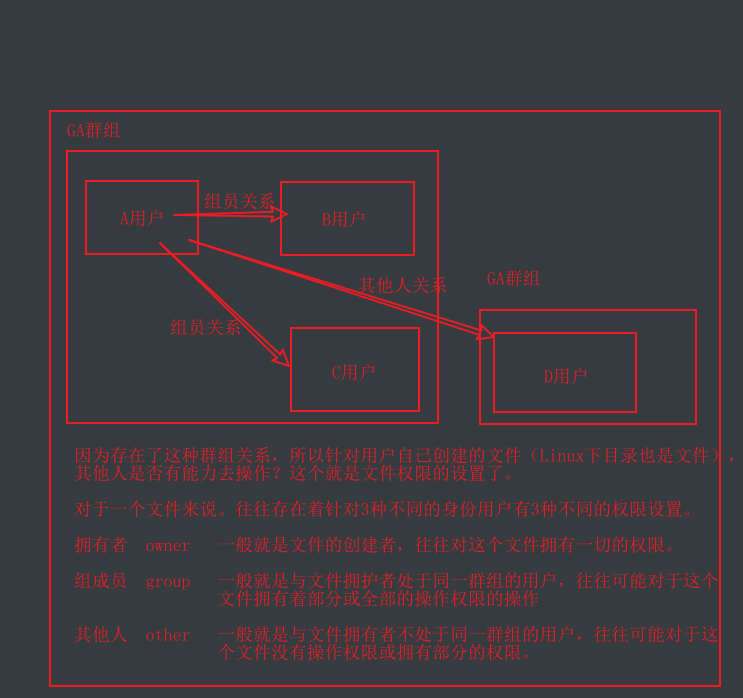

**组管理**

可以通过 `cat  /etc/group` 查看当前系统创建了哪些群组

*   `groupadd`
*   `groupmod`
*   `groupdel`

```bash
groupadd 组名
# 查看用户属于哪一个群组下的，有3种方式：
# 查看家目录的文件列表
cd /home
ll
# drwxr-xr-x  3 fuguang fuguang 4096 Aug 30 02:29 fuguang/
# 查看/etc/passwd文件里面的群组ID
cat /etc/group
api:x:1002:fuguang

# 查看用户加入了哪些群组？ groups 用户名
groups xiaoming
# xiaoming : xiaoming fuguang

# 列出一个群组下所有的成员
grep 'fuguang' /etc/group | awk -F":" '{print $1,$4}' # 结果：fuguang xiaoming,xiaohong
```

**批量管理用户**：

*   成批添加/更新一组账户：`newusers`
*   成批更新用户的口令：`chpasswd`

**组成员管理**：

*   向组中添加用户
    -   `gpasswd -a <用户账号名> <组账号名>`
    -   `usermod -G <组账号名> <用户账号名>`
*   从组中删除用户
    -   `gpasswd -d <用户账号名> <组账号名>`

**密码管理**(禁用、恢复和删除用户密码)：

*   **设置用户密码**：
    -   `passwd [<用户账号名>]`
*   禁用用户账户密码
    -   `passwd -l <用户账号名>`
*   查看用户账户密码状态
    -   `passwd -S <用户账号名>`
*   恢复用户账户密码，与上面的禁用相对应
    -   `passwd -u <用户账号名>`
*   清除用户账户密码
    -   `passwd -d <用户账号名>`

**用户切换命令**：

*   `su`
    -   直接切换为超级用户
*   `sudo`
    -   直接使用 sudo 命令前缀执行系统管理命令。执行系统管理命令时无需知道超级用户的口令，使用普通用户自己的口令即可，相当于windows下的“以管理员身份运行”。

关于文件，Linux下一般针对每个用户和用户不同的身份，有以下3种不同的操作权限：

| 权限               | 二进制 | 十进制 | 对文件的影响   | 对目录的影响                  |
| ------------------ | ------ | ------ | -------------- | ----------------------------- |
| r（Read, 读取）    | 100    | 4      | 可读取文件内容 | 可列出目录下的所有文件/子目录 |
| w（Write，写入）   | 010    | 2      | 可修改文件内容 | 可在目录中创建删除文件/子目录 |
| x（eXecute，执行） | 001    | 1      | 可作为命令执行 | 可访问目录下的所有文件的内容  |

注意：目录必须拥有 x 权限，否则无法查看其内部的文件内容。

Linux下文件的权限记录，针对rwx，采用的是二进制表示法。

```bash
# Linux下的权限在底层是基于二进制实现的，但是对于外层用户操作时，是可以使用十进制或者字符表示的。
r  w  x    字符
4  2  1    十进制
1  1  1    二进制

# 关于某一个用户对于单个文件的权限，常见有以下几种权限设置：
111  --> 7 表示当前用户对文件拥有可读可写可执行的所有权限
110  --> 6 表示当前用户对文件拥有可读可写的权限
101  --> 5 表示当前用户对文件只拥有可读可执行的权限
100  --> 4 表示当前用户对文件只拥有可读的权限
011  --> 3 表示当前用户对文件只拥有可写可执行的权限
010  --> 2 表示当前用户对文件只拥有可写的权限
001  --> 1 表示当前用户对文件只拥有可执行的权限
000  --> 0 表示当前用户对文件没有任何操作权限

# Linux下一个文件往往不会仅针对一个用户设置权限，而是针对整个系统下所有用户分配权限，
# 所以一个文件往往会针对当前文件的拥有者、组成员以及其他人同一分配权限的。
# 777  ---> 分别指代3个数字，代表了文件拥有者、文件组成员、其他人的三种身份对于当前文件的操作权限
# rwxrwxrwx  三段rwx，代表了文件拥有者、文件组成员、其他人的三种身份对于当前文件的操作权限，-表示没有对应权限
# 举例：
700 => rwx --- --- =>  文件拥有者具有一切(可读可写可执行)权限，组成员和其他人没有任何操作权限【常见于文件】
644 => rw- r-- r-- =>  文件拥有者可读可写，组成员和其他人可读【常见于目录】
755 => rwx r-x r-x =>  文件拥有者具有一切权限，组成员和其他人可读可执行【常见于目录】
777 => rwx rwx rwx =>  任何人都能对当前文件进行任意操作【这种少见，建议慎用！！！】
```

对于ll命令的结果说明

```bash
lrwxrwxrwx   1 root root          9 Feb  1  2021 lib32 -> usr/lib32/
lrwxrwxrwx   1 root root          9 Feb  1  2021 lib64 -> usr/lib64/
lrwxrwxrwx   1 root root         10 Feb  1  2021 libx32 -> usr/libx32/
drwx------   2 root root      16384 Aug 26 04:38 lost+found/
drwxr-xr-x   2 root root       4096 Feb  1  2021 media/
drwxr-xr-x   2 root root       4096 Feb  1  2021 mnt/
drwxr-xr-x   2 root root       4096 Feb  1  2021 opt/
dr-xr-xr-x 279 root root          0 Aug 30 00:23 proc/
drwx------   4 root root       4096 Aug 27 04:41 root/
drwxr-xr-x  27 root root        860 Aug 30 02:29 run/
lrwxrwxrwx   1 root root          8 Feb  1  2021 sbin -> usr/sbin/
drwxr-xr-x   6 root root       4096 Feb  1  2021 snap/
drwxr-xr-x   2 root root       4096 Feb  1  2021 srv/
-rw-------   1 root root 2147483648 Aug 26 05:49 swap.img
dr-xr-xr-x  13 root root          0 Aug 30 00:23 sys/
drwxrwxrwt  12 root root       4096 Aug 30 01:22 tmp/
drwxr-xr-x  14 root root       4096 Feb  1  2021 usr/
drwxr-xr-x  13 root root       4096 Feb  1  2021 var/

# 左边第1个字母，表示文件类型，常见文件类型：目录（d）、文件（-）、链接（l）
# 左边第2~10个字母，表示当前文件拥有者(2~4)、文件组成员(5~7)以及其他人(8~10)对于当前文件的操作权限。

# 命令别名，可以把一些相对比较长，或者参数较多的命令，起一个简单的别名进行调用。
# ll实际上就是ls -l的简写
alias ll='ls -l'

# 通过 alias 可以查看当前系统下所有的别名命令。
alias

# 一般工作中，我们为了保证系统安全，往往会设置rm成其他的操作，避免出现误删的情况。
alias rm='echo "rm命令已经被禁用，请改用替换操作：mv"'
# 删除别名
unalias 别名

# 文件权限操作
# chown # 分配文件给指定用户作为拥有者
# chown 用户名 文件名
chown xiaohong demo.txt          # 把指定文件demo.txt的拥有者分配给xiaohong
chown xiaohong:xiaohong demo.txt # 把指定文件demo.txt的拥有者分配给xiaohong，并分配组给xiaohong用户组

# chgrp 分配文件给指定的群组
	# chgrp 组名 文件名

# chmod 分配文件权限给指定用户
#   参数选项：
#   -c : 若该文件权限确实已经更改，才显示其更改动作
#   -f : 若该文件权限无法被更改也不要显示错误讯息
#   -v : 显示权限变更的详细资料
#   -R : 对目前目录下的所有文件与子目录进行相同的权限变更(即以递回的方式逐个变更)

# 基于chmod分配权限一般2种写法：
# 字母表示权限
#     a 表示all，同时给拥有者，组员和其他人分配权限
#     u 表示user，表示给拥有者分配权限
#     g 表示group，表示给组员分配权限
#     o 表示other，表示给其他人分配权限

# 单独给拥有者设置文件的权限为可读可写可执行，组员和其他人的权限没有任何改变
chmod u+rwx demo.txt
# 设置文件权限，拥有者(u)拥有可读可写可执行，组员(g)拥有可读可写，其他人（o）可执行的权限
chmod u+rwx,g+rw,o+r demo.txt   # rwxrw-r--
# 设置文件权限，拥有者(u)移除可执行，组员(g)移除可写，其他人（o）移除可读的权限
chmod u-x,g-w,o-r demo.txt
# 给所有人同时增加或减少权限
chmod a+r demo.txt
chmod a-wrx demo.txt

# 数字表示权限
chmod 777 demo.txt
chmod 755 demo.txt
chmod 644 demo.txt
chmod 700 demo.txt

# 注意：对于系统中的一切权限来说，root都是至高无上的。
```

### 系统时间更新

针对CentOS的时间设置，网络配时。

```bash
# 设置系统时区位亚洲/上海
timedatectl set-timezone Asia/Shanghai

# CentOS: yum install -y chrony
# systemctl start chronyd
```

针对linux/Ubuntu时间需要设置成网络配时的话，可以按以下方式：

```bash
sudo tzselect
# 选项Asia 4
# 选项China 9
# 选项beijing 1
# 选项Yes 1

# 复制时区文件
sudo cp /usr/share/zoneinfo/Asia/Shanghai /etc/localtime
# 安装ntp时间服务器
sudo apt install -y ntpdate
# 同步ntp时间服务器
sudo ntpdate time.windows.com
# 将系统时间与网络同步
sudo ntpdate cn.pool.ntp.org
# 将时间写入硬件
sudo hwclock --systohc
# 重启Ubuntu
reboot
```

### 计划任务-crontab

#### 查看服务是否运行

```bash
# CentOS
systemctl status crond
# ubuntu下则是systemctl status cron

# 列出所有任务计划
crontab -l
# 基于vi编辑器打开并编辑计划任务的配置文件，保存即生效。
crontab -e
# 删除所有计划任务，慎用！
crontab -r
# 如果要删除单个计划任务，直接通过crontab -e 打开计划任务的配置文件，删除任务即可。
```

#### crontab定时任务配置


```
# 五个星分别代表分时日月周
*  *  *  *  *
分 时 日 月 周
```

例: 设置一个每分钟执行一次的定时任务

```bash
crontab -e  # 打开定时任务配置文件，进行编辑
# 写入定时任务代码
# 快捷键 i 进入vim的编辑模型，并输入计划任务。计划任务中只识别绝对路径！！！
* * * * * echo "山外青山楼外青楼" >> /home/1.html
# 如果将来不需要执行这个任务，直接通过crontab -e 进去找到并删除即可。
```

计划任务相关：

```bash
# 强调！所有命令操作的文件路径一定要用绝对路径来写！！！

# 每分钟执行一次命令
* * * * * 执行命令
# * * * * * python /home/1.py

# 每小时的0,15,30,45分钟执行命令
0,15,30,45 * * * * 执行命令
# */15 * * * * 执行命令

# 在上午8-11点的第5和第15分钟执行命令
5,15 8-11 * * * 执行命令

# 每晚21:30执行命令
30 21 * * * 执行命令

# 每天早上6点，中午12点，执行命令
0 6,12 * * * 执行命令

# 每周六、日的凌晨1：30执行命令
30 1 * * 6,0 执行命令

# 每周一到周五的凌晨1点，清空/tmp目录的所有文件
0 1 * * 1-5 rm -rf /tmp/*

#每月的5,15,25日的16:45执行命令
45 16 5,15,25 * * 执行命令

# 每个星期一的上午8点到11点的03分和15分执行命令
03,15 8-11 * * 1 执行命令

# 每月1号凌晨1:30，定时备份数据库school到/home/data目录下
30 1 1 * * mysqldump -uroot -p123 school>/home/data/school.sql

# 每年的1月1号凌晨00:00 执行命令
* * 1 1 * 执行命令
```

### SSH

ssh（ Secure Shell，安全外壳协议），是一种可靠的，专为远程登录会话和其他网络服务提供安全性的协议。最初是UNIX系统上的一个程序，后来又迅速扩展到其他操作平台。简而言之，就是说白了，就是一种网络协议，**用于计算机之间的加密登录**。当然基于ssh协议实现的程序有商业收费的，也有社区免费的。我们可以在windows下安装putty、xshell来帮助我们远程登录，也可以ssh命令来操作。
SSH的默认端口是22。

```bash
# 语法：
ssh 用户名@主机地址  # 有时为安全考虑，运维人员会修改ssh端口，则客户端需要指定端口：ssh -p 端口 用户名@主机地址
# 退出ssh远程登录
exit
```

注意，首次使用ssh登录到远程主机，需要手动输入yes记录主机的指纹信息，如下图所示：

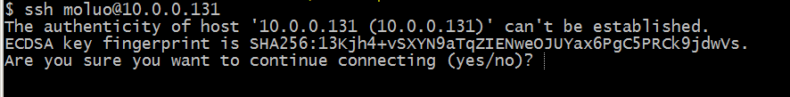

#### 基于ssh实现免密登录

所谓的免密登录就是基于rsa加密算法生成一对成对的秘钥对。然后当前主机保管私钥，把公钥上传到远程主机，这样以后登陆时仅需要验证公私钥即可，不再需要密码登陆了。

```bash
# 第一步：生成秘钥对。私钥和公钥成对才能匹配成功，秘钥文件默认保存在~/.ssh/目录下。
# 私钥文件名：id_rsa
# 公钥文件名：id_rsa.pub
ssh-keygen # 连续三下回车

# 第二步： 将公钥文件信息上传到需要被管理的主机上，远程服务器中的公钥保存目录就在该服务器的家目录下~/.ssh/authorized_keys
ssh-copy-id root@47.98.130.212
```

#### 基于ssh实现文件上传下载

scp（secure copy）是一个基于 SSH 协议在网络之间文件进行安全传输的命令。

```bash
# 语法：
# scp 【可选参数】 源目录/目标文件  新目录/目标文件
    # 可选参数：
    # -r：递归复制整个目录【强烈建议尽量是采用压缩包的上传】
    # -v：详细方式输出
    # -q：不显示传输进度条
    # -C：允许压缩
    # -6：使用 IPv6 协议

# 上传本地文件到远程地址
    # scp 本地目录/本地文件  远程用户名@远程ip:远程目录/               # 不修改文件名，直接上传
    # scp 本地目录/本地文件  远程用户名@远程ip:远程目录/远程文件名      # 修改文件名，再上传
    # scp -r 本地目录  远程用户名@远程ip:远程目录
scp /e/python36/day81/fuguang.zip  root@10.0.0.129:/home/

# 下载远程文件到本地
    # scp 远程用户名@远程ip:远程目录/远程文件名 本地目录/              # 不修改文件名，直接下载
    # scp 远程用户名@远程ip:远程目录/远程文件名 本地目录/本地文件       # 修改文件名，再下载
    # scp -r 远程用户名@远程ip:远程目录 本地目录
scp -r root@10.0.0.129:/home/abc.html /d/python35/day94/
```

### 链接操作

Linux下所谓的链接文件，其实就是类似windows 下的快捷方式的文件。主要为了保证源文件的安全和调用路径方便而使用的。

Linux下链接有2种：软链接和硬链接。

注意：链接使用的路劲必须是绝对路径，否则链接无效。无效的链接的字样为红色闪烁。

删除链接并不影响源文件的内容，但是修改了链接的内容，会影响到源文件内容。

```bash
ln -s 源文件 目标文件    # 创建软链接(Symbolic Link)
ln    源文件 目标文件    # 创建硬链接(Hard Link)

# 当删除源文件时，硬连接不受影响，但是软链接文件会失效。
# 软链接在Linux系统中，就是一个符号通道，方便访问和操作源文件的。
# 硬链接在Linux系统中，就是一个特殊文件，与源文件进行关联的。
```

当源文件被删除以后，软链接会出现失效闪烁。当源文件被修改文件名，就会失效闪烁。

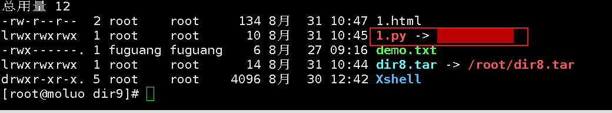

当源文件被删除以后，硬链接还可以继续操作内容，不被影响。当源文件被修改文件名，还会继续关联。

### Linux下的常用配置文件

#### 网卡配置

在VMware中获取网关gateway，可以通过VMware左上角的编辑菜单->虚拟网络编辑器得到网关是 `10.0.0.2` 。

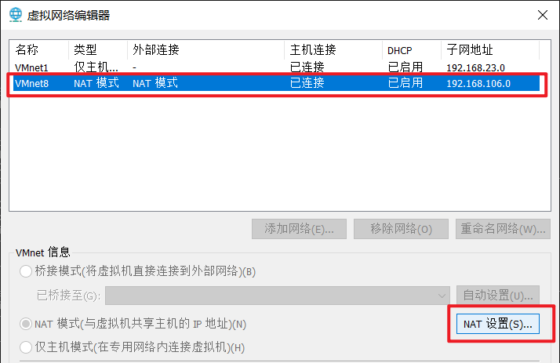

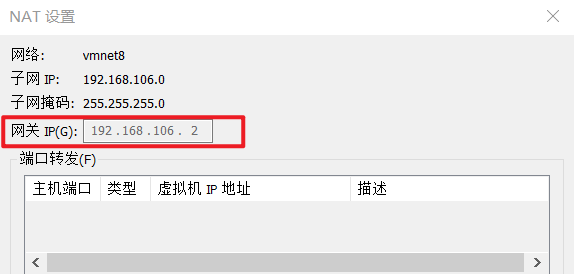

##### CentOS配置网卡

```bash
vim /etc/sysconfig/network-scripts/ifcfg-ens33  # CentOS网卡配置文件，可以通过ip a来查看，这里是ens33
```

```bash
TYPE=Ethernet
PROXY_METHOD=none
BROWSER_ONLY=no
# BOOTPROTO=dhcp # dhcp修改成static
BOOTPROTO=static
DEFROUTE=yes
IPV4_FAILURE_FATAL=no
IPV6INIT=yes
IPV6_AUTOCONF=yes
IPV6_DEFROUTE=yes
IPV6_FAILURE_FATAL=no
NAME=ens33
UUID=506f728f-b722-406b-ac13-a5d00ea49ba6
DEVICE=ens33
ONBOOT=yes
# 以下新增：
IPADDR=10.0.0.129
GATEWAY=10.0.0.254
DNS1=10.0.0.254
NETMASK=255.255.255.0
```

重启网卡

```bash
ifdown ens33 && ifup ens33
```

##### Ubuntu配置网卡

```bash
sudo vim /etc/netplan/00-installer-config.yaml
# 开发中常见的配置文件：json、yaml、ini、xml、conf
```

```bash
# This is the network config written by 'subiquity'
network:
  ethernets:
    ens33:
      dhcp4: no
      dhcp6: no
      addresses:
        - 10.0.0.130/24
      gateway4: 10.0.0.254
      nameservers:
        addresses: [10.0.0.254]
  version: 2
```

保存网卡配置，重启生效

```bash
sudo netplan apply
```

#### 其他配置

```bash
# 修改机器名以及网卡，网管等配置
/etc/sysconfig/network # CentOS
/etc/netplan           # ubuntu

# linux的dns客户端配置文件，实现域名和ip的互相解析
/etc/resolv.conf
# 本地dns解析文件,设定ip和域名的对应解析,开发测试最常用的临时域名解析
/etc/hosts

# 系统全局环境变量永久生效的配置文件,如PATH等
/etc/profile    # 格式： export 变量名=变量值

# 用户的环境变量
~/.bash_profile
~/.bashrc
# 使用上面的环境变量修改立即生效
source profile

# 存放可执行程序的目录，大多是系统管理命令
/usr/sbin

# 存放用户自编译安装软件的目录  > 等同于C:\Program files （windows）
/usr/local
```

## 网络安全

### SELinux

SELinux（Security-Enhanced Linux，美国国家安全局NSA开发的访问控制机制），SELinux可以最大限度地保证Linux系统的安全。如果没有SELinux的话，Linux和windows的安全防范级别就是一样的了。很容易招受到黑客的攻击。 但是这玩意不是一般人能弄得明白。会的人不愿意折腾，不会的人一脸懵逼。所以市面上基本上大部分的公司都是采用其他的方式来保证主机的安全，而选择永久关闭SELinux。

ubuntu是Linux中提供给个人开发者的一个分支，所以默认是没有安装这个SELinux的。

```bash
# 临时关闭selinux
setenforce 0

# 开启selinux
# setenforce 1

# 查看启用状态，Enforcing运行状态，Permissive关闭状态，Disabled禁用状态
getenforce
# 永久关闭selinux，有2种方式：
# 方式1：
# sed -i "s/SELINUX=enforcing/SELINUX=disabled/g" /etc/selinux/config

# 方式2：
# 1. vim打开配置文件，将SELINUX=enforcing改为disabled
vim /etc/selinux/config
# This file controls the state of SELinux on the system.
# SELINUX= can take one of these three values:
#     enforcing - SELinux security policy is enforced.
#     permissive - SELinux prints warnings instead of enforcing.
#     disabled - No SELinux policy is loaded.
# SELINUX=enforcing
SELINUX=disabled
# 2. 保存退出，并检查状态
:wq

grep "SELINUX=disabled" /etc/selinux/config
# 出现disabled结果即表示修改成功
```

### 防火墙

centos 8默认使用firewall作为防火墙。而Ubuntu20.04一般都默认安装了UFW作为防火墙。

通用命令使用

```bash
iptables -L # 查看防火墙规则[刚安装的机子是没有任何的规则配置的]
iptables -F # 清空防火墙规则
```

#### firewall

```bash
# 1.防火墙的开启和关闭
systemctl status firewalld  # 查看防火墙状态
systemctl start firewalld   # 开启防火墙
systemctl stop firewalld    # 关闭防火墙
systemctl enable firewalld  # 设置防火墙开机自启
systemctl disable firewalld # 关闭防火墙开机自启
systemctl is-enabled firewalld # 检查防火墙是否启动 enabled表示已设置开机自启，disabled表示禁用

# 2. 设置防火墙规则
firewall-cmd --reload                        # 更新防火墙规则【重点：修改了防火墙规则必须更新以后才生效！！！】
firewall-cmd --list-ports                    # 查看所有打开的端口
firewall-cmd --list-services                 # 查看所有允许的服务

# 开放端口   --permanent表示永久生效的意思
firewall-cmd --add-port=80/tcp --permanent        # 设置开放80端口，并永久生效  http
firewall-cmd --add-port=443/tcp --permanent       # 设置开放443端口，并永久生效  https
firewall-cmd --add-port=3306/tcp --permanent      # 设置开放3306端口，并永久生效 mysql
firewall-cmd --add-port=6379/tcp --permanent      # 设置开放6379端口，并永久生效 redis
firewall-cmd --add-port=27017/tcp --permanent     # 设置开放6379端口，并永久生效 mongoDB
firewall-cmd --add-port=8000-8008/tcp --permanent # 设置开放8000至8008这几个连续的端口，并永久生效
firewall-cmd --reload  # 每次开发/关闭端口或服务，必须更新防火墙规则，否则不生效

# 关闭端口
firewall-cmd --remove-port=80/tcp --permanent        # 设置关闭80端口，并永久生效   http
firewall-cmd --remove-port=443/tcp --permanent       # 设置关闭443端口，并永久生效  https
firewall-cmd --remove-port=3306/tcp --permanent      # 设置关闭3306端口，并永久生效 mysql
firewall-cmd --remove-port=6379/tcp --permanent      # 设置关闭6379端口，并永久生效 redis
firewall-cmd --remove-port=27017/tcp --permanent     # 设置关闭6379端口，并永久生效 mongoDB
firewall-cmd --remove-port=8000-8008/tcp --permanent # 设置关闭8000至8008这几个连续的端口，并永久生效

# 这里我们先开放80、443、3306、6379和8000-8008
firewall-cmd --reload
firewall-cmd --list-ports
# 80/tcp 443/tcp 3306/tcp 6379/tcp 8000-8008/tcp

# 开放服务
firewall-cmd --add-service=mysql --permanent

# 关闭服务
firewall-cmd --remove-service=mysql --permanent
firewall-cmd --reload
firewall-cmd --list-services
```

#### UFW

Ubuntu是面向个人开发者的Linux版本，所以默认情况下UFW是关闭状态的。

```bash
# 1.防火墙的开启和关闭
sudo ufw enable    # 开启防火墙
sudo ufw disable   # 关闭防火墙
sudo ufw status    # 查看防火墙状态，并列出所有规则。active表示开启，inactive表示关闭。默认关闭。
sudo ufw status verbose # 查看防火墙状态的详细信息，并列出所有规则。

# 开放端口
sudo ufw allow 22/tcp    # 设置开发22端口  ssh
sudo ufw allow 80/tcp    # 设置开放80端口  http
sudo ufw allow 443/tcp   # 设置开放443端口 https
sudo ufw allow 3306/tcp  # 设置开放3306端口  mysql
sudo ufw allow 6379/tcp  # 设置开放6379端口  redis

# 关闭端口
sudo ufw delete allow 80/tcp
sudo ufw delete allow 443/tcp
sudo ufw delete allow 3306/tcp
sudo ufw delete allow 6379/tcp
```

## 开发软件的安装和管理

01. 开发软件安装和配置

02. 开发环境的搭建和项目的部署

开发软件的安装和开发环境的搭建，都需要安装程序，而Linux系统下安装程序的方式无非2大类：

*   源码包

*   包管理器

### 软件包管理

```bash
Linux下最初只有tar.gz这样的源码包。但是Linux中的程序大多是小程序，程序与程序之间存在非常复杂的依赖关系，这些小程序的源码包的管理就是一个很让人头疼的问题。

dpkg（Debian package），是Debian软件包管理器的底层实现基础。
apt-get是早期Debian实现的包管理器，在16.04以后新出炉的apt比apt-get更好用。但是apt毕竟是刚出的，所有有时候有些操作还是要使用apt-get的。
apt（Advanced Packaging Tool，Linux高级打包工具）是一款基于Debian分支的所有Linux发行版本的包管理器，构建于dpkg之上。

deb，是Debian软件包格式的文件扩展名。一般使用dpkg或apt安装的软件包都是这个扩展名。
deb包在 Linux操作系统中类似于windows中的 软件包（exe)，几乎不需要什么复杂的编译即可通过鼠标点击安装使用。

rpm（Red-Hat Package Manager，红帽软件包管理器），是一款由红帽公司在APT基础上研发出来的包管理器。
用RPM工具可以将二进制程序进行打包，包被称为RPM包。RPM无法解决软件包的依赖关系，所以依赖yum自动解决软件依赖性。

yum（Yellow dog Updater, Modified）是一款在Fedora和RedHat以及CentOS中的软件包管理器的前端工具。基于RPM包管理，能够从指定的软件源服务器自动下载RPM包并且安装，可以自动处理依赖性关系，并且一次安装所有依赖的软件包，无须繁琐地一次次下载、安装。
```

#### dpkg[扩展]

```bash
dpkg -i 包名.deb              # 安装包
dpkg -r 包名                  # 删除包
dpkg -P 包名                  # 删除包（包括配置文件）
dpkg -L 包名                  # 列出与该包关联的文件
dpkg -l 包名                  # 显示该包的版本
dpkg --unpack 包名.deb        # 解开 deb 包的内容
dpkg -S keyword               # 搜索所属的包内容
dpkg -l                       # 列出当前已安装的包
dpkg -c 包名.deb              # 列出 deb 包的内容
dpkg --configure 包名         # 配置包
```

#### apt

| apt 命令           | 取代的命令           | 命令的功能                           |
| :----------------- | :------------------- | :----------------------------------- |
| **apt install**    | apt-get install      | 安装软件包                           |
| **apt remove**     | apt-get remove       | 移除软件包                           |
| apt purge          | apt-get purge        | 移除软件包及配置文件                 |
| apt update         | apt-get update       | 刷新存储库索引                       |
| apt upgrade        | apt-get upgrade      | 升级所有可升级的软件包               |
| **apt autoremove** | apt-get autoremove   | 自动删除不需要的包，自动删除依赖。   |
| apt full-upgrade   | apt-get dist-upgrade | 在升级软件包时自动处理依赖关系       |
| apt search         | apt-cache search     | 搜索应用程序                         |
| apt show           | apt-cache show       | 显示安装细节                         |
| apt list           |                      | 列出包含条件的包（已安装，可升级等） |

#### rpm[扩展]

```bash
# 安装软件包
rpm -ivh 包名.rpm
# 卸载软件包
rpm -e 包名.rpm
# 查询包是否已经安装
rpm -q 包名
# 升级软件包
rpm -Uvh 包名.rpm
# 查询软件包的描述信息
rpm -qpi 包名.rpm
# 列出软件文件信息
rpm -qpl 包名.rpm
```

#### yum

```bash
yum install 软件包名     # 安装软件包
yum reinstall 软件包名   # 重新安装软件包
yum update    软件包名   # 升级软件包
yum search 关键字        # 搜索包含关键字的软件包
yum remove    软件包名   # 移除软件包
yum clean all           # 清除所有仓库缓存
yum makecache           # 创建新的缓存
yum repolist all        # 列出所有仓库
yum list all            # 列出仓库所有软件包
yum info 软件包名        # 查看软件包信息
yum check-update        # 检查可以更新的软件包
yum grouplist           # 查看系统中已安装的软件包
```

### 系统服务管理

systemctl是一个非常强大的Linux的进程管理系统，为Linux系统的启动和管理提供一套完整的解决方案。systemctl的优点是功能强大，使用方便，缺点是体系庞大，非常复杂。它为Linux提供了一整套命令系统，涉及到系统管理的方方面面。这里我们只是简单介绍几个基础命令。

```bash
systemctl restart 服务名 # 重启服务
systemctl start 服务名   # 启动服务
systemctl stop 服务名    # 停止服务
systemctl status 服务名  # 查看服务状态【红色表示关闭、错误；绿色表示正常运行，白色表示启动中】
systemctl enable 服务名  # 设置服务开机自启
systemctl disable 服务名 # 设置关闭开机自启
systemctl is-enabled 服务名 # 检查服务是否设置了开机自启 enabled表示已设置开机自启，disabled表示禁用
```

### 开发软件的安装和配置

#### python环境搭建

##### 源码包安装

01. 下载python源码包

```bash
# CentOS: yum install -y wget
cd /usr/local/src
wget https://www.python.org/ftp/python/3.8.12/Python-3.8.12.tgz
# curl -O https://www.python.org/ftp/python/3.8.12/Python-3.8.12.tgz
```

02. 下载python3编译的依赖包

```bash
yum install -y gcc make openssl-devel zlib-devel  libffi-devel
```

03. 解压缩源码包

```bash
tar -zxvf Python-3.8.12.tgz
```

04. 进入源码包文件夹

```bash
cd  Python-3.8.12  # 进入源码包文件夹
```

05. 编译且安装
    (1) 进入源码包目录

​    (2) ls查看源码包内容

​    (3) 释放编译文件 Makefile

```bash
./configure --prefix=/opt/python38  # 此处，表示设置软件安装路径为/opt/python38
```

​    (4) 编译

```
make
```

​    (5) 编译安装, 此步才会最终生成 /opt/python38/

```
make install
```

​    (6) 进入/opt目录查看python38文件夹, 我们要的python3都在这里了

```bash
cd /opt/python38
ln -s /opt/python38/bin/python3.8   /opt/python38/bin/python
```

​    (7) 更改linux的path环境变量，添加python相关的环境变量

```bash
# 查看系统环境变量
echo $PATH
# /usr/local/sbin:/usr/local/bin:/usr/sbin:/usr/bin:/root/bin
```

​    一定要将python3.8的目录放在第一位

```bash
# 添加环境变量，在/etc/profile文件最后添加一行
# 记住一定要将python3的目录放在第一位
vi /etc/profile
PATH=$PATH:/opt/python38/bin:/usr/local/sbin:/usr/local/bin:/usr/sbin:/usr/bin:/root/bin
:wq
```

 为了永久生效path设置，添加到/etc/profile全局环境变量配置文件中
 重载配置文件/etc/profile

```
source /etc/profile
```

##### 包管理器安装

```bash
# centOS
# yum install -y python38 python38-pip && pip3 install setuptools
# Ubuntu
apt-get install -y python3.8
# 默认python命令：/usr/bin/python3.8
ln -s /usr/bin/python3.8   /usr/bin/python
```

#### 虚拟环境安装

主流的虚拟环境管理工具：anaconda（miniconda3）、virtualenv

安装虚拟环境miniconda3，https://conda.io/en/latest/miniconda.html

anaconda是一个开发中常用的环境工具，但是安装过程中，本身体量太大，内置将近200多个安装包，所以我们一般在公司服务器会使用miniconda来代替anaconda。miniconda本质上就是anaconda的轻量级版本，没有内置的安装包。

CentOS下安装miniconda

```bash
cd /usr/local/src
wget https://repo.anaconda.com/miniconda/Miniconda3-py39_4.10.3-Linux-x86_64.sh
bash Miniconda3-py39_4.10.3-Linux-x86_64.sh
# In order to continue the installation process, please review the license
# agreement.
# Please, press ENTER to continue
# >>>
回车查看协议
q退出
yes  # 表示同意协议
# Anaconda3 will now be installed into this location:
# /root/anaconda3         # anaconda的默认安装目录
/usr/local/anaconda3/     # 改成其他目录
# installation finished.
# Do you wish the installer to initialize Anaconda3
# by running conda init? [yes|no]
yes

# 经过上面操作，就表示miniconda安装成功了。
# 接着anaconda建议关闭conda自动进入全局base虚拟环境，可以执行以下命令，当然执行了以后会提示conda命令不存在。
# conda config --set auto_activate_base false

# 接下来配置conda的相关环境信息，让linux能识别conda命令
# 在/etc/profile文件尾部添加conda的路径
vim /etc/profile

export ANACONDA_PATH=/usr/local/anaconda3
export PATH=$PATH:$ANACONDA_PATH/bin

# :wq，保存退出，并重载配置，让配置生效
source /etc/profile

# 验证是否配置成功
conda --version
conda config --set auto_activate_base false
python  # 此处可以看到，我们还在全局环境下，并没有进入 conda 的 base全局虚拟环境，
# 所以可以通过conda创建虚拟环境，当然也可以进入conda默认提供的base全局虚拟环境中。
conda create -n djdemo python=3.8 django==3.2.5 pymysql
# 进入虚拟环境
conda activate djdemo

# 1. 家目录下创建一个工程目录
cd /home/
mkdir www && cd www

# 2. 安装虚拟环境
# 3. 创建一个django项目，目录名为djdemo
django-admin startproject djdemo
# 3. 进入django目录，启动项目
cd djdemo
python manage.py runserver 0.0.0.0:8000

# 当然，此时可以通过其他的系统访问到http://10.0.0.129:8000/，可以看到错误提示如下：
# Invalid HTTP_HOST header: '10.0.0.129:8000'. You may need to add '10.0.0.129' to ALLOWED_HOSTS.
# 开启远程访问的白名单：
sed -i "s/ALLOWED_HOSTS = \[\]/ALLOWED_HOSTS = \[\"*\"\]/g" /home/www/djdemo/djdemo/settings.py

# 4. 注意，是否已经开放了8000端口
firewall-cmd --list-ports
# 如果未开放，则操作如下开放端口：
# firewall-cmd --add-port=8000/tcp --permanent
# firewall-cmd --reload
# firewall-cmd --list-ports

# 5. 在windows或其他系统下，直接通过IP:8000再次即可访问。
```

#### mysql（MariaDB）

##### 安装使用

1  由于官网的MariaDB版本要比国内服务器商（如阿里云）的版本要高，所以我们应该优先使用官方的稳定版本

```bash
# 添加MariaDB yum仓库
# 1、首先在 RHEL/CentOS 和 Fedora 操作系统中添加 MariaDB 的 YUM 配置文件 MariaDB.repo 文件。

# 编辑创建mariadb.repo仓库文件，MariaDB.repo是我们新建的源文件
vim /etc/yum.repos.d/MariaDB.repo
```

2、添加repo仓库配置，:wq保存退出。

```bash
[mariadb]
name=MariaDB
baseurl=https://yum.mariadb.org/10.5.13/centos8-amd64
module_hotfixes=1
gpgkey=https://yum.mariadb.org/RPM-GPG-KEY-MariaDB
gpgcheck=1
```

3、当 MariaDB 仓库地址添加好后，你可以通过下面的一行命令轻松安装 MariaDB。

```
sudo yum install -y MariaDB-server MariaDB-client
```

4、如果官方的版本下载太慢，我们就直接使用国内镜像站提供的版本。修改MariaDB.repo，接着执行第3步。如果上面安装，忽略这一步。

```bash
vim /etc/yum.repos.d/MariaDB.repo
```

```bash
[mariadb]
name=MariaDB
baseurl=https://mirrors.tuna.tsinghua.edu.cn/mariadb/mariadb-10.5.13/yum/centos8-amd64
module_hotfixes=1
gpgkey=https://yum.mariadb.org/RPM-GPG-KEY-MariaDB
gpgcheck=1
```

清华源：https://mirrors.tuna.tsinghua.edu.cn/

清华源MariaDB仓库：https://mirrors.tuna.tsinghua.edu.cn/mariadb

5  启动mariadb命令

```bash
ss -ntl  # 查看端口监听情况，mySQL默认使用3306端口
systemctl status mariadb   # 设置开机启动，别名：systemctl status mysql
systemctl start mariadb    # 启动MariaDB，别名：systemctl start mysql
# systemctl stop mariadb   # 停止MariaDB，别名：systemctl stop mysql
# systemctl restart mariadb  # 重启MariaDB，别名：systemctl restart mysql
systemctl enable mariadb   # 设置开机启动，别名：systemctl enable mysql
rpm -ql MariaDB-server     # 查看配置文件
```

6 初始化mysql，进入mysql安装引导程序。

```
mysql_secure_installation
```

```bash
# (djdemo) [root@moluo myproject]# mysql_secure_installation

# NOTE: RUNNING ALL PARTS OF THIS SCRIPT IS RECOMMENDED FOR ALL MariaDB
#       SERVERS IN PRODUCTION USE!  PLEASE READ EACH STEP CAREFULLY!

# In order to log into MariaDB to secure it, we'll need the current
# password for the root user. If you've just installed MariaDB, and
# haven't set the root password yet, you should just press enter here.

# Enter current password for root (enter for none):
刚安装数据库没有设置密码，所以直接回车键
# OK, successfully used password, moving on...

# Setting the root password or using the unix_socket ensures that nobody
# can log into the MariaDB root user without the proper authorisation.

# You already have your root account protected, so you can safely answer 'n'.

# Switch to unix_socket authentication [Y/n]
y # 切换到socket认证流程中，进入修改root用户密码的流程
# Enabled successfully!
# Reloading privilege tables..
#  ... Success!

# You already have your root account protected, so you can safely answer 'n'.

# Change the root password? [Y/n]
y # 此处表示是否设置root用户的密码，因为原来没有密码所以要设置一下
# New password:
输入新密码
# Re-enter new password:
再次输入新密码   # 生产环境下一定设置一个非常靠谱的密码，然后一般运维人员都会设置非常复杂
# Password updated successfully!
# Reloading privilege tables..
#  ... Success!

# By default, a MariaDB installation has an anonymous user, allowing anyone
# to log into MariaDB without having to have a user account created for
# them.  This is intended only for testing, and to make the installation
# go a bit smoother.  You should remove them before moving into a
# production environment.

# Remove anonymous users? [Y/n]
y # 是否删除匿名用户
#  ... Success!

# Normally, root should only be allowed to connect from 'localhost'.  This
# ensures that someone cannot guess at the root password from the network.

# Disallow root login remotely? [Y/n]
y # 是否禁止root远程登录，生产环境下肯定是禁止的
#  ... Success!

# By default, MariaDB comes with a database named 'test' that anyone can
# access.  This is also intended only for testing, and should be removed
# before moving into a production environment.

# Remove test database and access to it? [Y/n]
y # 删除默认提供的test测试数据库
#  - Dropping test database...
#  ... Success!
#  - Removing privileges on test database...
#  ... Success!

# Reloading the privilege tables will ensure that all changes made so far
# will take effect immediately.

# Reload privilege tables now? [Y/n]
y # 是否刷新权限表信息，让上面的配置立刻生效。
#  ... Success!

# Cleaning up...

# All done!  If you've completed all of the above steps, your MariaDB
# installation should now be secure.

# Thanks for using MariaDB!
# 完成初始化流程了。
```

7 使用mysql命令进入数据库

```
mysql -u root -p
```

8 解决中文乱码问题

(1)  exit 退出数据库终端，修改配置文件

```
vim /etc/my.cnf
```

(2) 添加以下配置文件(如图)

```
[mysqld]
character-set-server=utf8mb4
collation-server=utf8mb4_general_ci
log-error=/var/log/mysqld.log
init_connect='SET NAMES utf8mb4'
skip-character-set-client-handshake=true
[client]
default-character-set=utf8mb4
[mysql]
default-character-set=utf8mb4
```

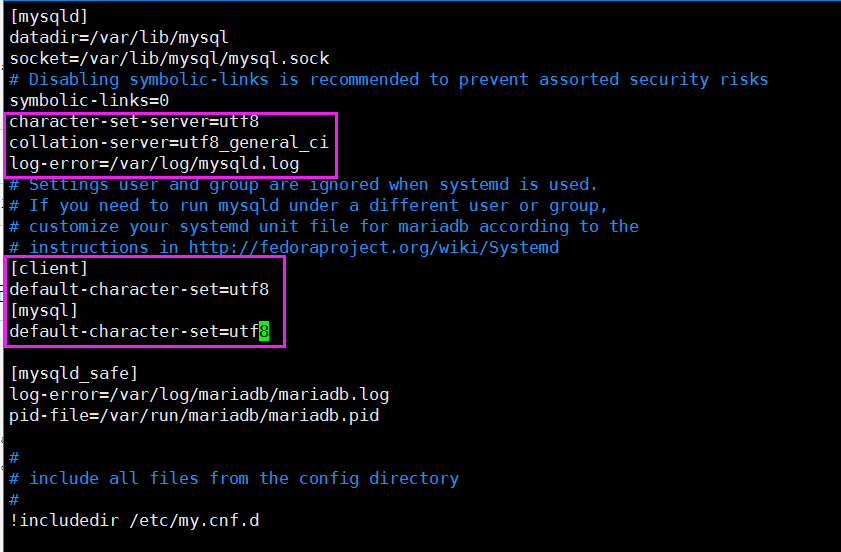

(3)  重启数据库

```
systemctl restart mariadb
# 注意，再次进入数据库，原来的数据库和数据表，如果是其他编码的，可以切换编码，但是数据库肯定有问题的，可以通过通过编码切换工具，切换回来。
```

9 mysql基本操作

```sql
-- 1 创建数据库
create database school;
show create database school;
-- 2 创建表
use school
create table student (id int, name char(11));
show create table student\G;
-- 3 插入数据
insert into student values (1, "王小明"), (2, "江小白");
-- 4 查看数据
select * from student;
```

```
# status 查看数据库的信息
\s

# 查看表的编码信息
show create table student\G;
```

10.  创建用户分配权限

```sql
-- 创建用户
-- create user 账号名@'终端地址' identified by '登录密码';
create user moluo@'%' identified by '123';   -- %表示任意主机，也就是可以允许远程登录
create user xiaoming@'%' identified by '123';

-- 分配权限
-- grant 权限 on 数据库.表名 to 账户@"主机名"             -- 对特定数据库中的特定表授权
-- grant 权限 on 数据库.* to 账户@"主机名"            　　-- 对特定数据库中的所有表给与授权
-- grant 权限1,权限2,权限3 on *.* to 账户@"主机名"   　　 -- 对所有库中的所有表给与多个授权
-- grant all privileges on *.* to 账户@"主机名"    　　  -- 对所有库和所有表授权所有权限，相当于root

grant all privileges on school.* to moluo@'%';     -- 给moluo用户在任意主机登录时, 拥有数据库school的所有权限
grant select,insert on school.* to xiaoming@'%';   -- 给xiaoming用户在任意主机登录时, 拥有数据库school的读取和添加数据权限

-- 移除权限
-- revoke 权限 on 数据库.表名 from 账户@"主机名";
-- 剔除moluo在任意主机下所有数据库中所有表的所有权限
-- revoke all privileges on *.* from moluo@"%";
-- 剔除xiaoming在任意主机下对于school数据库的任意表的添加数据权限
revoke insert on school.* from xiaoming@"%";

-- 删除用户，记得先剔除权限。
-- drop user 账户名@'主机名';
revoke all privileges on *.* from xiaoming@"%";
drop user xiaoming@'%';  -- 删除小明在任意主机登录的账户，慎用！！会导致数据库中的数据不一致的问题。
```

##### 主从复制

MariaDB与MySQL之间虽然是替代关系，但是实现主从复制时，还是不能混合使用的。要么MariaDB与MariaDB，要么MySQL与MySQL。尽管最早的时候MariaDB是为了替代MySQL出现，所以MariaDB尽可能的兼容了MySQL的所有功能，但是那么多年下来，毕竟2个公司在分别运营的项目，所以MariaDB与MySQL之间还是存在一些兼容性问题的：https://mariadb.com/kb/en/mariadb-vs-mysql-compatibility/

主从复制往往伴随着读写分离。

###### **1  原理**

主从复制七步曲(面试常问)

写操作：添加（insert）、删除（delete）、修改（update）

读操作：select（查询）

```
01. 主数据库(master)写入数据之后， 会有data changes(数据变化)记录
02. 主数据库(master)有变化记录之后，将增删改的一些sql语句记录到本地的Binary log(二进制日志)中
03. 从库(slave)会一直开启着一个线程
04. 从库(slave)通过这个线程去读取主数据库(master)的Binary log(二进制日志)的内容
05. 从库(slave)会将读取到的数据写入到自己的Relay log(中继日志)中
06. 从库(slave)会将中继日志中的操作转化为SQL thread(SQL语句)
07. 从库(slave)通过转化的SQL语句写入到自己的数据库, 两边的数据就一致了
```

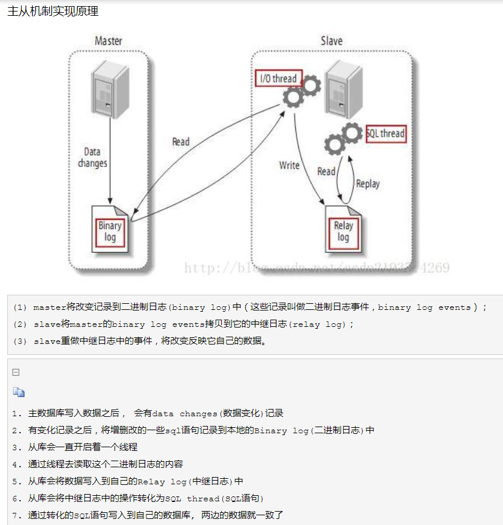

###### **2 实现**

(1) 背景

```bash
# 一主一从，2台服务器或者2个docker容器
# 一主多从，至少3台服务器或3个docker容器
# 多主多从，至少4台服务器或4个docker容器

主数据库master: 10.0.0.129（centos）
从数据库slave:  10.0.0.130（ubuntu）

# 如果主数据库所在的服务器开启了防火墙，必须要开放对应的端口
firewall-cmd --list-ports
firewall-cmd --add-port=3306/tcp --permanent
firewall-cmd --reload
# ubuntu的防火墙
su root
ufw status
sudo ufw allow 3306/tcp

# MySQL8.0以后，binlog日志和MarilDB的不兼容了，所以我们要么使用同样的mysql，要么使用同样的marilDB
# sudo ufw status;
# sudo ufw allow 3306/tcp  # 设置开放3306端口
# 根据素材目录下笔记，安装MarilDB数据库到Ubuntu20.04中。
```

(2)  在CentOS的主数据库master上进行操作

```bash
# 查看数据库状态
systemctl status mariadb
# 关闭mariadb
systemctl stop mariadb

# 修改配置文件
vim /etc/my.cnf
# 修改内容
# 解释：server-id服务的唯一标识（主从之间都必须不同）；log-bin启动二进制日志名称为mysql-bin
[mysqld]
server-id=1
log-bin=mysql-logbin

# :wq，开启mariadb
systemctl start mariadb
```

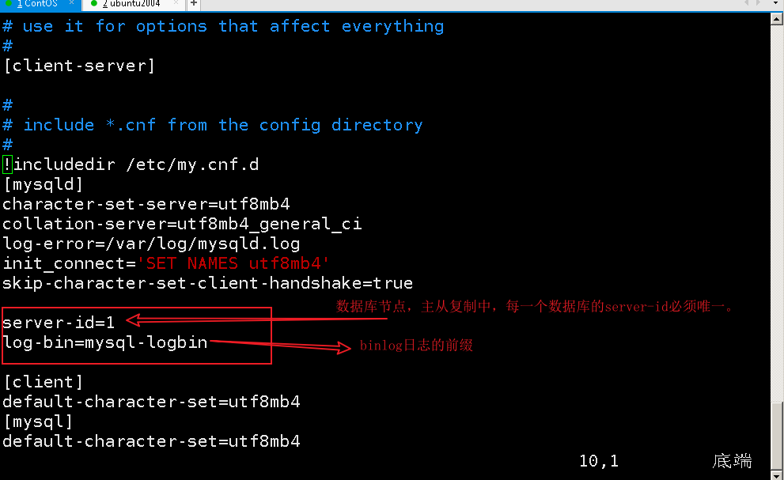

(3)  还是在CentOS上主数据库master上操作(创建主从同步用户)

```bash
mysql -uroot -p
# 1.新建用于主从同步的用户slave01,允许登录的从库(务必是从库服务器所在地址)是'10.0.0.130'
create user 'slave01'@'10.0.0.130' identified by 'slave01';
# 此处密码是举例，将来肯定设置非常复杂的密码。

# 2.给从库账号授权,说明给slave01从库复制binlog日志的权限，在10.0.0.130从数据库服务器上复制
grant replication slave on *.* to 'slave01'@'10.0.0.130';

# 3.实现对主数据库锁表只读，防止数据写入，数据复制失败
# 锁表的目的就是为了在主从复制完成之前，保持两台数据库的数据一致
flush table with read lock;

# 4.检查主库的状态, 并记录下日志文件的名字，和位置
show master status;
# 效果如下：
+---------------------+----------+--------------+------------------+
| File                | Position | Binlog_Do_DB | Binlog_Ignore_DB |
+---------------------+----------+--------------+------------------+
| mysql-logbin.000001 |      671 |              |                  |
+---------------------+----------+--------------+------------------+

# 5.锁表后，一定要单独再打开一个SSH窗口连接到主数据库所在的服务器，导出数据库的所有数据，
mysqldump -uroot -p --all-databases > /home/master.sql

# 6.确保数据导出后，没有数据插入，完毕再查看主库状态，如果还是上图的数值，则没有问题.
# 数值有变化，则需要从上面第3步重新执行。
mysql -uroot -p
show master status;  # 还是671，则表示没有问题了。
```

(4) 在Ubuntu上的从库slave上进行操作

```bash
# 7. ubuntu中，使用scp将备份导出的数据文件下载到Slave从数据库所在服务器 10.0.0.130
su root
scp -r root@10.0.0.129:/home/master.sql  /home/

# 2.在从库上导入数据
mysql -uroot -p
source /home/master.sql    # 此处必须使用绝对路径，否则无法导入
exit

# 3.修改Slave从数据库的配置文件/etc/mysql/my.cnf，文件最后，写入从属配置。1主多从，建议server-id自增即可。
vim /etc/mysql/my.cnf
"""内容开始
[mysqld]
bind-address=0.0.0.0
server-id=2
read-only=true
replicate-do-db=fuguang
"""内容结束 replicate-do-db 表示 仅仅同步的数据库有哪些？一行一个

# 4.重启从数据库，终端操作：
systemctl restart mariadb

# 5 配置复制的参数，Slave从库连接Master主库的配置，SQL语句如下：
mysql -uroot -p

change master to master_host='10.0.0.129',
master_user='slave01',
master_password='slave01',
master_log_file='mysql-logbin.000001',
master_log_pos=671;

# 6.启动从库的同步开关，测试主从复制的情况，SQL语句如下：
start slave;

# 7.查看当前从数据库的复制状态
show slave status\G;
```

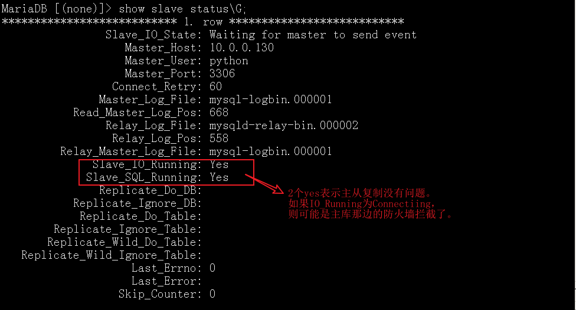

(5)  再回到主库上进行操作

```bash
mysql -uroot -p
# 1. 最后再给主库解锁
unlock tables;
# 2. 最后在主库上刷新授权表
flush privileges;
# 3. 操作主库的数据，可以看到从库的数据已经同步过来了。
```

(6)  在从库上登录普通用户，尝试写入数据会报以下错误, 说明从库只读

注意：在从库中使用普通用户主从同步即可达到只读的效果，但如果是使用了root用户反而无法达到readonly的效果，因为root用户在当前数据库中是至高无上的，具有上帝权限，所以这是一个坑。

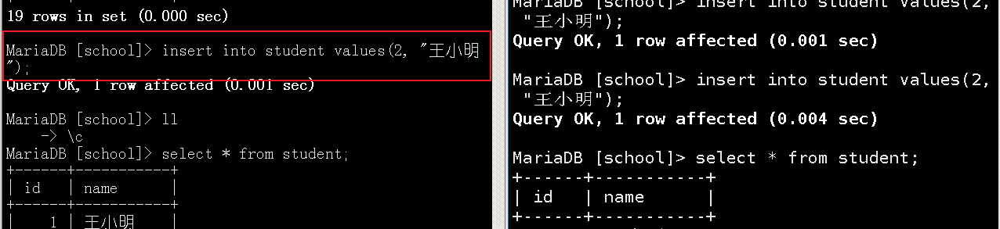

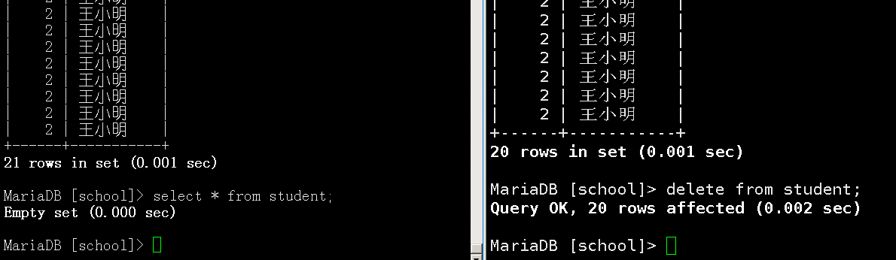

##### django实现数据库的读写分离

在settings.py或dev.py配置文件中的DATABASES中记录主从所有的服务器连接信息。

```python
DATABASES = {
    'default': {  # master主库
        'ENGINE': 'django.db.backends.mysql',
        # 'ENGINE': 'dj_db_conn_pool.backends.mysql',
        'NAME': 'fuguang',
        'USER': 'fuguang_user',
        'PASSWORD': 'fuguang',
        'HOST': '10.0.0.129',
        'PORT': 3306,
        'POOL_OPTIONS' : {      # 连接池的配置信息
            'POOL_SIZE': 10,    # 连接池默认创建的链接对象的数量
            'MAX_OVERFLOW': 10  # 连接池默认创建的链接对象的最大数量
        },
    },
    'read1': {    # slave01从库
        'ENGINE': 'django.db.backends.mysql',
        # 'ENGINE': 'dj_db_conn_pool.backends.mysql',
        'NAME': 'fuguang',
        'USER': 'fuguang_user',
        'PASSWORD': 'fuguang',
        'HOST': '10.0.0.130',
        'PORT': 3306,
        'POOL_OPTIONS': {  # 连接池的配置信息
            'POOL_SIZE': 10,  # 连接池默认创建的链接对象的数量
            'MAX_OVERFLOW': 10  # 连接池默认创建的链接对象的最大数量
        },
    },

}
```

在主应用下新增读写数据库的路由类文件，db_router.py，代码：

```python
class Router(object):
    """数据库主从读写分离路由"""

    def db_for_read(self, model, **hints):
        """读数据库【从库】"""
        return "read1"

    def db_for_write(self, model, **hints):
        """写数据库[写库]"""
        return "default"
```

接着，在配置文件settings中，增加配置如下：

```bash
DATABASE_ROUTERS = ["fuguangapi.db_router.Router"]
```

接下来，只需要让主库保存当前项目的数据，并保证django所在的服务器能访问到所有的主库和从库就可以了。

到处项目的所属数据库中所有数据信息，保存成sql文件。

```bash
cd fuguangapi
mysqldump -uroot -p123 fuguang > fuguang.sql
```

在CentOS所在的主库master中下载上面的fuguang.api，并导入数据到主库中。

```bash
scp -r moluo@10.0.0.131:/home/moluo/Desktop/fuguang/fuguangapi/fuguang.sql  /home/
mysql -uroot -p123

create database fuguang;
create user 'fuguang_user'@'%' identified by 'fuguang';

source /home/fuguang.sql
```

#### redis

01. 下载redis源码

```bash
cd /usr/local/src
wget http://download.redis.io/releases/redis-6.0.16.tar.gz
# curl -O http://download.redis.io/releases/redis-6.0.16.tar.gz
```

02. 解压缩

```
tar -zxf redis-6.0.16.tar.gz
```

03. 切换redis源码目录

```
cd redis-6.0.16
```

04. 编译源文件

```
make
```

05. 编译好后，src/目录下有编译好的redis指令
6.make install 安装到指定目录，默认在/usr/local/bin

```bash
make install
```

7 创建一个redis的配置文件redis-6379.conf

```bash
# 创建一个单独的目录保存redis相关的配置，默认情况下在上面执行make install，系统已经在/etc/已经生成了一个redis.conf，如果为了方便将来完成主从，集群或者哨兵的配置。建议单独另外声明一个目录中。
mkdir -p /opt/redis/conf
# 创建一个单独的目录保存redis的数据库文件
mkdir -p /opt/redis/data/6379
# 创建一个单独的目录保存redis的日志文件
mkdir -p /opt/redis/log/6379
cd /opt/redis/conf
vim redis-6379.conf
```

添加以下配置：

```bash
port 6379
bind 0.0.0.0
daemonize yes
pidfile /opt/redis/data/6379/redis.pid
loglevel notice
logfile /opt/redis/log/6379/redis.log
dir /opt/redis/data/6379
protected-mode yes
requirepass python

dbfilename   dump.rdb
rdbcompression  yes
save 900 1
save 300 10
save 60 10000

appendonly yes
appendfilename appendonly.aof
appendfsync everysec
```

redis配置文件详解

```bash
port 6379                         # 运行在6379的redis数据库实例
daemonize yes                     # 后台运行redis，redis守护进程模式运行
pidfile /data/6379/redis.pid      # 存放redis pid的文件
loglevel notice                   # 日志等级
logfile "/data/6379/redis.log"    # 指定redis日志文件的生成目录
dir /data/6379                    # 指定redis数据文件夹的目录
protected-mode yes                # 安全模式
requirepass   python              # 设置redis的登录密码

# RDB的配置项 redis的快照，用于备份数据进行数据的持久化，因为默认情况下redis是基于内存操作的数据，因为redis如果重启的话，则会导致数据丢失，所以redis提供了2种方式用于提供给开发者对数据进行持久化(把数据从内存中备份到硬盘中进行永久保存)：RDB（数据快照，二进制格式文件），AOF（追加日志记录，类似MySQL的bin-log日志的命令记录，记录了redis操作过程中的每一个命令）
dbfilename   dump.rdb  # rdb备份数据的文件名，目录就是dir指定的
rdbcompression  yes    # rdb备份数据时，是否压缩存储
# 备份策略
save 900 1     # 在间隔900秒以内，如果累计有1次key的写操作，则执行一次RDB的备份操作
save 300 10    # 在间隔300秒以内，如果累计有10次key的写操作，则执行一次RDB的备份操作
save 60 10000  # 在间隔50秒以内，如果累计有10000次key的写操作，则执行一次RDB的备份操作

# 针对RDB的配置，存在一定的数据的安全风险，例如：redis运行过程中900面内有唯一的1次key写入操作，但是在899时redis突然重启了，则会导致数据丢失，又或者300内有累计10次，结果在299秒时redis重启了，则会导致这10次写操作丢失了数据。基于此，Redis还提供了另一种持久化的策略：AOF

# AOF日志备份功能默认是no，表示关闭，我们需要打开
appendonly yes
# AOF日志文件名，所在目录由dir来指定
appendfilename appendonly.aof
# AOF日志备份策略，共有3个可选值：
# no：表示等操作系统进行数据缓存同步到磁盘（快，不安全）
# always：表示每次redis写操作后手动调用fsync()将数据写到磁盘（慢，安全）
# everysec：表示每秒同步一次（折衷，默认值，工作中常用，最多只会丢失1秒数据）

# fsync()表示在底层C语言中Fork一个子进程进行异步操作

appendfsync everysec
```

8 启动redis服务端，并指定配置文件，如果不指定，则默认使用/etc/redis.conf

```bash
redis-server /opt/redis/conf/redis-6379.conf

# 开放端口
firewall-cmd --list-ports
firewall-cmd --add-port=6379/tcp --permanent
firewall-cmd --reload
```

9 使用redis

```bash
redis-cli
auth python
set name xiaoming
get name
```

redis中也有主从复制读写分离，也可以基于集群模式、甚至还有哨兵模式。工作中，现在一般配置这几个运行架构，都基本采用docker来进行配置。

#### nginx

查看网站的web服务器

```
curl -I https://www.jd.com
```

##### nginx是什么

nginx是一个开源免费的，高性能，高并发的web服务和代理服务软件。它是俄罗斯人lgor sysoev(伊戈尔·塞索耶夫)在2000开发的，在2004年将源代码开源出来供全球使用。
nginx比传统的web服务器apache性能改进了许多，nginx占用的系统资源更少，支持更高的并发连接，有更高的访问效率。
nginx不但是一个优秀的web服务软件，还可以作为**反向代理**，**负载均衡**，以及**缓存服务**使用。
安装更为简单，方便，灵活。


优势

```
01. 支持高并发，能支持几万并发连接
02. 资源消耗少，在3万并发连接下开启10个nginx线程消耗的内存不到200M
03. 可以做http反向代理和负载均衡
04. 支持异步网络io，epoll事件模型
05. 是目前最优秀的静态网页web服务器，最优秀静态资源web服务器
```

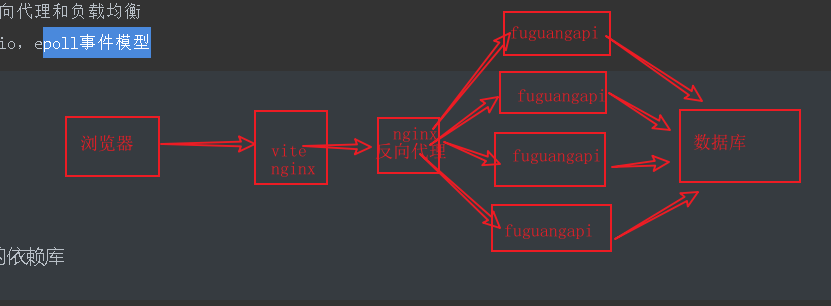

##### 基本使用

###### 编译安装nginx

1 安装nginx需要的依赖库

```
yum -y install gcc-c++ pcre pcre-devel zlib zlib-devel openssl openssl-devel
```

01. 下载源码包

```
cd /usr/local/src
wget -c https://nginx.org/download/nginx-1.21.4.tar.gz
```

02. 解压缩源码包

```bash
tar -zxvf nginx-1.21.4.tar.gz
```

03. 配置，编译安装

```
cd nginx-1.21.4
./configure --prefix=/opt/nginx-1.21.4 --with-http_stub_status_module
```

编译安装

```
make && make install
```

04. 启动nginx

```bash
# 把nginx作为全局命令使用，需要在/etc/prifile环境变量中添加nginx命令所在路径
vim /etc/profile
export PATH=$PATH:/opt/nginx-1.21.4/sbin
:wq
source /etc/profile

nginx           # 启动nginx
nginx -s stop   # 关闭nginx
nginx -s reload # 平滑重启 ，修改了nginx.conf之后，可以不重启服务，加载新的配置
# nginx安装成功以后，可通过80端口访问默认站点.默认站点在nginx安装目录下的html目录下，默认首页是index.html

# 查看nginx默认配置文件：/opt/nginx-1.21.4/conf/nginx.conf
nginx -t
```

###### nginx配置文件解析

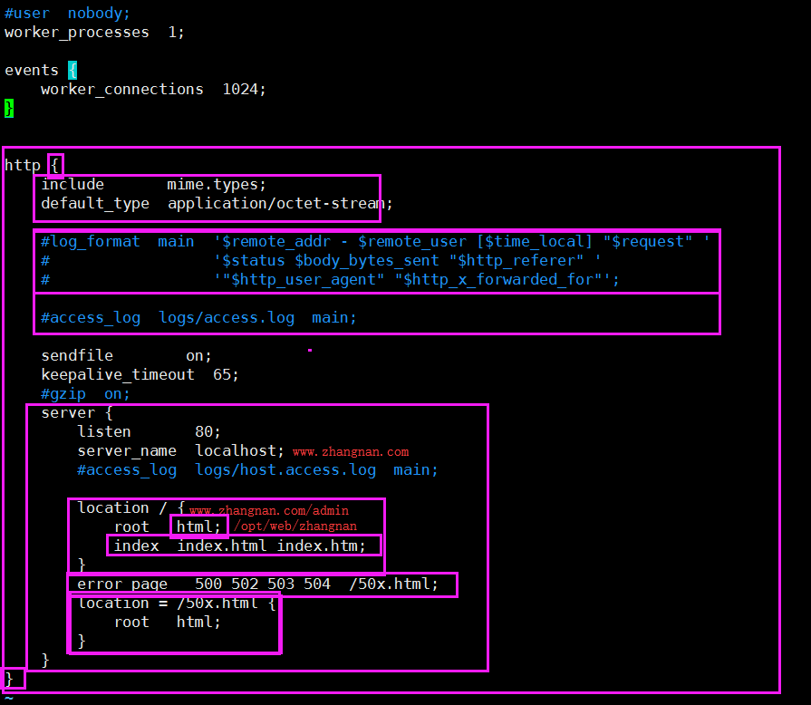

nginx核心配置文件

```bash
# nginx运行的用户身份，一般要么注释掉，要么就把nobody改成www或者nginx
# user  nobody;

# CPU核心数，(双核4线程，可以设置为4)
worker_processes  4;

# 单个进程最大可打开文件数，因为nginx经常用于提供静态文件访问支持，所以往往运营时间长了就会出现单个进程打开文件超标，所以要设置。
worker_rlimit_nofile 65535;

# 错误日志配置，如果不配置，则错误日志保存在安装路径下
# error_log  logs/error.log;
# error_log  logs/error.log  notice;
# error_log  logs/error.log  info;

# 进程标识符
# pid        logs/nginx.pid;

events {
    worker_connections 102400;
    # 最大可以调整到100000以上，nginx的最大并发连接数 = worker_processes * worker_connections

    # use epoll;
    # 设置nginx使用的IO多路复用的事件模型，默认不设置即可，nginx会采用当前系统最优的事件模型
    # linux建议epoll，FreeBSD建议采用kqueue，window下不指定，采用select。
}

# nginx作为httpweb服务器的相关配置，站点配置server必须填写在http选项中。
http {
    # 导入mime.types模块，让nginx能够识别各种各样的文件资源
    include       mime.types;
    # nginx默认识别的mime.types
    default_type  application/octet-stream;

    # 设置客户端访问nginx的访问日志格式
    log_format  main  '$remote_addr - $remote_user [$time_local] "$request" '
                      '$status $body_bytes_sent "$http_referer" '
                      '"$http_user_agent" "$http_x_forwarded_for"';
    # 开启访问日志
    access_log  logs/access.log  main;

    # Nginx在进行数据传输，会调用sendfile()函数， Linux 2.0+ 以后的推出的一个系统调用。
    # 对比一般的数据的网络传输sendfile会有更少的切换和更少的数据拷贝。
    sendfile        on;
    #tcp_nopush     on;

    #keepalive_timeout  0;
    keepalive_timeout  65;

    # 开启网络传输的数据gzip压缩
    gzip  on;
    # web站点的虚拟主机，类似python的虚拟环境，这里的配置，会让nginx自动提供一个站点给外界访问
    # nginx可以通过设置多个server配置项，提供多个站点的访问支持
    # 一个server就代表一个站点，也可以理解为一个服务端的源，源是通过端口、地址、协议进行区分。
    server {
        # 站点的访问端口，要允许外界访问，还需要设置防火墙
        listen       81;
        # 站点的访问域名地址
        server_name  localhost;

        #charset koi8-r;

        #access_log  logs/host.access.log  main;
        # 地址模式匹配，location后面的是访问url路径，相当于django的正则路由一样，
        # 地址匹配成功以后，则会调用当前花括号的配置信息
        location / {
            # root 表示当前站点所在目录
            root   html;
	    # index 指定默认首页
            index  main.html main.htm;
        }
	location /admin {
            # 代理
            proxy_pass http://localhost:81/main.html;
        }

        error_page  404              /404.html;

        # redirect server error pages to the static page /50x.html
        #
        error_page   500 502 503 504  /50x.html;
        location = /50x.html {
            root   html;
        }

        # proxy the PHP scripts to Apache listening on 127.0.0.1:80
        #
        #location ~ \.php$ {
        #    proxy_pass   http://127.0.0.1;
        #}

        # pass the PHP scripts to FastCGI server listening on 127.0.0.1:9000
        #
        #location ~ \.php$ {
        #    root           html;
        #    fastcgi_pass   127.0.0.1:9000;
        #    fastcgi_index  index.php;
        #    fastcgi_param  SCRIPT_FILENAME  /scripts$fastcgi_script_name;
        #    include        fastcgi_params;
        #}

        # deny access to .htaccess files, if Apache's document root
        # concurs with nginx's one
        #
        #location ~ /\.ht {
        #    deny  all;
        #}
    }

    # another virtual host using mix of IP-, name-, and port-based configuration
    #
    #server {
    #    listen       8000;
    #    listen       somename:8080;
    #    server_name  somename  alias  another.alias;

    #    location / {
    #        root   html;
    #        index  index.html index.htm;
    #    }
    #}

    # HTTPS server
    #
    #server {
    #    listen       443 ssl;
    #    server_name  localhost;

    #    ssl_certificate      cert.pem;
    #    ssl_certificate_key  cert.key;

    #    ssl_session_cache    shared:SSL:1m;
    #    ssl_session_timeout  5m;

    #    ssl_ciphers  HIGH:!aNULL:!MD5;
    #    ssl_prefer_server_ciphers  on;

    #    location / {
    #        root   html;
    #        index  index.html index.htm;
    #    }
    #}

}
```

##### nginx多虚拟主机

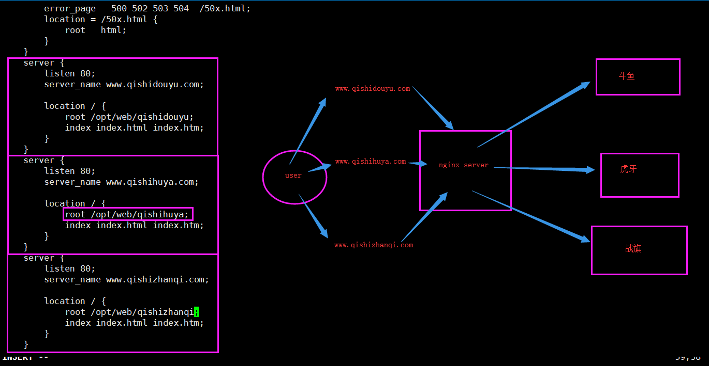

配置多虚拟主机的方法

00. 在nginx.conf配置配置文件中，设置加载外部自定义的配置文件到nginx环境中。

    

```bash
    vim /opt/nginx-1.21.4/conf/nginx.conf   # 配置文件的路径，根据 ngixn -t 得到得。
    ```

    nginx.conf，末行通过include 加载配置文件，代码：

    

```nginx

    #user  nobody;
    worker_processes  4;

    worker_rlimit_nofile 65535;

    error_log  logs/error.log;
    # error_log  logs/error.log  notice;
    # error_log  logs/error.log  info;

    pid        logs/nginx.pid;

    events {
        worker_connections  1024;
    }

    http {
        include       mime.types;
        default_type  application/octet-stream;

        log_format  main  '$remote_addr - $remote_user [$time_local] "$request" '
                          '$status $body_bytes_sent "$http_referer" '
                          '"$http_user_agent" "$http_x_forwarded_for"';

        access_log  logs/access.log  main;

        sendfile        on;
        #tcp_nopush     on;

        #keepalive_timeout  0;
        keepalive_timeout  65;

        gzip  on;

        server {
            listen       8000;
            server_name  localhost;

            charset utf8;

            # access_log  logs/api.fuguang.cn-access.log  main;

            location / {
                root   html;
                index  index.html index.htm;
            }

            #error_page  404              /404.html;

            # redirect server error pages to the static page /50x.html
            #
            error_page   500 502 503 504  /50x.html;
            location = /50x.html {
                root   html;
            }

            # proxy the PHP scripts to Apache listening on 127.0.0.1:80
            #
            #location ~ \.php$ {
            #    proxy_pass   http://127.0.0.1;
            #}

            # pass the PHP scripts to FastCGI server listening on 127.0.0.1:9000
            #
            #location ~ \.php$ {
            #    root           html;
            #    fastcgi_pass   127.0.0.1:9000;
            #    fastcgi_index  index.php;
            #    fastcgi_param  SCRIPT_FILENAME  /scripts$fastcgi_script_name;
            #    include        fastcgi_params;
            #}

            # deny access to .htaccess files, if Apache's document root
            # concurs with nginx's one
            #
            #location ~ /\.ht {
            #    deny  all;
            #}
        }

        # another virtual host using mix of IP-, name-, and port-based configuration
        #
        #server {
        #    listen       8000;
        #    listen       somename:8080;
        #    server_name  somename  alias  another.alias;

        #    location / {
        #        root   html;
        #        index  index.html index.htm;
        #    }
        #}

        # HTTPS server
        #
        #server {
        #    listen       443 ssl;
        #    server_name  localhost;

        #    ssl_certificate      cert.pem;
        #    ssl_certificate_key  cert.key;

        #    ssl_session_cache    shared:SSL:1m;
        #    ssl_session_timeout  5m;

        #    ssl_ciphers  HIGH:!aNULL:!MD5;
        #    ssl_prefer_server_ciphers  on;

        #    location / {
        #        root   html;
        #        index  index.html index.htm;
        #    }
        #}
        include /home/nginx/*.conf;
    }

    ```

02. 在/home/nginx下创建三个站点的nginx虚拟主机server配置文件。

   

```bash
   mkdir -p /home/nginx/
   touch /home/nginx/zhanqi.conf
   touch /home/nginx/huya.conf
   touch /home/nginx/douyu.conf
   ```

03. 分别配置三个虚拟主机server代码。(斗鱼、虎牙、站旗)

   

```bash
   vim /home/nginx/douyu.conf
   ```

   代码：

   

```nginx
      server {
           listen 80;
           server_name www.douyu.com;

           location / {
               root /opt/web/douyu;
               index index.html index.htm;
           }
       }
   ```

   

```bash
   vim /home/nginx/huya.conf
   ```

   代码：

   

```nginx
       server {
           listen 80;
           server_name www.huya.com;

           location / {
               root /opt/web/huya;
               index index.html index.htm;
           }
       }
   ```

   

```bash
   vim /home/nginx/zhanqi.conf
   ```

   代码：

   

```nginx
   server {
   	listen 80;
   	server_name www.zhanqi.com;

   	location / {
   		root /opt/web/zhanqi;
   		index index.html index.htm;
   	}
   }
   ```

04. 创建三个网站的源码存储目录

   

```bash
   mkdir -p /opt/web/{douyu,huya,zhanqi}
   echo '<mate charset="utf-8">welcome to douyu!!!!!!!!' > /opt/web/douyu/index.html
   echo '<mate charset="utf-8">welcome to huya!!!!!!!!' > /opt/web/huya/index.html
   echo '<mate charset="utf-8">welcome to zhanqi!!!!!!!!' > /opt/web/zhanqi/index.html
   # index.html里面的内容自己随意定义
   ```

05. 重启nginx服务（平滑重启）

   

```bash
   nginx -s reload
   # reload不行，则换成 nginx
   ```

06. 配置域名解析

   (1)  到阿里云或腾讯云等云服务商平台注册一个域名。在哪里购买服务器，就在哪里购买域名，否则回头还要迁移域名。

   (2)  修改客户端本地HOSTS文件C:\Windows\System32\drivers\etc\hosts

```
10.0.0.129 www.douyu.com
10.0.0.129 www.huya.com
10.0.0.129 www.zhanqi.com

DNS【域名解析服务器】
顶级域名:       # com / cn / net / org /edu
douyu.com       10.0.0.129
二级域名:
www.douyu.com   10.0.0.129
api.douyu.com   10.0.0.130
db.douyu.com    10.0.0.135
三级域名:
mysql.db.douyu.com      10.0.0.129
mongodb.db.douyu.com    10.0.0.129
```

5 可以通过windows下的客户端浏览器直接访问。

```
http://www.douyu.com
http://www.huya.com
http://www.zhanqi.com
```

#####　nginx状态信息查看

启用status状态，修改douyu站点的配置文件。

```bash
vim /home/nginx/douyu.conf
```

代码：

```
# 在server代码块下添加以下location配置
    server {
        listen 80;
        server_name www.douyu.com;

        location / {
            root /opt/web/douyu;
            index index.html index.htm;
        }
        location /status {
             stub_status on;
        }
    }
```

3 重启nginx

```bash
nginx -s reload
```

4 通过域名/status访问状态信息

```bash
http://www.douyu.com/status

Active connections: 2
server accepts handled requests
 43 43 73
Reading: 0 Writing: 1 Waiting: 1

# Active connections – 活跃的连接数量
# server accepts handled requests — 总共处理了43个连接 , 成功创建43次握手, 总共处理了73个请求。
# reading — 读取客户端的连接数。
# writing — 响应数据到客户端的数量。
# waiting — 开启 keep-alive 的情况下,这个值等于 active – (reading+writing), 意思就是 Nginx 已经处理完正在等候下一次请求指令的驻留连接。
```

附录

```bash
# apache ab压测命令(简称：ab压测工具), 测试服务器对于并发请求和最大连接数的支撑能力。(数值尽量少一点，不要开太多)
# 我们通过ubuntu对centos进行压测测试
# ubuntu安装ab工具：
sudo apt install -y apache2-utils
# centos安装ab工具：
# yum install -y httpd-tools

# 修改/etc/hosts信息，让域名指向到centos中nginx的站点域名地址
vim /etc/hosts

10.0.0.129 www.douyu.com
10.0.0.129 www.huya.com
10.0.0.129 www.zhanqi.com

ab -c 100 -n 1000 http://www.douyu.com/status   # -c不能大于-n的数值
# 当然，上面得到的时候乐观数值，实际运营肯定比这更一部分的。

# This is ApacheBench, Version 2.3 <$Revision: 1843412 $>
# Copyright 1996 Adam Twiss, Zeus Technology Ltd, http://www.zeustech.net/
# Licensed to The Apache Software Foundation, http://www.apache.org/

# Benchmarking www.douyu.com (be patient)
# Completed 100 requests
# Completed 200 requests
# Completed 300 requests
# Completed 400 requests
# Completed 500 requests
# Completed 600 requests
# Completed 700 requests
# Completed 800 requests
# Completed 900 requests
# Completed 1000 requests
# Finished 1000 requests

# Server Software:        nginx/1.21.0
# Server Hostname:        www.douyu.com
# Server Port:            80

# Document Path:          /status
# Document Length:        100 bytes

# Concurrency Level:      100               # 当前的并发请求数量
# Time taken for tests:   0.509 seconds
# Complete requests:      1000
# Failed requests:        999
#    (Connect: 0, Receive: 0, Length: 999, Exceptions: 0)
# Total transferred:      248,190 bytes
# HTML transferred:       104,190 bytes
# Requests per second:    1965.80 [#/sec] (mean)    # 每秒处理完成的请求数量，是web服务器并发能力的体现
# Time per request:       50.870 [ms] (mean)        # 处理完全部的请求所消耗的时间
# Time per request:       0.509 [ms] (mean, across all concurrent requests) # 处理1个请求的消耗平均时间
# Transfer rate:          476.46 [Kbytes/sec] received

# Connection Times (ms)
#               min  mean[+/-sd] median   max
# Connect:        0   14   9.5     13      36
# Processing:    12   34  11.4     34      59
# Waiting:        2   30  12.1     29      58
# Total:         19   48  11.3     46      72

# Percentage of the requests served within a certain time (ms)
#   50%     46
#   66%     56
#   75%     59
#   80%     60
#   90%     62
#   95%     65
#   98%     67
#   99%     71
#  100%     72 (longest request)
```

##### nginx访问日志

1 修改nginx.conf配置文件，启用访问日志功能

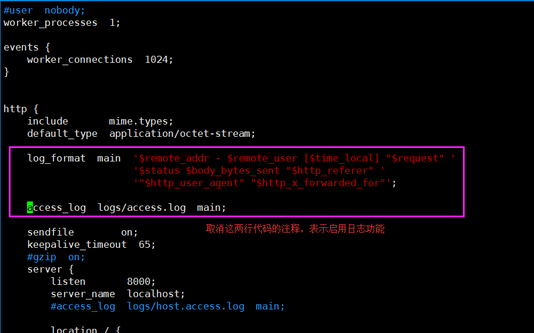

2 重启nginx服务

3 用户访问我的网站，/opt/nginx-1.21.4/logs/access.log就有了日志

```
tail -f /opt/nginx-1.21.4/logs/access.log
```

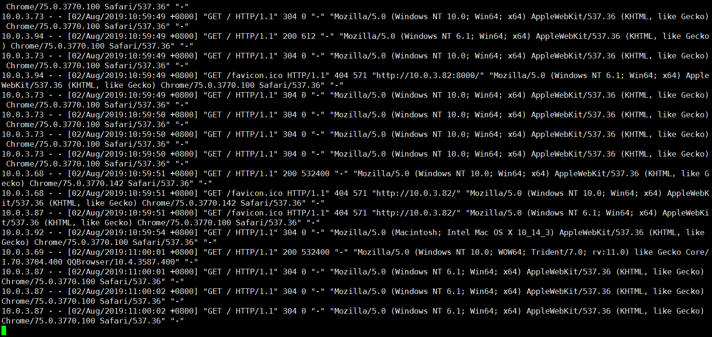

##### nginx访问控制

1 修改nginx.conf配置文件，添加访问的白名单和黑名单

```bash
# 通过nginx -t 查看当前nginx正在使用的配置文件，并使用vi/vim编辑器进行编辑
nginx -t
vi /opt/nginx-1.21.0/conf/nginx.conf
# 在需要进行访问控制的站点server配置项中，可以针对整个站点或者站点下的某个路径设置访问白名单或黑名单
# 注意：白名单和黑名单注意不要冲突。
# deny  主机地址;   # 表示限制指定的主机地址访问当前域名/当前地址, all 表示任意主机
# allow 主机地址;   # 表示允许指定的主机地址访问当前域名/当前地址, all 表示任意主机

# 以下是配置文件中的localhost的配置信息：
    server {
        listen       80;
        server_name  localhost;
        location / {
            # root 表示当前站点所在目录
            root   html;
	        # index 指定默认首页
            index  main.html main.htm;
        }
	    location /admin {
            # 仅禁止指定的客户端主机访问当前站点的admin地址[黑名单]
            # deny 10.0.0.1;
            # 仅允许指定的客户端主机访问当前站点的admin地址[白名单]
            allow 10.0.0.1;
            deny all;

            # 代理转发
            proxy_pass http://localhost:80/main.html;
        }

        # 仅禁止指定的客户端主机访问当前站点[黑名单]
	    # deny 10.0.0.1;

	    # 仅允许指定的客户端主机访问当前站点，其他任意主机禁止[白名单，优先级比黑名单要高]
        allow 10.0.0.1;
	    deny all;

        # 配置http错误页面，/404.html表示站点根目录下404.html页面
        error_page  404              /404.html;

        # redirect server error pages to the static page /50x.html
        #
        error_page   500 502 503 504  /50x.html;

        location = /50x.html {
            root   html;
        }
    }

# 这个页面不能访问！已经被鲸鱼吃掉了。
```

2 重启nginx服务

```bash
nginx -s reload
```

注意：访问控制，要么写在站点server下，要么写在地址匹配的location下。

3 在客户机上访问，就会提示403错误


##### 自定制错误页面

1 修改nginx配置文件

```nginx
    server {
        listen       80;
        server_name  localhost;
        location / {
            # root 表示当前站点所在目录
            root   html;
	        # index 指定默认首页
            index  main.html main.htm;
        }
	    location /admin {
            # 代理
            proxy_pass /main.html;
        }

        # 配置http错误页面
        # error_page  404              /404.html;
        error_page 400,402,403,404     /40x.html;
	    location = /40x.html {
            root /opt/web/errors;
        }
        # redirect server error pages to the static page /50x.html
        #
        error_page   500 502 503 504  /50x.html;
        location = /50x.html {
            root   html;
        }
    }
```

2 在错误日志目录下创建对应的40x.html

```
mkdir -p /opt/web/errors
vim /opt/web/errors/40x.html
```

添加自定制的错误页面内容(这里我们可以随意在各大网站拷贝一个比较好看的错误页面)

40x.html，代码：

```bash
page not exists
```

3 重启nginx

```bash
nginx -s reload
```

4 随意访问我们网站里面的一个不存在的页面，就可以看到错误页面


##### nginx代理服务

proxy

1 正向代理(翻墙、vpn)

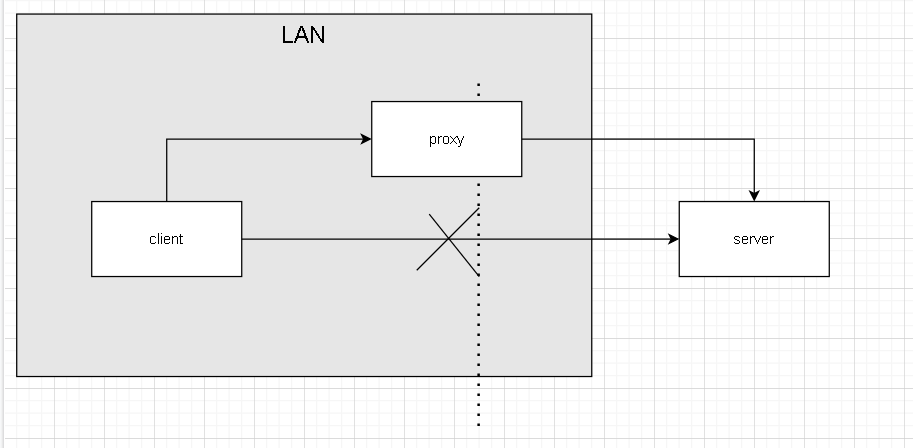

2 反向代理

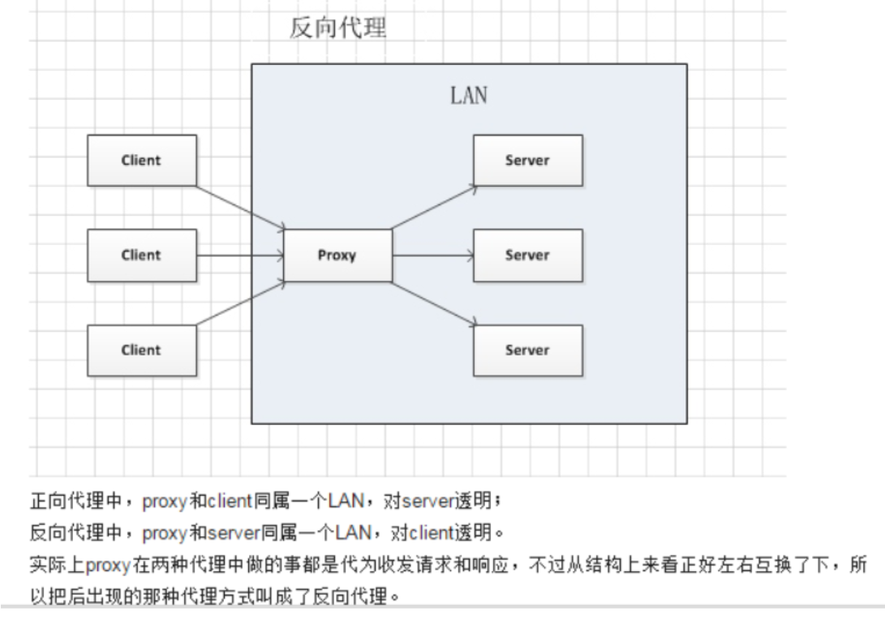

3 实现一个简单的反向代理

(1)  准备两台机器，这里我直接使用了演示的ubuntu和centos了。

```
10.0.0.129  # centos  配置代理服务器
10.0.0.130  # ubuntu  配置WEB服务器(保证能够通过IP+端口进行正常访问)
```

(2) 在代理服务器（centos）上添加配置

```
vim /home/nginx/douyu.conf
```

进行如下配置:

```
    server {
        listen 80;
        server_name www.douyu.com;

        location / {
            proxy_pass http://10.0.0.130;
        }
    }
```

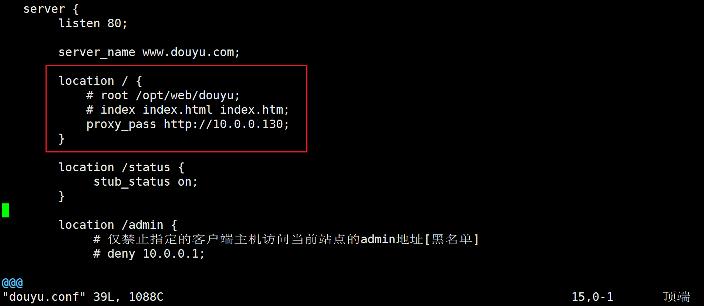

(3)  将10.0.0.130(ubuntu)的nginx配置OK，能够正常访问

```bash
Ubuntu20.04安装nginx的步骤在笔记素材目录下。
```

(4)  我们尝试访问www.douyu.com，就可以正常访问到ubuntu系统里面Nginx web服务器的index.html页面


(5)  反向代理配置OK

##### nginx负载均衡

集群的概念:  就是一堆服务器干一件事情

高可用: 如果有一台机器宕机，其他的服务器可以正常提供服务

负载均衡: 一台服务器不能满足用户访问量，就需要多台服务器进行压力负载(一根筷子与一把筷子的故事)


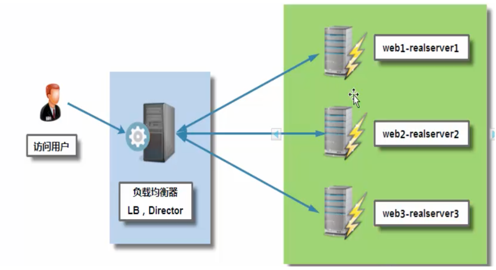

###### nginx负载均衡配置

(1)  准备一台nginx代理服务器, 用作负载均衡器, 这里我们还是使用之前的centos作为负载均衡器

```
10.0.0.129  # centos 负载均衡器
```

(2)  准备两台以上的web服务器，用作网站服务器（上游服务器）

```bash
# 模拟2个服务器的站点内容，同时为了识别，给不同的服务器下的文件内容，标记对应的IP地址
# 10.0.0.130  ubuntu，uwsgi/uvincron所在的服务器
echo "10.0.0.130 ---> Ubuntu 20.04>>> fuguang" > /home/fuguang/index.html
sudo cp index.html main.html
# 10.0.0.131  uwsgi/uvincron所在的服务器，这里我们选择克隆ubuntu容器。修改网卡IP得到10.0.0.131
echo "10.0.0.131 ---> Ubuntu 20.04>>> fuguang" > /home/fuguang/index.html
sudo cp index.html main.html
```

(3)  在centos中，打开nginx配置文件，配置负载均衡器

```bash
# 修改配置文件nginx.conf
vim /home/nginx/huya.conf
```

基于Nginx实现的负载均衡，nginx提供了有5种不同的调度算法：

* select，默认算法，轮询算法，每一台服务器都会被平均分配流量。
* ip_hash，IP映射，把客户端IP的hash值与上游服务器进行捆绑，固定的服务器处理固定的IP的客户端请求。
* url_hash，url映射，把客户端请求的url地址的hash值与上游服务器进行捆绑，固定地址访问固定的服务器。
* weight，性能分配，给每一台服务器设置一个权重分数，基于分数进行流量进行分发。
* fair，响应时间分配，根据后台响应时间来分发请求，响应时间短的分发的请求多。(第三方需要单独编译模块才可用)

修改以下配置(详情看图)

```bash
    # select模型的均衡调度，平均分配流量
    upstream fuguang_select {
        server 10.0.0.130;
        server 10.0.0.131;
        # server 10.0.0.x;
    }

    # ip_hash模型的均衡调度，根据客户端IP和上游服务器进行hash映射，固定的客户端IP访问的总是同一服务器。
    upstream fuguang_ip_hash {
        server 10.0.0.130;
        server 10.0.0.131;
        ip_hash;
    }

    # url_hash模型的均衡调度，根据客户端的url请求地址和上游服务器进行hash映射，固定的url地址访问的总是同一个服务器
    upstream fuguang_url_hash {
        server 10.0.0.130;
        server 10.0.0.131;
        hash $request_uri;
    }

    # weight模型的均衡调度，基于服务器的性能，并发处理能来分配权重值，权重值的比例就是流量分配比例
    upstream fuguang_weight {
        server 10.0.0.130 weight=1;
        server 10.0.0.131 weight=4;
    }

    # 防止宕机阻塞
    upstream fuguang_weight_two {
      server 10.0.0.130  weight=1 max_fails=2 fail_timeout=30s;
      server 10.0.0.131  weight=4 max_fails=2 fail_timeout=30s;
      # 优化，开启长链接，300表示5分钟超时
      keepalive 300;
    }

	# 按响应时间分配流量, 响应时间越短，则响应得到的流量越多
    # upstream fuguang_fair {
    #     server 10.0.0.130;
    #     server 10.0.0.131;
    #     fair;
    # }

    server {
        listen 80;
        server_name www.huya.com;

        location / {
            # root /opt/web/huya;
            # index index.html index.htm;
            # select 轮询
            # proxy_pass http://fuguang_select;
            # ip_hash IP的hash值映射
            # proxy_pass http://fuguang_ip_hash;
            # url_hash url的hash值映射
            # proxy_pass http://fuguang_url_hash;
            # weight 性能分配流量
            # proxy_pass http://fuguang_weight;
            # 防止宕机阻塞
            proxy_pass http://fuguang_weight_two;
            # 按响应时间分配流量
            # proxy_pass http://fuguang_fair;
        }
    }
```

参考图片，里面的IP地址和变量有所不同。

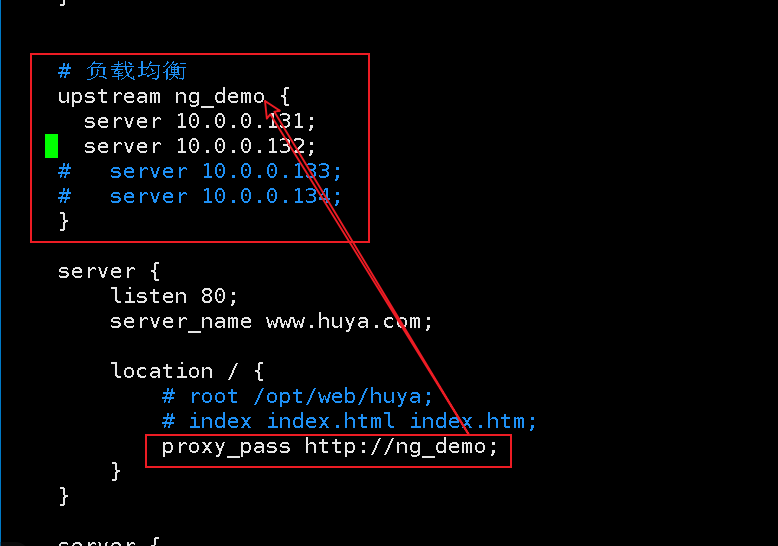

(4)centos，重启nginx服务

```bash
nginx -s reload
```

(5) 不断刷新并访问huya.com, 就可以看到访问的页面是不同的页面


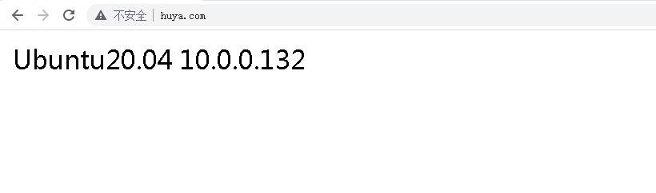

### docker容器化技术

#### 镜像制作之Dockerfile

一键安装

```bash
curl -sSL https://get.daocloud.io/docker | sh

# 启动docker，并设置开机自启
systemctl status docker
systemctl start docker
systemctl enable docker
```

什么是docker

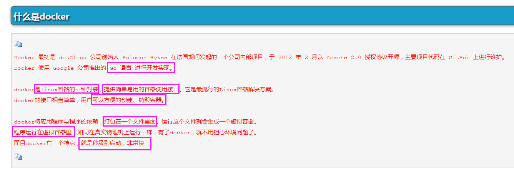

docker的应用场景

```
web应用的自动化打包和发布
自动化测试和持续交付持续集成CICD、自动化发布
在服务型环境中部署和调整数据库或其他应用
```

我们为什么要使用docker

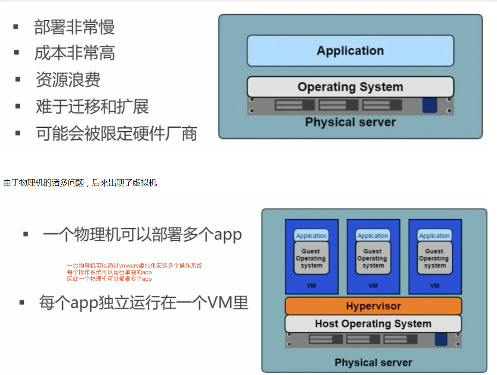

docker  VS 传统虚拟机


环境配置的难题

解决方案二  Linux容器:

**Linux容器不是模拟一个完整的操作系统，而是对进程进行隔离。在正常进程的外面套了一个保护层，对于容器里面进程来说，它接触的资源都是虚拟的，从而实现和底层系统的隔离。**

（1）启动快

容器里面的应用，直接就是底层系统的一个进程，而不是虚拟机内部的进程。所以，启动容器相当于启动本机的一个进程，而不是启动一个操作系统，速度就快很多。

（2）资源占用少

容器只占用需要的资源，不占用那些没有用到的资源；虚拟机由于是完整的操作系统，不可避免要占用所有资源。另外，多个容器可以共享资源，虚拟机都是独享资源。

（3）体积小

容器只要包含用到的组件即可，而虚拟机是整个操作系统的打包，所以容器文件比虚拟机文件要小很多。

总之，容器有点像轻量级的虚拟机，能够提供虚拟化的环境，但是成本开销小得多。

docker容器的架构

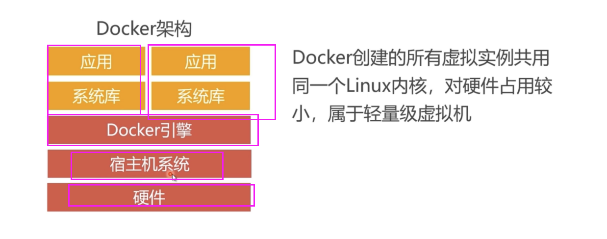

7 基本使用

```bash
docker version
docker ps
```

##### 利用Dockerfile定制镜像

docker/podman中， 镜像是容器的基础，每次执行docker run的时候都会指定哪个基本镜像作为容器运行的基础。我们之前的docker的操作都是使用来自dockerhub提供的官方镜像，直接使用这些镜像只能满足一定的基本需求，当基础镜像无法满足我们的业务需求时，就得使用Dockerfile自己定制这些镜像了。

Dockerfile是提供开发者用于定制自定义镜像的配置文件。所以我们需要掌握Dockerfile文件的基本语法。

```
镜像的定制就类似小时候学画画的水彩画一样，水彩画是一层一层的涂抹上去的，而镜像的定制则是编写定制每一层所添加的配置、文件等命令信息。如果可以把每一层修改、安装、构建、操作的命令都写入到一个脚本，用脚本来构建、定制镜像，这个脚本就是Dockerfile。

Dockerfile 是一个文本文件，其内包含了一条条用于自定义镜像的指令(Instruction)，这些指令每一条就构建一层，因此每一条指令的内容，就是告诉docker该如何构建每一层的镜像内容。
注意：Dockerfile中的命令层级如果越多，则构建生成的镜像就越大，也就越臃肿，所以我们应该在学习完Dockerfile的语法以后，尽量采用最少的命令来构建镜像。
```

Dockerfile提供的命令


```
01. FROM参数(指定基础镜像)
FROM elasticsearch # 制作base image(基础镜像)，尽量使用官方的image作为base image
FROM centos # 以centos为基础镜像，进行二次构建镜像
FROM ubuntu:20.04 # 带有tag的基础镜像，FROM centos:8

02. LABEL参数(标签, 定义作者信息)
LABEL version="1.0.0"     # 容器元信息，帮助信息，Metadata，类似于代码注释
LABEL maintainer="649641514@qq.com"

03. RUN参数(是一个万能指令，执行命令)
# 对于复杂的RUN命令，避免无用的分层，多条命令用反斜线换行，合成一条命令！
RUN yum update && yum install -y vim \
    Python-dev # 反斜线表示命令没有结束，仅仅换行
/bin/bash -c "source $HOME/.bashrc;echo $HOME"

04. WORKDIR参数(相当于linux的cd命令)
WORKDIR /root # 相当于linux的cd命令，改变目录，尽量使用绝对路径！！！不要用RUN cd
WORKDIR /test # 如果没有就自动创建
WORKDIR demo  # 再进入demo文件夹
RUN pwd       # 打印结果应该是/test/demo

05. ADD参数(复制解压，把宿主机的一个文件，添加到容器空间内，相当于 docker的cp)
ADD /opt/django/manage.py /opt/  # 把宿主机的/opt/django/manage.py放到容器空间内的/opt/目录下
ADD /opt/python3.8.12.tar.gz /opt/  # ADD的解压文件作用，将宿主机的/opt/下的python3.6.tar.gz解压到容器内的/opt/目录下

06. COPY参数(拷贝指令，单纯复制，相当于 docker的cp)
# 将宿主机的文件, 拷贝到容器内，但是没有解压缩的命令，尽量使用COPY,不要使用ADD
COPY /opt/django/manage.py /opt/ # 把宿主机的/opt/django/manage.py放到容器空间内的/opt/目录下

ADD与COPY
   - 优先使用COPY命令
    -ADD除了COPY功能还有解压功能

添加远程文件/目录使用RUN curl或RUN wget

07. ENV参数(docker的环境参数指令)
ENV MYSQL_VERSION 5.6 # 设置一个mysql常量,这个${MYSQL_VERSION}类似于全局常量
RUN yum install -y mysql-server="${MYSQL_VERSION}"  # 如果版本号有变更，则只需要改这个常量就可以了

08. COMMAND(Dockerfile的结尾运行命令，类似RUN)
COMMAND ["sh", "run.sh"]
```

使用 Dockerfile之前，先切换成国内docker镜像源

```bash
mkdir -p /etc/docker
vim /etc/docker/daemon.json

{
"registry-mirrors" : [
"https://registry.docker-cn.com",
"https://docker.mirrors.ustc.edu.cn",
"http://hub-mirror.c.163.com",
"https://cr.console.aliyun.com/"
]
}
```

##### 使用Dockerfile封装Django镜像

01. 在/home下建立了docker目录，在这个目录下准备好要构建镜像的文件和源码包。

```bash
mkdir /home/docker && cd /home/docker
ll

-rw-r--r--. 1 root root    2595 9月   1 02:41 CentOS-Linux-BaseOS.repo（源）
-rw-r--r--. 1 root root     508 9月   1 02:55 Dockerfile（定制镜像的文件，现在空内容）
-rw-r--r--. 1 root root     664 12月 26 2020  epel.repo（源）
-rw-r--r--. 1 root root      41 9月   1 02:47 run.sh（启动django的shell脚本，现在是空文件）
```

下载一个django-3.2.5的源码包和阿里云扩展源epel.repo文件以及centOS8的基本源

```
wget -O Django-3.2.5.tar.gz https://gitee.com/mirrors/django/repository/archive/3.2.5?format=tar.gz
wget -O epel.repo http://mirrors.aliyun.com/repo/epel-7.repo
cp /etc/yum.repos.d/CentOS-Linux-BaseOS.repo /home/docker/CentOS-Linux-BaseOS.repo
```

02. 编写Dockerfile构建镜像的配置文件

```bash
vim Dockerfile
```

```
FROM centos:8

LABEL version="1.0.0"
LABEL maintainer="649641514@qq.com"

ADD ./CentOS-Linux-BaseOS.repo /etc/yum.repos.d
ADD epel.repo /etc/yum.repos.d
ADD Django-3.2.5.tar.gz /opt/

RUN yum install -y python38 python38-pip && pip3 install setuptools

WORKDIR /opt/
RUN mv Django-3.2.5 django

WORKDIR /opt/django
RUN python3 setup.py install

WORKDIR /opt
RUN django-admin.py startproject djdemo
ADD run.sh /opt/djdemo/run.sh

WORKDIR /opt/djdemo
RUN sed -i "s/ALLOWED_HOSTS = \[\]/ALLOWED_HOSTS = \['\*'\]/g" /opt/djdemo/djdemo/settings.py && chmod 755 run.sh

EXPOSE 8000
CMD ["/bin/sh","run.sh"]
```

注意：Dockerfile中不能出现命令以外的任何注释。以下是注释版本：

```dockerfile
# 指定当前定制镜像的基础镜像以及版本号
FROM centos:8
# 指定镜像的描述信息[版本号、作者]
LABEL version="1.0.0"
LABEL maintainer="649641514@qq.com"

# 设置当前定制镜像的镜像源、外部依赖包从镜像外复制并解压到镜像内部
COPY ./CentOS-BaseOS.repo /etc/yum.repos.d
COPY epel.repo /etc/yum.repos.d
ADD Django-3.2.5.tar.gz /opt/
# 运行终端命令，安装python3.8以及相关工具包
RUN yum install -y python38 python38-pip && pip3 install setuptools
# 切换工作目录
WORKDIR /opt/
# 改目录名
RUN mv Django-3.2.5 django
# 切换工作目录
WORKDIR /opt/django
# 安装django框架
RUN python3 setup.py install
# 切换工作目录
WORKDIR /opt
# 创建一个django项目
RUN django-admin.py startproject djdemo
# 从镜像外界复制一个run.sh启动脚本到django项目根目录下
ADD run.sh /opt/djdemo/run.sh

# 切换工作目录
WORKDIR /opt/djdemo
# 替换django配置文件settings.py的ALLOWED_HOSTS配置项，允许客户端通过任何地址访问django项目并设置django的启动脚本的权限为755
RUN sed -i "s/ALLOWED_HOSTS = \[\]/ALLOWED_HOSTS = \['\*'\]/g" /opt/djdemo/djdemo/settings.py && chmod 755 run.sh
# 开放镜像的端口8000
EXPOSE 8000
# CMD就是RUN，用于在结尾执行终端命令
CMD ["/bin/sh","run.sh"]
```

03. 编写run.sh

```bash
vim run.sh
```

```
python3 manage.py runserver 0.0.0.0:8000
```

04.  Docker构建镜像

```bash
# docker build -t 镜像名:镜像版本 Dockerfile所在路径
sudo docker build -t djdemo:1.0.0 .
docker images
```

构建完成后，可以看到生成一个新镜像。

此时后台启动镜像，并把8000端口映射到物理机的8888端口。

```
docker run -d -p 8888:8000 --name=django djdemo:1.0.0
```

#### Docker-Compose

##### 简介

使用一个Dockerfile模板文件，可以很方便的定义一个自定义镜像。在工作中，经常会碰到需要多个容器相互配合来完成某项任务的情况。例如要实现一个Web项目，除了Web服务容器本身，往往还需要再加上后端的数据库服务容器，甚至还包括负载均衡容器等。此时，我们就需要使用到Docker-Compose了。注意：docker-compose仅仅用于docker不能用于podman。podman使用的podman-compose。当然，podman-compose和docker-compose的使用和语法是一样的。

Docker-Compose项目是Docker官方的开源项目，负责实现对Docker容器集群的快速编排。Docker-Compose项目由Python编写，调用Docker服务提供的API来对容器进行管理和编排。因此，只要所操作的平台支持Docker API，就可以在其上利用Docker-Compose来进行Docker容器的编排和管理。

Docker-Compose将所管理的Docker容器分为三层，分别是工程（project），服务（service）以及容器（container）。

Docker-Compose允许我们开发者通过一个单独的docker-compose.yml配置文件（YAML 格式）来定义一组相关联的应用容器为一个工程（project）。一个工程至少有一个服务，一个服务下至少有一个容器。

Docker-Compose运行指定目录下的所有关联文件组成一个工程（工程名默认为当前目录名）。一个工程当中可包含多个服务，每个服务中可以定义Docker容器运行的镜像，参数，环境依赖等信息。

Docker-Compose的工程配置文件默认为docker-compose.yml，也可以通过-f 参数来指定成其他的配置文件名。

##### 安装

安装环境查看

```bash
uname -a
lsb_release -a  # CentOS： yum install redhat-lsb
```

安装地址：https://docs.docker.com/compose/install/

```bash
sudo curl -L "https://github.com/docker/compose/releases/download/1.29.2/docker-compose-$(uname -s)-$(uname -m)" -o /usr/local/bin/docker-compose
sudo chmod +x /usr/local/bin/docker-compose
sudo ln -s /usr/local/bin/docker-compose /usr/bin/docker-compose
```

查看安装的版本

```bash
docker-compose version # docker-compose --version
```

##### 卸载

```
sudo rm /usr/local/bin/docker-compose
sudo rm /usr/bin/docker-compose
```

##### 常用命令

基本命令格式

```
docker-compose [-f <arg>...] [options] [COMMAND] [ARGS...]
```

命令选项如下

```bash
-f --file FILE指定Compose模板文件，默认为当前目录下docker-compose.yml
# -p --project-name NAME 指定项目名称，默认使用当前所在目录为项目名
# --verbose  输出更多调试信息
# -v，-version 打印版本并退出
# --log-level LEVEL 定义日志等级(DEBUG, INFO, WARNING, ERROR, CRITICAL)
```

######  　docker-compose up

根据容器编排配置文件docker-compose.yml，进行编排和启动容器。

```bash
docker-compose up [options] [--scale SERVICE=NUM...] [SERVICE...]
选项包括：
  -f 指定compose模板文件名
  -d 在后台守护进程的方式运行服务容器

# 常用写法：
# docker-compose up
# docker-compose up -d
# docker-compose -f docker-compose.yml up -d
```

###### docker-compose down

停止运行并删除docker-compose.yml配置的容器、网络、卷。

```bash
docker-compose down [options]
选项包括：
  -f 指定compose模板文件名

# 常用写法：
# docker-compose down
# docker-compose -f docker-compose.yml down
```

###### docker-compose stop

停止运行docker-compose.yml配置的容器，可以通过docker-compose start 再次启动

```bash
docker-compose stop [options] [SERVICE...]
选项包括：
  -f 指定compose模板文件名

# 常用写法：
# docker-compose stop
# docker-compose -f docker-compose.yml stop
```

######  docker-compose start

启动运行docker-compose.yml配置的容器，可以通过docker-compose stop 关闭运行。

```
docker-compose start [SERVICE...]
选项包括：
  -f 指定compose模板文件名

# 常用写法：
# docker-compose stop
# docker-compose -f docker-compose.yml stop
```

###### docker-compose ps

列出当前工程项目中的所有服务容器

```
docker-compose  ps [options] [SERVICE...]
```

###### docker-compose logs

列出当前工程项目中运行容器过程中的运行日志。

```bash
docker-compose logs [options] [SERVICE...]
选项包括：
  -f 跟踪日志输出

# 常用写法：
docker-compose logs -f
```

###### docker-compose bulid

```
docker-compose build [options] [--build-arg key=val...] [SERVICE...]
构建（重新构建）项目中的服务容器。
选项包括：
–compress 通过gzip压缩构建上下环境
–force-rm 删除构建过程中的临时容器
–no-cache 构建镜像过程中不使用缓存
–pull 始终尝试通过拉取操作来获取更新版本的镜像
-m, –memory MEM为构建的容器设置内存大小
–build-arg key=val为服务设置build-time变量
服务容器一旦构建后，将会带上一个标记名。可以随时在项目目录下运行docker-compose build来重新构建服务
```

###### docker-compose pull

```
docker-compose pull [options] [SERVICE...]
拉取服务依赖的镜像。
选项包括：
–ignore-pull-failures，忽略拉取镜像过程中的错误
–parallel，多个镜像同时拉取
–quiet，拉取镜像过程中不打印进度信息
docker-compose pull
拉取服务依赖的镜像
```

###### docker-compose restart

```
docker-compose restart [options] [SERVICE...]
重启项目中的服务。
选项包括：
-t, –timeout TIMEOUT，指定重启前停止容器的超时（默认为10秒）
docker-compose restart
重启项目中的服务
```

###### docker-compose rm

```
docker-compose rm [options] [SERVICE...]
删除所有（停止状态的）服务容器。
选项包括：
–f, –force，强制直接删除，包括非停止状态的容器
-v，删除容器所挂载的数据卷
docker-compose rm
删除所有（停止状态的）服务容器。推荐先执行docker-compose stop命令来停止容器。
```

###### docker-compose run

```
docker-compose run [options] [-v VOLUME...] [-p PORT...] [-e KEY=VAL...] SERVICE [COMMAND] [ARGS...]
在指定服务上执行一个命令。
docker-compose run ubuntu ping www.baidu.com
在指定容器上执行一个ping命令。
```

###### docker-compose scale

```
docker-compose scale web=3 db=2
设置指定服务运行的容器个数。通过service=num的参数来设置数量
```

###### docker-compose pause

```
docker-compose pause [SERVICE...]
暂停一个服务容器
```

###### docker-compose uppause

```
docker-compose unpause [SERVICE...]
恢复处于暂停状态中的服务。
```

###### docker-compose kill

```
docker-compose kill [options] [SERVICE...]
通过发送SIGKILL信号来强制停止服务容器。
支持通过-s参数来指定发送的信号，例如通过如下指令发送SIGINT信号：
docker-compose kill -s SIGINT
```

###### docker-compose config

```
docker-compose config [options]
验证并查看compose文件配置。
选项包括：
–resolve-image-digests 将镜像标签标记为摘要
-q, –quiet 只验证配置，不输出。 当配置正确时，不输出任何内容，当文件配置错误，输出错误信息
–services 打印服务名，一行一个
–volumes 打印数据卷名，一行一个
```

###### docker-compose create

```
docker-compose create [options] [SERVICE...]
为服务创建容器。
选项包括：
–force-recreate：重新创建容器，即使配置和镜像没有改变，不兼容–no-recreate参数
–no-recreate：如果容器已经存在，不需要重新创建，不兼容–force-recreate参数
–no-build：不创建镜像，即使缺失
–build：创建容器前　　，生成镜像
```

###### docker-compose exec

```
docker-compose exec [options] SERVICE COMMAND [ARGS...]
选项包括：
-d 分离模式，后台运行命令。
–privileged 获取特权。
–user USER 指定运行的用户。
-T 禁用分配TTY，默认docker-compose exec分配TTY。
–index=index，当一个服务拥有多个容器时，可通过该参数登陆到该服务下的任何服务，例如：docker-compose exec –index=1 web /bin/bash ，web服务中包含多个容器
```

###### docker-compose port

```
docker-compose port [options] SERVICE PRIVATE_PORT
显示某个容器端口所映射的公共端口。
选项包括：
–protocol=proto，指定端口协议，TCP（默认值）或者UDP
–index=index，如果同意服务存在多个容器，指定命令对象容器的序号（默认为1）
```

###### docker-compose push

```
docker-compose push [options] [SERVICE...]
推送服务依的镜像。
选项包括：
–ignore-push-failures 忽略推送镜像过程中的错误
```

##### compose模板文件

Compose模板文件是一个定义服务、网络和卷的YAML文件。Compose模板文件默认路径是当前目录下的docker-compose.yml，可以使用.yml或.yaml作为文件扩展名。
Docker-Compose标准模板文件应该包含version、services、networks 三大部分，最关键的是services和networks两个部分。

例如，我们要一次性启动3个nginx容器运行各自不同的配置下。

```bash
mkdir -p /home/compose && cd /home/compose
vim docker-compose.yml
```

docker-compose.yml，代码：

```yaml
version: "3.7"
services:
  web1:
    image: nginx:1.21.4
    container_name: "web1"
    ports:
      - "8081:80"
    networks:
      - dev

  web2:
    image: nginx:1.21.4
    container_name: "web2"
    ports:
      - "8082:80"
    networks:
      - dev
      - pro

  web3:
    image: nginx:1.21.4
    container_name: "web3"
    ports:
      - "8083:80"
    networks:
      - pro

networks:
  dev:
    driver: bridge
  pro:
    driver: bridge
```

docker-compose.yml，注释版本，代码：

```python
# Compose目前有三个版本分别为Version 1，Version 2，Version 3，不同版本的compose提供的指令语法不一样。
# 目前我们使用的基本都是Version3版本，最新版本是3.9。
version: "3.7"

# 声明接下来开始配置服务容器
services:
  # 服务名，开发者自定义的，
  web1:
    # image 当前服务容器的基本依赖镜像，如果本地没有该镜像，则会自动从官网pull拉取
    # image 也可以是自己本地基于Dockerfile编译后产生的定制镜像，但是必须是已经build编译好的
    # 如希望在docker-compose up启动容器服务时自动编译Dockerfile，则必须增加配置项build指定Dockerfile
    # 文件的所在路径，如果不指定，则可能出现从官网拉取镜像失败的情况，build配置项写法如下:
    # build: .
    # 如使用了build配置项时还声明了image配置项，则基于build所在的Dockerfile编译的镜像名为image指定名字。
    # build: .
    # image: djdemo:1.0.0
    image: nginx:1.21.4
    # container_name 指定当前服务容器启动以后的容器名
    container_name: "web1"
    # ports 进行端口映射，值为数组，可以映射1个或多个端口
    # - "外部端口:容器内部端口"
    ports:
      - "8081:80"
   	# networks 指定网络，可以分配容器在一个或多个网络，如果不指定，则默认分配在docker的default网络中
    networks:
      - dev

  web2:
    image: nginx:1.21.4
    container_name: "web2"
    ports:
      - "8082:80"
    networks:
      - dev
      - pro

  web3:
    image: nginx:1.21.4
    container_name: "web3"
    ports:
      - "8083:80"
    networks:
      - pro

# 网络配置
networks:
  # 指定网络名称，相当于网卡名
  dev:
    # driver 网卡驱动：bridge 桥接模式，网卡驱动有三种模式：bridge、host、none
    # 查看网络：docker network ls
    driver: bridge
  pro:
    driver: bridge
```

**配置项说明**

###### image

image是指定服务的镜像名称或镜像ID。如果镜像在本地不存在，Compose将会尝试拉取镜像。

注意：如果镜像有版本号，则镜像名和版本号之间不能出现空格！否则报错！！！

```yaml
services:
  web1:
    image: nginx:1.21.4
```

###### build

服务除了可以基于指定的镜像，还可以基于一份自定义Dockerfile，在使用docker-compose up启动时执行docker容器的构建任务，构建标签是build，可以指定Dockerfile所在文件夹的路径。Compose将会利用Docker自动构建镜像，然后使用镜像启动服务容器。

```yaml
services:
    web:
        build: /home/docker
```

也可以是相对路径，只要上下文确定就可以读取到Dockerfile。

```yaml
services:
    web:
        build: ../docker
```

设定上下文根目录，然后以该目录为准指定Dockerfile。

```yaml
services:
  web:
    build:
      context: ../docker
      dockerfile: Dockerfile
```

build都是一个目录，如果要指定Dockerfile文件需要在build标签的子级标签中使用dockerfile标签指定。
如果同时指定image和build两个标签，那么Compose会构建镜像并且把镜像命名为image值指定的名字。

```yaml
services:
  web:
    image: djdemo:1.0.0
    build:
      context: /home/docker
      dockerfile: Dockerfile
```

```python
context选项可以是Dockerfile的文件路径，也可以是到链接到git仓库的url，当提供的值是相对路径时，被解析为相对于撰写文件的路径，此目录也是发送到Docker守护进程的context
dockerfile选项可以指定context对应目录下的Dockerfile文件来构建，必须指定构建路径
```

###### command

使用command可以覆盖容器启动后默认执行的命令。

compose的command会覆盖Dockerfile里面的CMD的值。

```yaml
command: shell命令
```

###### container_name

Compose的容器名称格式是：<项目名称><服务名称><序号>
可以自定义项目名称、服务名称，但如果想完全控制容器的命名，可以使用标签指定：

```yaml
container_name: app
```

###### restart

指定是否在开机以后，docker启动以后，是否容器也自动重启

```yaml
restart: always
```

###### environment

指定服务容器中的环境变量，可以多个环境变量，每个环境变量就一个成员

```yaml
version: '3.7'
services:
  mysql:
    image: mysql:8.0.26
    restart: always
    container_name: mysql
    networks:
      - mysql
    environment:
      - "MYSQL_ROOT_PASSWORD=root"
      - "MYSQL_USER=fuguang"
      - "MYSQL_PASSWORD=fuguang"
      - "MYSQL_DATABASE=fuguang"
      - "TZ=Asia/Shanghai"
```

###### depends_on

在使用Compose时，最大的好处就是少打启动命令，但一般项目中多个容器的启动，顺序是有要求的，如果直接从上到下启动容器，必然会因为容器依赖问题而启动失败。例如在没启动数据库容器的时候启动应用容器，应用容器会因为找不到数据库而退出。depends_on标签用于解决容器的依赖、启动先后顺序的问题

```yaml
version: '3.7'
services:
  django:
    build: .
    depends_on:
      - db
      - redis
  redis:
    image: redis
  mysql:
    image: postgres
```

上述YAML文件定义的容器会先启动redis和db两个服务，最后才启动django服务。

###### ports

ports用于映射端口的标签。
使用HOST: CONTAINER格式或者只是指定容器的端口，宿主机会随机映射端口。

```yaml
ports:
 - "3000"
 - "8000:8000"
 - "49100:22"
 - "127.0.0.1:8001:8001"
```

当使用HOST: CONTAINER格式来映射端口时，如果使用的容器端口小于60可能会得到错误得结果，因为YAML将会解析xx:yy这种数字格式为60进制。所以建议采用字符串格式。

###### volumes

挂载一个目录或者一个已存在的数据卷容器，可以直接使用 [HOST: CONTAINER]格式，或者使用[HOST: CONTAINER:ro]格式，后者对于容器来说，数据卷是只读的，可以有效保护宿主机的文件系统。
Compose的数据卷指定路径可以是相对路径，使用 . 或者 .. 来指定相对目录。

相当于 docker run 终端命令选项-v参数

数据卷的格式可以是下面多种形式

```yaml
volumes:
  # 只是指定一个路径，Docker 会自动在创建一个数据卷（这个路径是容器内部的）。
  # 相当于 /var/lib/mysql:/var/lib/mysql
  - /var/lib/mysql
  # 使用绝对路径挂载数据卷
  - /opt/data:/var/lib/mysql
  # 以 Compose 配置文件为中心的相对路径作为数据卷挂载到容器。
  - ./cache:/tmp/cache
  # 使用用户的相对路径（~/ 表示的目录是 /home/<用户目录>/ 或者 /root/）。
  - ~/configs:/etc/configs/:ro
  # 已经存在的命名的数据卷。
  - datavolume:/var/lib/mysql
```

如果不使用宿主机的路径，可以指定一个volume_driver。
 `　　volume_driver: mydriver`

###### volumes_from

从另一个服务或容器挂载其数据卷：

```yaml
volumes_from:
   - service_name
     - container_name
```

###### dns

自定义DNS服务器。可以是一个值，也可以是一个列表。

```yaml
dns：8.8.8.8
dns：
    - 8.8.8.8
      - 9.9.9.9
```

###### expose

暴露端口，但不映射到宿主机，只允许能被连接的服务访问。仅可以指定内部端口为参数，如下所示：

```yaml
expose:
    - "3000"
    - "8000"
```

###### links

链接到其它服务中的容器。使用服务名称（同时作为别名），或者“服务名称: 服务别名”（如 SERVICE: ALIAS），例如：

```yaml
links:
    - db
    - db:database
    - redis
```

###### net

设置网络模式。

```yaml
net: "bridge"
net: "none"
net: "host"
```

##### 模板文件编写

docker-compose.yml，代码：

```yaml
version: "3.7"
services:
  web1:
    image: nginx:1.21.4
    container_name: "web1"
    ports:
      - "8081:80"
    networks:
      - dev

  web2:
    image: nginx:1.21.4
    container_name: "web2"
    ports:
      - "8082:80"
    networks:
      - dev
      - pro

  web3:
    image: nginx:1.21.4
    container_name: "web3"
    ports:
      - "8083:80"
    networks:
      - pro

networks:
  dev:
    driver: bridge
  pro:
    driver: bridge
```

docker-compose.yml文件指定了3个web服务

###### 启动服务容器

创建一个webapp目录，将docker-compose.yaml文件拷贝到webapp目录下，使用docker-compose启动应用。

```bash
# docker-compose up      # 阻塞运行
docker-compose up -d     # 后台运行
```

###### 服务访问

通过浏览器访问web1，web2，web3

```
http://10.0.0.129:8081/
http://10.0.0.129:8082/
http://10.0.0.129:8083/
```

##### Docker-Compose搭建服务

###### Docker-Compose搭建mysql服务

docker-compose-single-mysql.yml，代码：

```yaml
version: '3.7'
services:
  mysql:
    image: mysql:8.0.26
    restart: always
    container_name: mysql
    networks:
      - mysql
    environment:
      - "MYSQL_ROOT_PASSWORD=root"
      - "MYSQL_USER=fuguang"
      - "MYSQL_PASSWORD=fuguang"
      - "MYSQL_DATABASE=fuguang"
      - "TZ=Asia/Shanghai"
    command:
      --default-authentication-plugin=mysql_native_password
      --character-set-server=utf8mb4
      --collation-server=utf8mb4_general_ci
      --explicit_defaults_for_timestamp=true
    ports:
      - 3306:3306
    volumes:
      - ./conf/mysql/my.cnf:/etc/my.cnf
      - ./data/mysql:/var/lib/mysql
      - ./logs/mysql:/logs
      - ./initdb:/docker-entrypoint-initdb.d/

networks:
  mysql:
```

```bash
docker-compose -f docker-compose-single-mysql.yml up -d
# 如果出现端口被占用，则修改yml中的mysql端口3307
# ports:
#   - 3307:3306
docker exec -it mysql mysql -uroot -proot
# exit
# 也可以使用fuguang_user登录数据库
docker exec -it mysql mysql -ufuguang_user -pfuguang
show databases;
```

上面的运行是没有设置数据库配置的，所以还可以在当前目录下conf/mysql/my.cnf，代码：

```bash
[mysqld]
character-set-server=utf8mb4
collation-server=utf8mb4_general_ci
log-error=/var/lib/mysql/mysqld.log
init_connect='SET NAMES utf8mb4'
skip-character-set-client-handshake=true
server-id=1
log-bin=mysql-logbin
[client]
default-character-set=utf8mb4
[mysql]
default-character-set=utf8mb4
```

关闭现有的服务容器，再次基于配置文件，生成服务容器。

```bash
docker-compose -f docker-compose-single-mysql.yml down
docker-compose -f docker-compose-single-mysql.yml up -d

docker exec -it mysql mysql -ufuguang_user -pfuguang
```

###### Docker-Compose搭建redis单点服务

docker-compose-single-redis.yml，代码：

```yaml
version: '3.7'
services:
  redis:
    image: redis:6.2.6-alpine3.15
    ports:
      - "6378:6379"
    container_name: redis-single
```

```bash
docker-compose -f docker-compose-single-redis.yml up -d
docker exec -it redis-single redis-cli
```

###### Docker-Compose搭建redis一主多从服务

**主从复制原理：**

*   从服务器连接主服务器，发送SYNC命令；
*   主服务器接收到SYNC命名后，开始执行BGSAVE命令生成RDB文件并使用缓冲区记录此后执行的所有写命令；
*   主服务器执行完BGSAVE后，向所有从服务器发送RDB快照文件，并在发送期间继续记录被执行的写命令；
*   从服务器收到RDB快照文件后丢弃所有旧数据，载入收到的快照；
*   主服务器快照发送完毕后开始向从服务器发送缓冲区中的写命令；
*   从服务器完成对快照的载入，开始接收命令请求，并执行来自主服务器缓冲区的写命令；（**从服务器初始化完成**）
*   主服务器每执行一个写命令就会向从服务器发送相同的写命令，从服务器接收并执行收到的写命令（**从服务器初始化完成后的操作**）

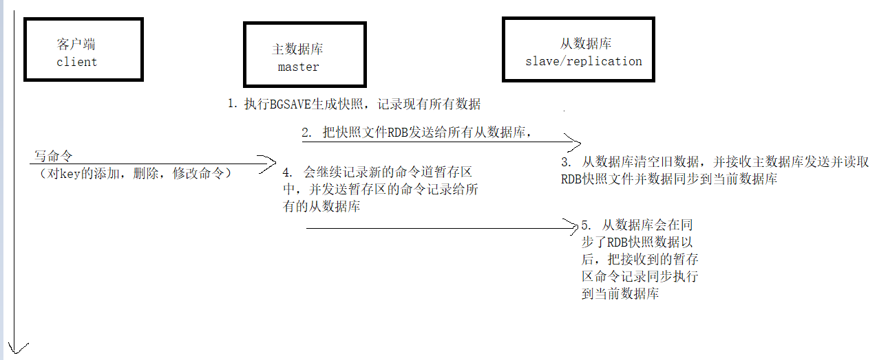

**主从复制优缺点：**

**优点：**

*   支持主从复制，主机会自动将数据同步到从机，可以进行读写分离
*   分担Master的读操作压力，Slave服务器可以为客户端提供只读操作的服务，写服务仍然必须由Master来完成
*   Slave同样可以接受其它Slaves的连接和同步请求，这样可以有效的分担Master的同步压力。
*   Master是以非阻塞的方式为Slaves提供服务。所以在主从同步期间，客户端仍然可以对redis提交查询或修改请求。
*   Slave同样是以非阻塞的方式完成数据同步。在同步主库数据期间，如果有客户端提交查询请求，Redis则返回同步之前的数据。

**缺点：**

*   Redis不具备自动容错和恢复功能，主机从机的宕机都会导致前端部分读写请求失败，需要等待机器重启或者手动切换前端的IP才能恢复。
*   主机宕机，宕机前有部分数据未能及时同步到从机，切换IP后还会引入数据不一致的问题，降低了系统的可用性。
*   单机的Redis较难支持在线扩容，在容量达到上限时在线扩容会变得很复杂。可以使用分布式集群。

docker-compose-reids.yml，代码：

```python
version: "3.7"
services:
  master:
    image: redis:6.2.6-alpine3.15
    container_name: redis-master
    restart: always
    command: redis-server --requirepass 123456
    ports:
      - "6379:6379"
    privileged: true

  slave1:
    image: redis:6.2.6-alpine3.15
    container_name: redis-slave-1
    restart: always
    ports:
      - "6380:6379"
    command: redis-server --replicaof redis-master 6379 --requirepass 123456 --masterauth 123456
    depends_on:
      - master

  slave2:
    image: redis:6.2.6-alpine3.15
    container_name: redis-slave-2
    restart: always
    ports:
      - "6381:6379"
    command: redis-server --replicaof redis-master 6379 --requirepass 123456 --masterauth 123456
    depends_on:
      - master
```

```bash
docker-compose -f docker-compose-reids.yml up -d
docker exec -it redis-master redis-cli
# auth 123456
# info replication
# set name xiaoming
# exit
docker exec -it redis-slave-1 redis-cli
# auth 123456
# info replication
# get name     # --> xiaoming
# set name     # 报错，因为从数据库无法写入数据，只能读取数据
```

注意：主从架构虽然可以让项目架构支撑更高的访问量，但是主从架构默认情况下是没有容灾机制的。所以我们为了提高整个项目架构的高可用性，也就是提高容灾性，会选择采用**哨兵集群模式**。

###### Docker-Compose搭建哨兵集群

sentinel哨兵是特殊的redis服务，不提供读写数据服务，主要用来监控redis实例节点。

哨兵模式（Redis-Sentinel）是官方推荐的高可用解决方案，上面redis在做master-slave主从复制的高可用方案时，假如master宕机了，redis本身（以及其很多客户端）都没有实现自动进行主从切换，而redis-sentinel本身也是独立运行的进程，可以部署在其他与redis集群可通讯的机器中监控redis集群。

哨兵的作用就是监控Redis系统的运行状况。其功能包括以下：

  （1）监控主服务器和从服务器是否正常运行。 往往一个哨兵监控一个redis
  （2）主服务器出现故障时自动将从服务器转换为主服务器。

**哨兵的工作方式：**

*   每个Sentinel（哨兵）进程以每秒钟一次的频率向整个集群中的Master主服务器，Slave从服务器以及其他Sentinel（哨兵）进程发送一个 PING 命令。
*   如果一个实例（instance）距离最后一次有效回复 PING 命令的时间超过 down-after-milliseconds 选项所指定的值， 则这个实例会被 Sentinel（哨兵）进程标记为主观下线（SDOWN）
*   如果一个Master主服务器被标记为主观下线（SDOWN），则正在监视这个Master主服务器的所有 Sentinel（哨兵）进程要以每秒一次的频率确认Master主服务器的确进入了主观下线状态
*   当有足够数量的 Sentinel（哨兵）进程（大于等于配置文件指定的值）在指定的时间范围内确认Master主服务器进入了主观下线状态（SDOWN）， 则Master主服务器会被标记为客观下线（ODOWN）
*   在一般情况下， 每个 Sentinel（哨兵）进程会以每 10 秒一次的频率向集群中的所有Master主服务器、Slave从服务器发送 INFO 命令。
*   当Master主服务器被 Sentinel（哨兵）进程标记为客观下线（ODOWN）时，Sentinel（哨兵）进程向下线的 Master主服务器的所有 Slave从服务器发送 INFO 命令的频率会从 10 秒一次改为每秒一次。(选举，所有 Slave从服务器会进行竞选，从中产生1台新的master主库)
*   若没有足够数量的 Sentinel（哨兵）进程同意 Master主服务器下线， Master主服务器的客观下线状态就会被移除。若 Master主服务器重新向 Sentinel（哨兵）进程发送 PING 命令返回有效回复，Master主服务器的主观下线状态就会被移除。（没有出现新的Master主库之前，如果客观下线过程中产生了新的master主库，则原来的Master主服务器在重新上线以后，会变成新的master主库的从库运行。）

**哨兵模式的优缺点**

**优点：**

*   哨兵模式是基于主从模式的，，哨兵模式具有主从模式的所有优点。
*   哨兵模式下，主从可以自动切换，系统更健壮，具有更高的可用性、容灾性。

**缺点：**

*   Redis较难支持在线扩容，在集群容量达到上限时在线扩容会变得很复杂。（解决：Codis或Redis-Cluster等分布式集群方案）

工作中最常用的哨兵集群方案：一主二从三哨兵

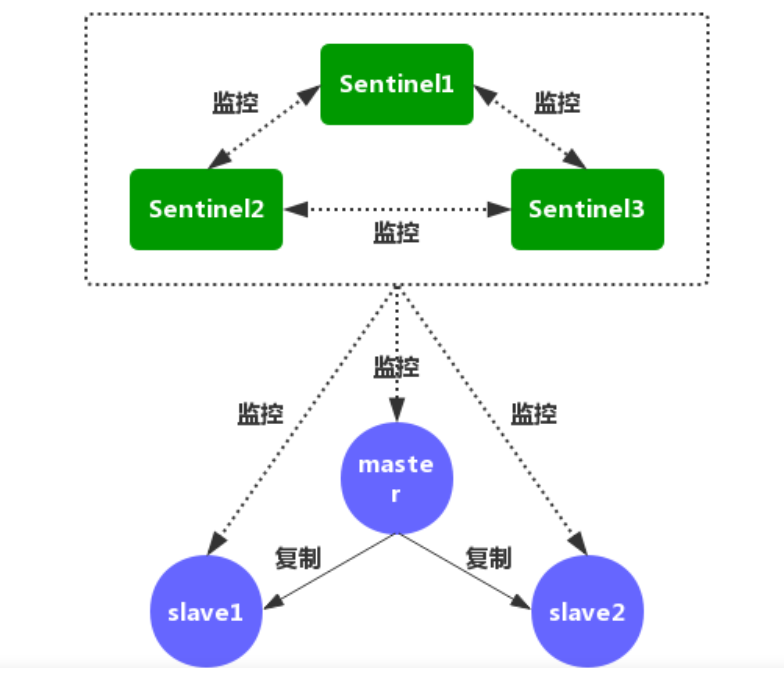

docker-compose-sentinel.yml，代码：

```yaml
version: '3.7'
services:
  master:
    image: redis:6.2.6-alpine3.15
    container_name: redis-master
    restart: always
    command: redis-server /usr/local/etc/redis/master.conf
    volumes:
      - "./conf/redis/master.conf:/usr/local/etc/redis/master.conf"
    ports:
      - "6379:6379"
    privileged: true
    networks:
      mynetwork:
        ipv4_address: 192.168.5.11

  slave1:
    image: redis:6.2.6-alpine3.15
    container_name: redis-slave-1
    restart: always
    ports:
      - "6380:6379"
    command: redis-server /usr/local/etc/redis/slave.conf
    volumes:
      - "./conf/redis/slave.conf:/usr/local/etc/redis/slave.conf"
    depends_on:
      - master
    networks:
      mynetwork:
        ipv4_address: 192.168.5.12

  slave2:
    image: redis:6.2.6-alpine3.15
    container_name: redis-slave-2
    restart: always
    ports:
      - "6381:6379"
    command: redis-server /usr/local/etc/redis/slave.conf
    volumes:
      - "./conf/redis/slave.conf:/usr/local/etc/redis/slave.conf"
    depends_on:
      - master
    networks:
      mynetwork:
        ipv4_address: 192.168.5.13

  sentinel1:
    image: redis:6.2.6-alpine3.15
    container_name: redis-sentinel-1
    restart: always
    ports:
      - "26379:26379"
    command: redis-sentinel /usr/local/etc/redis/sentinel.conf
    volumes:
      - "./conf/redis/sentinel.conf:/usr/local/etc/redis/sentinel.conf"
    depends_on:
      - master
      - slave1
      - slave2
    networks:
      mynetwork:
        ipv4_address: 192.168.5.14

  sentinel2:
    image: redis:6.2.6-alpine3.15
    container_name: redis-sentinel-2
    restart: always
    ports:
      - "26380:26379"
    command: redis-sentinel /usr/local/etc/redis/sentinel.conf
    volumes:
      - "./conf/redis/sentinel.conf:/usr/local/etc/redis/sentinel.conf"
    depends_on:
      - master
      - slave1
      - slave2
    networks:
      mynetwork:
        ipv4_address: 192.168.5.15

  sentinel3:
    image: redis:6.2.6-alpine3.15
    container_name: redis-sentinel-3
    restart: always
    ports:
      - "26381:26379"
    command: redis-sentinel /usr/local/etc/redis/sentinel.conf
    volumes:
      - ./conf/redis/sentinel.conf:/usr/local/etc/redis/sentinel.conf
    depends_on:
      - master
      - slave1
      - slave2
    networks:
      mynetwork:
        ipv4_address: 192.168.5.16

networks:
  mynetwork:
    driver: bridge
    ipam:
      driver: default
      config:
        - subnet: 192.168.5.0/24
```

conf/redis/master.conf，主库配置文件，代码：

```yaml
requirepass 123456
masterauth 123456
bind 0.0.0.0
# Generated by CONFIG REWRITE
dir "/data"
```

conf/redis/slave.conf，从库配置文件，代码：

```yaml
replicaof master 6379
requirepass 123456
masterauth 123456
bind 0.0.0.0
# Generated by CONFIG REWRITE
dir "/data"
```

conf/redis/sentinel.conf，哨兵配置文件，代码：

```bash
port 26379
dir "/tmp"

sentinel deny-scripts-reconfig yes
sentinel monitor mymaster 192.168.5.11 6379 2
sentinel down-after-milliseconds mymaster 3000
sentinel failover-timeout mymaster 3000
sentinel auth-pass mymaster 123456
sentinel config-epoch mymaster 0
# Generated by CONFIG REWRITE
sentinel leader-epoch mymaster 0
sentinel known-replica mymaster 192.168.5.13 6379
sentinel known-replica mymaster 192.168.5.12 6379
sentinel current-epoch 0
```

配置完成，接下来启动服务。

```bash
docker-compose -f docker-compose-sentinel.yml up -d
docker exec -it redis-master redis-cli
# auth 123456
# info replication
# set name xiaoming
# exit
docker exec -it redis-slave-1 redis-cli
# auth 123456
# info replication
# get name     # --> xiaoming
# set name     # 报错，因为从数据库无法写入数据，只能读取数据
# exit

docker exec -it redis-sentinel-1 redis-cli -p 26379
# info sentinel

# 关闭主库
docker stop redis-master

# 等待30秒以后，观察哨兵是否选举出了新的主库。
docker exec -it redis-slave-1 redis-cli
# auth 123456
# info replication

docker exec -it redis-slave-2 redis-cli
# auth 123456
# info replication

# 启动redis-master容器，查看是否自动切换成了从库。
docker start redis-master
docker exec -it redis-master redis-cli
# auth 123456
# info replication
```

###### Docker-Compose搭建redis-cluster分布式集群

**特点**

在Redis 3.0版本以后，Redis发布了Redis Cluster。Redis Cluster是社区版推出的Redis分布式集群解决方案，Redis Cluster主要解决Redis分布式方面的需求，着眼于提高并发量以支持高并发和海量数据处理等业务。比如当遇到单机内存，并发和流量等瓶颈的时候，Redis Cluster能起到很好的负载均衡的目的。Redis集群既实现了主从复制，也兼顾了哨兵的选举模式。

**优势**

① 自动分割数据到不同的节点上。基于哈希槽保存数据

② 整个集群的部分节点失败或者不可达的情况下能够继续处理命令。

key=uname   ----> CRC16(uname)   ----> 44

key=age        ----> CRC16(age)   --> 33

44%4 = 11...0

33%4 = 8 ... 1

[uname] [age] [] [] [] []

**哈希槽**

Redis Cluster集群固定由16384个哈希槽，每个数据的key通过CRC16校验算后对16384取模来决定key对应的数据放置哪个槽，集群的每个服务器节点负责一部分hash槽，也就是说数据存放在hash槽里，而每个服务器节点只负责部分hash槽（这样数据就存放在不同的服务器节点）。

redis-cluster的源码文件[src](https://github.com/y123456yz/Reading-and-comprehense-redis-cluster/tree/master/redis-3.0/src)/**cluster.c**中声明了keyHashSlot函数中基于CRC16校验算法计算指定key应该被分配到哪个槽。

相关文档：https://github.com/y123456yz/Reading-and-comprehense-redis-cluster

**集群搭建**

群集至少需要3主3从，且每个实例使用不同的配置文件。

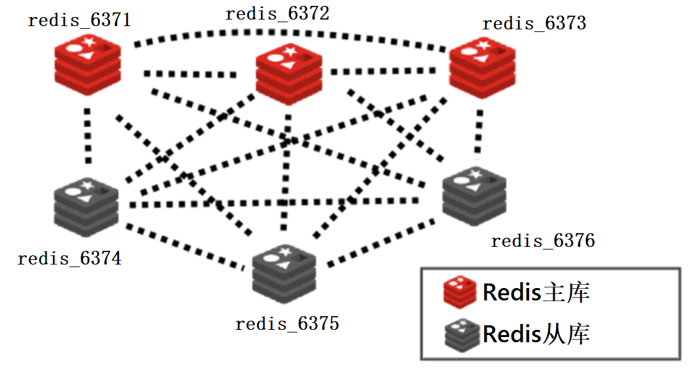

此处的IP，需要查看当前宿主机的IP网卡地址。

```bash
mkdir -p cluster/conf
touch cluster/conf/redis-637{1..6}.conf
echo -e '# 端口\nport 6371\n# 是否开启集群模式，默认 no\ncluster-enabled yes\n# 集群节点信息文件\ncluster-config-file nodes-6371.conf\n# 集群节点连接超时时间\ncluster-node-timeout 15000\n# aof模式开启和aof数据文件名\nappendonly yes\nappendfilename "appendonly-6371.aof"\n# rdb数据文件名\ndbfilename dump-6371.rdb\n# 设置密码\nrequirepass 123456\n# 从节点访问主节点密码(必须与 requirepass 一致)\nmasterauth 123456\n# 集群节点 IP（宿主机IP）\ncluster-announce-ip 10.0.0.129\n# 集群节点映射端口\ncluster-announce-port 6371\n# 集群节点总线端口\ncluster-announce-bus-port 16371' > cluster/conf/redis-6371.conf

echo -e '# 端口\nport 6372\n# 是否开启集群模式，默认 no\ncluster-enabled yes\n# 集群节点信息文件\ncluster-config-file nodes-6372.conf\n# 集群节点连接超时时间\ncluster-node-timeout 15000\n# aof模式开启和aof数据文件名\nappendonly yes\nappendfilename "appendonly-6372.aof"\n# rdb数据文件名\ndbfilename dump-6372.rdb\n# 设置密码\nrequirepass 123456\n# 从节点访问主节点密码(必须与 requirepass 一致)\nmasterauth 123456\n# 集群节点 IP（宿主机IP）\ncluster-announce-ip 10.0.0.129\n# 集群节点映射端口\ncluster-announce-port 6372\n# 集群节点总线端口\ncluster-announce-bus-port 16372' > cluster/conf/redis-6372.conf

echo -e '# 端口\nport 6373\n# 是否开启集群模式，默认 no\ncluster-enabled yes\n# 集群节点信息文件\ncluster-config-file nodes-6373.conf\n# 集群节点连接超时时间\ncluster-node-timeout 15000\n# aof模式开启和aof数据文件名\nappendonly yes\nappendfilename "appendonly-6373.aof"\n# rdb数据文件名\ndbfilename dump-6373.rdb\n# 设置密码\nrequirepass 123456\n# 从节点访问主节点密码(必须与 requirepass 一致)\nmasterauth 123456\n# 集群节点 IP（宿主机IP）\ncluster-announce-ip 10.0.0.129\n# 集群节点映射端口\ncluster-announce-port 6373\n# 集群节点总线端口\ncluster-announce-bus-port 16373' > cluster/conf/redis-6373.conf

echo -e '# 端口\nport 6374\n# 是否开启集群模式，默认 no\ncluster-enabled yes\n# 集群节点信息文件\ncluster-config-file nodes-6374.conf\n# 集群节点连接超时时间\ncluster-node-timeout 15000\n# aof模式开启和aof数据文件名\nappendonly yes\nappendfilename "appendonly-6374.aof"\n# rdb数据文件名\ndbfilename dump-6374.rdb\n# 设置密码\nrequirepass 123456\n# 从节点访问主节点密码(必须与 requirepass 一致)\nmasterauth 123456\n# 集群节点 IP（宿主机IP）\ncluster-announce-ip 10.0.0.129\n# 集群节点映射端口\ncluster-announce-port 6374\n# 集群节点总线端口\ncluster-announce-bus-port 16374' > cluster/conf/redis-6374.conf

echo -e '# 端口\nport 6375\n# 是否开启集群模式，默认 no\ncluster-enabled yes\n# 集群节点信息文件\ncluster-config-file nodes-6375.conf\n# 集群节点连接超时时间\ncluster-node-timeout 15000\n# aof模式开启和aof数据文件名\nappendonly yes\nappendfilename "appendonly-6375.aof"\n# rdb数据文件名\ndbfilename dump-6375.rdb\n# 设置密码\nrequirepass 123456\n# 从节点访问主节点密码(必须与 requirepass 一致)\nmasterauth 123456\n# 集群节点 IP（宿主机IP）\ncluster-announce-ip 10.0.0.129\n# 集群节点映射端口\ncluster-announce-port 6375\n# 集群节点总线端口\ncluster-announce-bus-port 16375' > cluster/conf/redis-6375.conf

echo -e '# 端口\nport 6376\n# 是否开启集群模式，默认 no\ncluster-enabled yes\n# 集群节点信息文件\ncluster-config-file nodes-6376.conf\n# 集群节点连接超时时间\ncluster-node-timeout 15000\n# aof模式开启和aof数据文件名\nappendonly yes\nappendfilename "appendonly-6376.aof"\n# rdb数据文件名\ndbfilename dump-6376.rdb\n# 设置密码\nrequirepass 123456\n# 从节点访问主节点密码(必须与 requirepass 一致)\nmasterauth 123456\n# 集群节点 IP（宿主机IP）\ncluster-announce-ip 10.0.0.129\n# 集群节点映射端口\ncluster-announce-port 6376\n# 集群节点总线端口\ncluster-announce-bus-port 16376' > cluster/conf/redis-6376.conf
```

docker-compose-cluster-redis.yml，代码：

```yaml
version: "3.7"
services:
  redis_6371:
    image: redis:6.2.6-alpine3.15
    container_name: redis_6371
    restart: always
    volumes:
      - ./cluster/conf/redis-6371.conf:/usr/local/etc/redis/redis.conf
      - ./cluster/data/redis-6371:/data
    ports:
      - 6371:6371
      - 16371:16371
    command:
      ["redis-server", "/usr/local/etc/redis/redis.conf"]

  redis_6372:
    image: redis:6.2.6-alpine3.15
    container_name: redis_6372
    volumes:
      - ./cluster/conf/redis-6372.conf:/usr/local/etc/redis/redis.conf
      - ./cluster/data/redis-6372:/data
    ports:
      - 6372:6372
      - 16372:16372
    command:
      ["redis-server", "/usr/local/etc/redis/redis.conf"]

  redis_6373:
    image: redis:6.2.6-alpine3.15
    container_name: redis_6373
    volumes:
      - ./cluster/conf/redis-6373.conf:/usr/local/etc/redis/redis.conf
      - ./cluster/data/redis-6373:/data
    ports:
      - 6373:6373
      - 16373:16373
    command:
      ["redis-server", "/usr/local/etc/redis/redis.conf"]

  redis_6374:
    image: redis:6.2.6-alpine3.15
    container_name: redis_6374
    restart: always
    volumes:
      - ./cluster/conf/redis-6374.conf:/usr/local/etc/redis/redis.conf
      - ./cluster/data/redis-6374:/data
    ports:
      - 6374:6374
      - 16374:16374
    command:
      ["redis-server", "/usr/local/etc/redis/redis.conf"]

  redis_6375:
    image: redis:6.2.6-alpine3.15
    container_name: redis_6375
    volumes:
      - ./cluster/conf/redis-6375.conf:/usr/local/etc/redis/redis.conf
      - ./cluster/data/redis-6375:/data
    ports:
      - 6375:6375
      - 16375:16375
    command:
      ["redis-server", "/usr/local/etc/redis/redis.conf"]

  redis_6376:
    image: redis:6.2.6-alpine3.15
    container_name: redis_6376
    volumes:
      - ./cluster/conf/redis-6376.conf:/usr/local/etc/redis/redis.conf
      - ./cluster/data/redis-6376:/data
    ports:
      - 6376:6376
      - 16376:16376
    command:
      ["redis-server", "/usr/local/etc/redis/redis.conf"]
```

**构建集群**

```bash
docker-compose -f docker-compose-cluster-redis.yml up -d

# 进入其中一台redis容器
docker exec -it redis_6371 sh

# 构建集群
redis-cli -a 123456 --cluster create \
10.0.0.129:6371 10.0.0.129:6372 \
10.0.0.129:6373 10.0.0.129:6374 \
10.0.0.129:6375 10.0.0.129:6376 \
--cluster-replicas 1

# yes
```

**验证效果**

```bash

### 连接集群

redis-cli -c -a 123456 -h 10.0.0.129 -p 6376
set name xiaoming
# -> Redirected to slot [5798] located at 10.0.0.129:6372
# OK
get name
# -> Redirected to slot [5798] located at 10.0.0.129:6372
# "xiaoming"

set age 18
# -> Redirected to slot [741] located at 10.0.0.129:6371
# OK
get age
# -> Redirected to slot [741] located at 10.0.0.129:6371
# "18"

### 检查集群状态

redis-cli -a 123456 --cluster check 10.0.0.129:6371
# Warning: Using a password with '-a' or '-u' option on the command line interface may not be safe.
# 10.0.0.129:6371 (faf04504...) -> 2 keys | 5461 slots | 1 slaves.
# 10.0.0.129:6373 (e2dbf0c9...) -> 1 keys | 5461 slots | 1 slaves.
# 10.0.0.129:6372 (0026bfda...) -> 2 keys | 5462 slots | 1 slaves.
# [OK] 5 keys in 3 masters.
# 0.00 keys per slot on average.
# >>> Performing Cluster Check (using node 10.0.0.129:6371)
# M: faf0450469bc74cb0b6356384ea65be30ce91455 10.0.0.129:6371
#    slots:[0-5460] (5461 slots) master
#    1 additional replica(s)
# S: 6703581ec5fdb12034a38958d0ca3101da27a540 10.0.0.129:6374
#    slots: (0 slots) slave
#    replicates 0026bfdabf6bc0c5e97fdc84b6410cbd85c5bae3
# M: e2dbf0c93e0d34fc73e2df8e19bec9a96b674722 10.0.0.129:6373
#    slots:[10923-16383] (5461 slots) master
#    1 additional replica(s)
# M: 0026bfdabf6bc0c5e97fdc84b6410cbd85c5bae3 10.0.0.129:6372
#    slots:[5461-10922] (5462 slots) master
#    1 additional replica(s)
# S: 545443543f805ab2a00d2420208a1f21b1816d05 10.0.0.129:6375
#    slots: (0 slots) slave
#    replicates e2dbf0c93e0d34fc73e2df8e19bec9a96b674722
# S: 3c3f5fb10f340c086a0e2c2d9c9e53c10daf744b 10.0.0.129:6376
#    slots: (0 slots) slave
#    replicates faf0450469bc74cb0b6356384ea65be30ce91455
# [OK] All nodes agree about slots configuration.
# >>> Check for open slots...
# >>> Check slots coverage...
# [OK] All 16384 slots covered.

# 测试选举
# 关闭一个主库，例如：6371
docker stop redis_6371

# 进入其中一台redis容器
docker exec -it redis_6376 sh

# 进入上面主库对应的从库，例如：6371的从库是6376
redis-cli -c -a 123456 -h 10.0.0.129 -p 6376
# info replication
# 可以看到从库被选举成了主库

# 再次启动原来的主库，例如：6371
docker start redis_6371

# 进入其中一台redis容器
docker exec -it redis_6371 sh

# 进入刚刚主库，例如：6371
redis-cli -c -a 123456 -h 10.0.0.129 -p 6371
# info replication
# 可以看到刚启动6371由原来的主库变成了从库
```

注意：Redis集群不能保证数据的强一致性。主要原因是Redis集群采用**异步写**的方法，即当客户端向Master主库写入一条数据后，Master主库先进行主从数据异步写入到从库，然后再给客户端返回一个执行结果，这样当客户端完成写入并拿到Master返回的结果时（Master有可能还未来得及执行主从同步），Master出现宕机或网络不可达，就出现了数据不一致的情况，这就是Redis的异步写的缺点。但是如果Redis集群采用同步写，那么整个集群的性能将大大下降（即：客户端写入数据后，Master先执行主从同步，然后才返回写入结果给客户端）。

###### Docker-Compose搭建elasticsearch单点服务

docker-compose-single-es.yml，代码：

```yaml
version: "3.7"
services:
  elasticsearch:
    image: elasticsearch:7.16.1
    environment:
      - "discovery.type=single-node"
      - "bootstrap.memory_lock=true"
      - "ES_JAVA_OPTS=-Xms256m -Xmx256m"
      - "xpack.security.enabled=false"
      - "http.cors.enabled=true"
      - "http.cors.allow-origin=*"
    ulimits:
      memlock:
        soft: -1
        hard: -1
    volumes:
      - ./data/elastic:/usr/share/elasticsearch/data
      - ./log/elastic:/var/log/elasticsearch
      - ./plugins:/usr/share/elasticsearch/plugins
    ports:
      - 9200:9200
    networks:
      - default
networks:
  default:
```

接下来，我们可以把elasticsearch容器和ik分词器一步到位的集成进来。

ik分词器下载：https://github.com/medcl/elasticsearch-analysis-ik/releases

注意：ik分词器仅支持中文分词，如果要基于亚洲其他国家（如日文、韩文等）则可以采用官方提供的icu分词器插件来集成实现，icu的使用和ik分词器一样。

```bash
mkdir /home/compose/data/elastic
chmod 777 /home/compose/data/elastic
mkdir -p /home/compose/plugins
wget https://github.com/medcl/elasticsearch-analysis-ik/releases/download/v7.16.1/elasticsearch-analysis-ik-7.16.1.zip
unzip elasticsearch-analysis-ik-7.16.1.zip -d /home/compose/plugins/ik-7.16.1

docker-compose -f docker-compose-single-es.yml up -d
```

测试：

post http://10.0.0.129:9200/_analyze?pretty

```json
{
    "analyzer":"standard",        // es内置标准分词
    // "analyzer":"ik_max_word",  // ik最大分词
    // "analyzer":"ik_smart",     // ik智能分词
    "text": "我是中国人，我来自北京。"
}
```

###### Docker-Compose搭建elasticsearch分布式集群服务

文档：https://www.elastic.co/guide/en/elasticsearch/reference/7.16/docker.html

docker-compose-cluster-es.yml，代码：

```yaml
version: "3.7"
services:
  es01:
    image: docker.elastic.co/elasticsearch/elasticsearch:7.16.1
    container_name: es01
    environment:
      - node.name=es01
      - cluster.name=es-docker-cluster
      - discovery.seed_hosts=es02,es03
      - cluster.initial_master_nodes=es01,es02,es03
      - bootstrap.memory_lock=true
      - "ES_JAVA_OPTS=-Xms512m -Xmx512m"
    ulimits:
      memlock:
        soft: -1
        hard: -1
    volumes:
      - ./data/elastic01:/usr/share/elasticsearch/data
      - ./log/elastic01:/var/log/elasticsearch
      - ./plugins:/usr/share/elasticsearch/plugins
    ports:
      - 9200:9200
    networks:
      - elastic
  es02:
    image: docker.elastic.co/elasticsearch/elasticsearch:7.16.1
    container_name: es02
    environment:
      - node.name=es02
      - cluster.name=es-docker-cluster
      - discovery.seed_hosts=es01,es03
      - cluster.initial_master_nodes=es01,es02,es03
      - bootstrap.memory_lock=true
      - "ES_JAVA_OPTS=-Xms512m -Xmx512m"
    ulimits:
      memlock:
        soft: -1
        hard: -1
    volumes:
      - ./data/elastic02:/usr/share/elasticsearch/data
      - ./log/elastic02:/var/log/elasticsearch
      - ./plugins:/usr/share/elasticsearch/plugins
    networks:
      - elastic
  es03:
    image: docker.elastic.co/elasticsearch/elasticsearch:7.16.1
    container_name: es03
    environment:
      - node.name=es03
      - cluster.name=es-docker-cluster
      - discovery.seed_hosts=es01,es02
      - cluster.initial_master_nodes=es01,es02,es03
      - bootstrap.memory_lock=true
      - "ES_JAVA_OPTS=-Xms512m -Xmx512m"
    ulimits:
      memlock:
        soft: -1
        hard: -1
    volumes:
      - ./data/elastic03:/usr/share/elasticsearch/data
      - ./log/elastic03:/var/log/elasticsearch
      - ./plugins:/usr/share/elasticsearch/plugins
    networks:
      - elastic

volumes:
  data01:
    driver: local
  data02:
    driver: local
  data03:
    driver: local

networks:
  elastic:
    driver: bridge
```

启动服务容器

```bash
mkdir -m 777 -p /home/compose/data/elastic01
mkdir -m 777 -p /home/compose/data/elastic02
mkdir -m 777 -p  /home/compose/data/elastic03

# 解决es启动时内存过小导致宕机的情况
vim /etc/sysctl.conf
文件最后添加一行: vm.max_map_count=262144
sysctl -p

docker-compose -f docker-compose-cluster-es.yml up -d
```

测试：

post http://10.0.0.129:9200/_analyze?pretty

```json
{
    "analyzer":"standard",        // es内置标准分词
    // "analyzer":"ik_max_word",  // ik最大分词
    // "analyzer":"ik_smart",     // ik智能分词
    "text": "我是中国人，我来自北京。"
}
```
