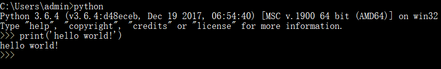
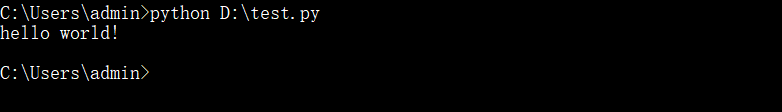

# Python的运行方法

### 方式一： 交互式模式

### 方式二：脚本文件

1、打开一个文本编辑工具，写入下述代码，并保存文件，此处文件的路径为D:\test.py。强调：python解释器执行程序是解释执行，解释的根本就是打开文件读内容，因此文件的后缀名没有硬性限制，但通常定义为.py结尾
print('hello world')

2、打开cmd，运行命令，如下图

**总结**：

- 交互式模式下可以即时得到代码执行结果，调试程序十分方便
- 若想将代码永久保存下来，则必须将代码写入文件中
- 我们以后主要就是在代码写入文件中，偶尔需要打开交互式模式调试某段代码、验证结果

