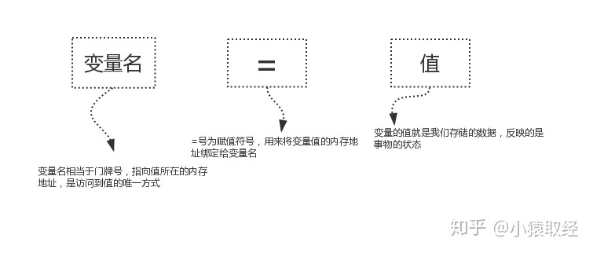

# 变量、常量

## 一、什么是变量

在程序设计中，变量是一种存储数据的载体。计算机中的变量是实际存在的数据或者说是存储器中存储数据的一块内存空间，变量的值可以被读取和修改，这是所有计算和控制的基础。

白话：变量就是可以变化的量，量指的是事物的状态，比如人的年龄、性别，游戏角色的等级、金钱等等


## 二、为什么要有变量

为了让计算机能够像人一样去记忆事物的某种状态，并且状态是可以发生变化的。

详细地说：

程序执行的本质就是一系列状态的变化，变是程序执行的直接体现，所以我们需要有一种机制能够反映或者说是保存下来程序执行时状态，以及状态的变化。


## 三、怎么使用变量（先定义、后使用）

### 3.1、变量的定义与使用

变量的定义由三部分组成，如下图



定义变量示范如下

```python
name = 'John'		 # 记下人的名字为'John'
sex = '男'           # 记下人的性别为男性
age = 18             # 记下人的年龄为18岁
salary = 15000.123   # 记下人的薪资为15000.123元
```

解释器执行到变量定义的代码时会申请内存空间存放变量值，然后将变量值的内存地址绑定给变量名


### 3.2 、变量的赋值类型

- 单一赋值

  变量名 = 值

- 统一赋值

  变量1 = 变量2 = 变量n = 值

- 对称赋值

  变量1,变量2,变量n = 值1,值2,值n

```python
# 单一赋值
a = 1

# 统一赋值
a = b = c = 1

# 对称赋值
a,b = 1,2
```

### 3.3、变量名的命名规范

对于每个变量我们需要给它取一个名字，就如同我们每个人都有属于自己的响亮的名字一样。在Python中，变量命名需要遵循以下规则。

- 硬性规则：
  - 变量名由字母（广义的Unicode字符，不包括特殊字符）、数字和下划线构成，数字不能开头
  - 大小写敏感（大写的`a`和小写的`A`是两个不同的变量）
  - 不要跟关键字和系统保留字（如函数、模块等的名字）冲突

  - 见名知意
  

**作为一个专业的程序员，给变量（事实上应该是所有的标识符）命名时做到<u>见名知意</u>也是非常重要的。**


### 3.4、变量名的命名风格

 ```python
# 风格一：驼峰体，变量名中每个单词的开头字母大写
AgeOfTony = 56 
NumberOfStudents = 80
    
# 风格二：纯小写下划线(在python中，变量名的命名推荐使用该风格)
age_of_tony = 56 
number_of_students = 80
 ```


### 3.5、变量值的三大特性

变量的值具备三大特性

```python
#1、id
反应的是变量在内存中的唯一编号，内存地址不同id肯定不同

#2、type
变量值的类型

#3、value
变量值
```

查看变量值三大特性的方式如下，我们将会在运算符中用到变量值的三大特性

```python
>>> x='Info Tony:18'
>>> id(x),type(x),x
4376607152，<class 'str'>,'Info Tony:18'
```


## 四、变量的删除 del

**格式:**

del 变量名

(1) 删除一个变量

```python
name = "lucky"
del name
```

(2) 删除多个变量

```python
name = "lucky"
age = 18
del name,age
```


## 五、常量

### 5.1、什么是常量？

常量指在程序运行过程中不会改变的量


### 5.2、为什么要有常量？

在程序运行过程中，有些值是固定的、不应该被改变，比如圆周率 3.141592653...


### 5.3、怎么使用常量？

**在Python中没有一个专门的语法定义常量，约定用全部大写的变量名表示常量。**

如：PI=3.14159

所以单从语法层面去讲，常量的使用与变量完全一致。

**Tips：常亮只是一个约定，遵不遵守在个人**

