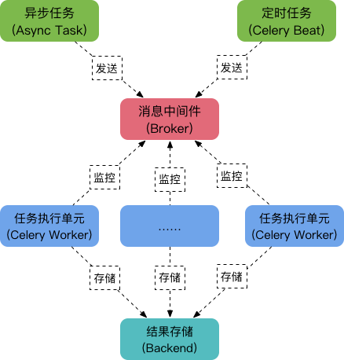

# celery 分布式任务队列


用户发起请求 request ，等待服务端的 response 响应， 但是如果在服务端视图函数中有一些耗时操作，那用户就要等待很长时间才能接收到响应，对于用户来说体验很差。

## 一、简介

Celery是由Python开发、简单、灵活、可靠的分布式任务队列，其本质是生产者消费者模型，生产者发送任务到消息队列，消费者负责处理任务。Celery侧重于实时操作，但对调度支持也很好，其每天可以处理数以百万计的任务。

### 特点

- 简单：熟悉celery的工作流程后，配置使用简单
- 高可用：当任务执行失败或执行过程中发生连接中断，celery会自动尝试重新执行任务
- 快速：一个单进程的celery每分钟可处理上百万个任务
- 灵活：几乎celery的各个组件都可以被扩展及自定制

### 应用场景举例

　　1.web应用：当用户在网站进行某个操作需要很长时间完成时，我们可以将这种操作交给Celery执行，直接返回给用户，等到Celery执行完成以后通知用户，大大提好网站的并发以及用户的体验感。

　　2.任务场景：比如在运维场景下需要批量在几百台机器执行某些命令或者任务，此时Celery可以轻松搞定。

　　3.定时任务：向定时导数据报表、定时发送通知类似场景，虽然Linux的计划任务可以帮我实现，但是非常不利于管理，而Celery可以提供管理接口和丰富的API。

## 二、celery的核心模块

**Task**：就是任务，有异步任务和定时任务

**Broker**：中间人，接收生产者发来的消息即Task，将任务存入队列。任务的消费者是Worker。

**Worker**：执行任务的单元，它实时监控消息队列，如果有任务就获取任务并执行它。

**Beat**：定时任务调度器，根据配置定时将任务发送给Broker。

**Backend**：用于存储任务的执行结果。



工作原理：

1. 任务模块Task包含异步任务和定时任务。其中，异步任务通常在业务逻辑中被触发并发往消息队列，而定时任务由Celery Beat进程周期性地将任务发往消息队列；
2. 任务执行单元Worker实时监视消息队列获取队列中的任务执行；
3. Woker执行完任务后将结果保存在Backend中;

**消息中间件Broker**

消息中间件Broker官方提供了很多备选方案，支持RabbitMQ、Redis、Amazon SQS、MongoDB、Memcached 等，官方推荐RabbitMQ。

**任务执行单元Worker**

Worker是任务执行单元，负责从消息队列中取出任务执行，它可以启动一个或者多个，也可以启动在不同的机器节点，这就是其实现分布式的核心。

**结果存储Backend**

Backend结果存储官方也提供了诸多的存储方式支持：RabbitMQ、 Redis、Memcached,SQLAlchemy, Django ORM、Apache Cassandra、Elasticsearch。

## 三、配置

### 1、模块安装

+ pip install celery
+ pip install celery-with-redis
+ pip install django-celery
+ pip install redis==2.10.6

### 2、配置

- settings.py 中 INSTALLED_APPS 下

  ```python
  INSTALLED_APPS = [
      ...
      'App',
      'djcelery',
  ]
  ```

- settings.py 下方添加

  ```python
  import djcelery
  djcelery.setup_loader()  # 初始化
  BROKER_URL = 'redis://127.0.0.1:6379/0'
  CELERY_IMPORTS = ('App.task')  # 导入执行的任务
  ```

### 3、添加耗时任务

App/task.py

```python
from celery import task
import time

# 耗时操作
@task
def test1():
    print('耗时开始')
    time.sleep(5)
    print('耗时结束')
```

### 7、执行迁移

生成所需celery表

python manage.py migrate

### 8、project下新建celery

```python
from __future__ import absolute_import

import os
from celery import Celery
from django.conf import settings

os.environ.setdefault('DJANGO_SETTINGS_MODULE', 'whthas_home.settings')

app = Celery('portal')

app.config_from_object('django.conf:settings')
app.autodiscover_tasks(lambda: settings.INSTALLED_APPS)


@app.task(bind=True)
def debug_task(self):
    print('Request: {0!r}'.format(self.request))
```

### 9、工程project/init

```python
from .celery import app as celery_app
```

### 10、视图函数中使用celery

```python
from django.shortcuts import render, HttpResponse
import time
from .task import test1
# Create your views here.
def index(req):
    # 执行耗时任务
    test1.delay()
    return HttpResponse('index')
```

### 11、启动顺序

+ 启动redis

  redis-cli

+ 启动服务

  python manage.py runserver

+ 启动worker

  python manage.py celery worker --loglevel=info

### 12、将邮件发送发到celery中

task.py

```python
from celery import task
import time
from django.conf import settings


# 耗时操作
@task
def test1(subject, content, *args):
    # print('耗时开始')
    # time.sleep(5)
    # print('耗时结束')
    from django.core.mail import send_mass_mail, EmailMessage
    msg = EmailMessage(subject, content, settings.EMAIL_HOST_USER, args)
    msg.content_subtype = "html"  # Main content is now text/html
    msg.send()
```

views.py

```python
from django.shortcuts import render, HttpResponse
import time
from .task import test1
# Create your views here.
def index(req):
    # 执行耗时任务
    test1.delay('主题', '内容', '793390457@qq.com')
    return HttpResponse('index')
```

### 13、定时执行

+ 定时执行一个任务

  task.py添加定时任务

  ```python
  @task
  def test2():
      print('定时任务开启')
      print('定时任务结束')
  ```

  settings.py中添加如下代码

  ```python
  from datetime import timedelta
  # 添加定时任务
  CELERYBEAT_SCHEDULE = {
      'schedule-test':{
          'task':'App.task.test2',
          'schedule': timedelta(seconds=3),  # 定时任务3秒一次
          # 'args': (1,)  # 如果任务需要传参则传递参数
      },
  }
  ```

+ 启动

  + 启动redis

    redis-cli

  + 启动django

    python manage.py runserver

  + 启动worker

    python manage.py celery worker --loglevel=info

  + 开启定时任务

    python manage.py celery beat  --loglevel=info

+ 定时执行多个任务

  task.py

  ```python
  @task
  def test3(i):
      print('定时任务开启')
      print(i)
      print('定时任务结束')
  ```

  settings.py

  ```python
  from datetime import timedelta
  # 添加定时任务
  CELERYBEAT_SCHEDULE = {
      'schedule-test1':{
          'task':'App.task.test2',
          'schedule': timedelta(seconds=3),  # 定时任务3秒一次
          # 'args': (1,)  # 如果任务需要传参则传递参数
      },
      'schedule-test2':{
          'task':'App.task.test3',
          'schedule': timedelta(seconds=3),  # 定时任务3秒一次
          # 'args': (1,)  # 如果任务需要传参则传递参数
      },
  }
  ```

### 14、修改报错

+ 启动django
+ 启动worker

出现报错

按照报错位置 将所有async 改为async1
