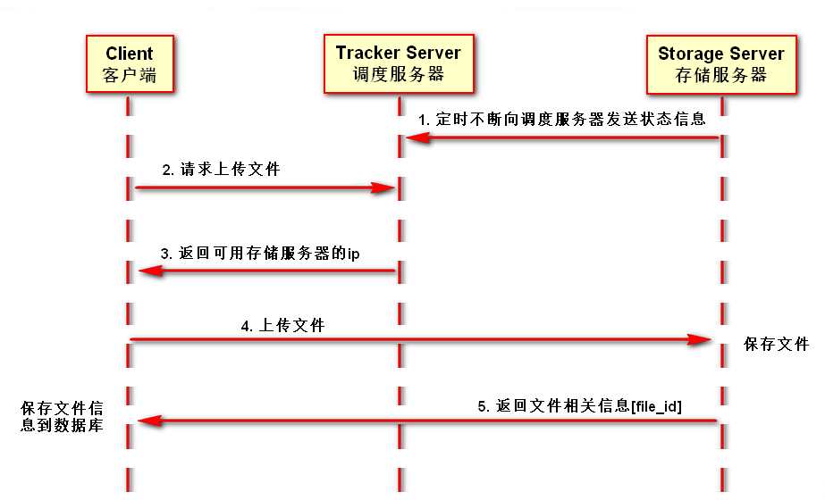
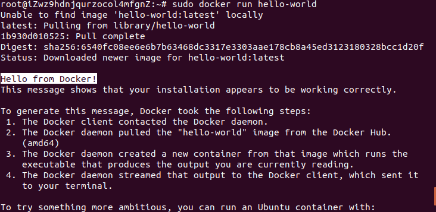
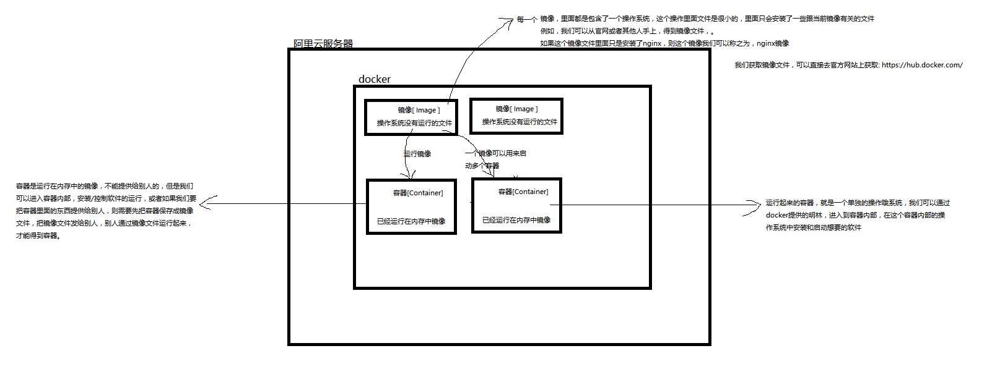
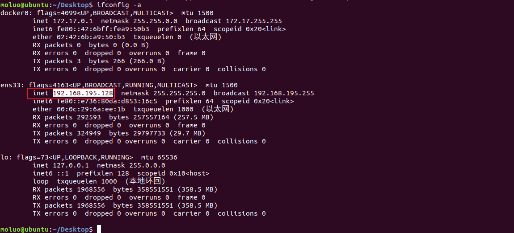

# FastDFS分布式文件系统

## FastDFS

FastDFS 是用 c 语言编写的一款开源的分布式文件系统。FastDFS 为互联网量身定制， 充分考虑了冗余备份、负载均衡、线性扩容等机制，并注重高可用、高性能等指标，使用 FastDFS 很容易搭建一套高性能的文件服务器集群提供文件上传、下载等服务。

为什么要用FastDFS？

```bash
1. 解决海量存储，同时存储容量扩展方便。
2. 解决文件内容重复, 如果用户上传的文件重复(文件指纹一样 md5_files. sha1_files)，那么系统只有存储一份数据，这项技术目前被广泛应用在网盘和即时通讯中。
3. 结合Nginx提高网站读取图片的效率。
```


## FastDFS的原理

FastDFS 架构包括 **Tracker server** 和 **Storage server**。客户端请求 Tracker server 进行文件上传、下载文件 ，通过 Tracker server 调度最终由 Storage server 完成文件上传和下载。

-   **Tracker server** 作用是负载均衡和存储调度，通过 Tracker server 在文件上传时可以根据一些 策略算法找到 Storage server 提供文件上传服务。可以将 tracker 称为**追踪服务器**或**调度服务器**。
-   **Storage server** 作用是文件存储，客户端上传的文件最终存储在 Storage 服务器上， Storage Serve利用操作系统 的文件系统来管理文件。可以将 storage 称为**存储服务器**。


服务端由两部分组成:

-   **Tracker**: 管理集群，tracker 也可以实现集群。每个 tracker 节点地位平等。收集 Storage 集群的状态。
-   **Storage**: 实际保存文件， Storage 分为多个组，每个组之间保存的文件是不同的。每 个组内部可以有多个成员，组成员内部保存的内容是一样的，组成员的地位是一致的，没有 主从的概念。


## 文件上传流程



客户端上传文件后存储服务器将文件 ID 返回给客户端，此文件 ID 用于以后访问该文 件的索引信息。文件索引信息包括:组名，虚拟磁盘路径，数据两级目录，文件名。

-   **组名**：文件上传后所在的 storage 组名称，在文件上传成功后有 storage 服务器返回， 需要客户端自行保存。
-   **虚拟磁盘路径**：storage 配置的虚拟路径，与磁盘选项 store_path*对应。如果配置了 store_path0 则是 M00，如果配置了 store_path1 则是 M01，以此类推。
-   **数据两级目录**：storage 服务器在每个虚拟磁盘路径下创建的两级目录，用于存储数据 文件。
-   **文件名**：与文件上传时不同。是由存储服务器根据特定信息生成，文件名包含:源存储 服务器 IP 地址、文件创建时间戳、文件大小、随机数和文件拓展名等信息。


# 使用Docker安装FastDFS

## 0. docker安装

更新ubuntu的apt源索引

```shell
sudo apt-get update
```


安装包允许apt通过HTTPS使用仓库

```shell
sudo dpkg --configure -a
sudo apt-get install apt-transport-https ca-certificates curl software-properties-common
```


添加Docker官方GPG key【这个是国外服务器地址，所以网路不好的时候，会失败！在网路好的情况下，多执行几次就没问题了】

```shell
curl -fsSL https://download.docker.com/linux/ubuntu/gpg | sudo apt-key add -
```


设置Docker稳定版仓库

```shell
sudo add-apt-repository "deb [arch=amd64] https://download.docker.com/linux/ubuntu $(lsb_release -cs) stable"
```

添加仓库后，更新apt源索引

```shell
sudo apt-get update
```

前面的准备工作完成以后，接下来安装最新版Docker CE（社区版）

```shell
sudo apt-get install docker-ce
```

检查Docker CE是否安装正确

```shell
sudo docker run hello-world
```

出现了`helo from Docker`则表示上面的安装成功！







我们获取镜像文件，可以直接去官方网站上获取: https://hub.docker.com/


## 1. 获取镜像

可以到docker中使用search搜索已有的FastDFS Docker镜像来部署和运行FastDFS。

```
sudo docker search fastdfs
```

镜像下载

```shell
sudo docker pull season/fastdfs
```

也可是直接使用笔记中提供给大家的镜像备份文件

```shell
sudo docker load -i ~/Desktop/season_fastdfs.tar.gz
```

加载好镜像后，就可以开启运行FastDFS的tracker和storage了。

```
sudo docker image ls
```


## 2. 运行tracker 

1.  查看fastdfs的端口是否被占用

```bash
netstat -aon | grep 22122
```

在家目录下创建tracker调度服务器器的运行目录tracker_data，开发中我们不会把真实的数据保存到容器中，而且保存到容器外面，通过-v参数进行映射到容器内部使用。这样的话，将来即便删除了容器，数据也不会丢失。

```bash
mkdir ~/tracker_data
```

并创建容器开启tracker服务

```shell
sudo docker run -itd --name tracker --restart=always --net=host -v ~/tracker_data:/fastdfs/tracker/data season/fastdfs tracker
```

经过上面的操作，就创建了fastdfs的调度服务器了，默认端口在22122

执行如下命令查看tracker是否运行起来

```shell
sudo docker container ls
```

注意：

```shell
# 如果想停止tracker服务，可以执行如下命令
sudo docker container stop tracker
# 重新运行已经停止的tracker服务，可以执行如下命令
sudo docker container start tracker
# 如果要重启tracker服务，上面2个命令一块执行。
```


## 3. 运行storage

通过以下命令查找到上面tracker server的ip地址，注意，不能使用127.0.0.1。

```bash
ifconfig -a
```



本机创建目录，用于在容器外面保存存储服务器的相关数据。

```
mkdir ~/storage_data  # 存储服务器的运行目录
mkdir ~/store_path    # 存储服务器保存文件目录
```

执行如下命令开启storage服务

```shell
sudo docker run -itd --restart=always --net=host --name storage -v ~/storage_data:/fastdfs/storage/data -v ~/store_path:/fastdfs/store_path -e TRACKER_SERVER:192.168.136.128:22122 season/fastdfs storage
```

强调：TRACKER_SERVER=本机的ip地址:22122 本机ip地址不要使用127.0.0.1

>   如果需要创建多个存储服务器，依然使用上面的命令，但是参数值需要调整
>
>   mkdir ~/storage_data1  # 存储服务器的运行目录
>   mkdir ~/store_path1    # 存储服务器保存文件目录
>
>   sudo docker run -itd --restart=always --net=host --name storage1 -v ~/storage_data1:/fastdfs/storage/data -v ~/store_path1:/fastdfs/store_path -e TRACKER_SERVER:192.168.136.128:22122 season/fastdfs storage

执行如下命令查看storage是否运行起来

```shell
sudo docker container ls
```


### 调整配置

指定storage服务器注册到trakcer服务器的ip地址是没有生效的，所以我们需要手动设置storage的配置文件

进入storage容器下，将fdfs_conf目录下的storage.conf文件拷贝到当前用户家目录下

```bash
# sudo docker cp <容器名称/容器ID>:<容器内的文件路径> <本机的文件目录>  # 从容器内部复制指定文件到本机
# sudo docker cp <本机的文件路径> <容器名称/容器ID>:<容器内的文件目录>  # 从本机复制指定文件到容器内部
sudo docker cp storage:/fdfs_conf/storage.conf ~/
```

编辑文件，找到tracker_server配置项，修改为本地IP地址

```
sudo vim ~/storage.conf
:set nu          # 显示行号
:114             # 跳转到111行
tracker_server=192.168.136.128:22122

# 注意，如果将来需要配置多个存储服务器，则需要配置不同的group_name和port，否则冲突。
```

将编辑好的文件再从本机拷贝到容器storage内部

```
sudo docker cp ~/storage.conf  storage:/fdfs_conf/
sudo docker cp ~/storage.conf  tracker:/fdfs_conf/
```

重启storage存储服务器

```
sudo docker container stop storage
sudo docker container start storage
```

进入tracker调度服务器容器中，查看调度服务器和存储服务器是否连接上了。

```bash
sudo docker exec -it tracker bash
cd /fdfs_conf/
fdfs_monitor storage.conf
```


# FastDFS客户端与自定义文件存储系统

## 1. FastDFS的Python客户端

python版本的FastDFS客户端使用说明参考<https://github.com/jefforeilly/fdfs_client-py>

### 安装

安装提供给大家的fdfs_client-py-master.zip到虚拟环境中

注意：一定要安装都当前项目的虚拟环境中，否则安装到了全局环境中。

```shell
pip install https://github.com/JaceHo/fdfs_client-py/archive/master.zip
# 注意，因为mutagen在新版本中提出了_compat方法，而fdfs_client-py并没有升级，所以必须安装1.43.0以下版本
pip install mutagen==1.43.0
pip install requests
```

### 使用FastDFS客户端

使用FastDFS客户端，需要有配置文件。我们在renranapi/utils目录下新建fastdfs目录，创建 客户端配置文件client.conf放到这个目录中。

```ini
# connect timeout in seconds
# default value is 30s
connect_timeout=30

# network timeout in seconds
# default value is 30s
network_timeout=120

# the base path to store log files
base_path=/home/moluo/Desktop/renran/renranapi/logs

# tracker_server can ocur more than once, and tracker_server format is
#  "host:port", host can be hostname or ip address
tracker_server=192.168.252.134:22122

#standard log level as syslog, case insensitive, value list:
### emerg for emergency
### alert
### crit for critical
### error
### warn for warning
### notice
### info
### debug
log_level=info

# if use connection pool
# default value is false
# since V4.05
use_connection_pool = false

# connections whose the idle time exceeds this time will be closed
# unit: second
# default value is 3600
# since V4.05
connection_pool_max_idle_time = 3600

# if load FastDFS parameters from tracker server
# since V4.05
# default value is false
load_fdfs_parameters_from_tracker=false

# if use storage ID instead of IP address
# same as tracker.conf
# valid only when load_fdfs_parameters_from_tracker is false
# default value is false
# since V4.05
use_storage_id = false

# specify storage ids filename, can use relative or absolute path
# same as tracker.conf
# valid only when load_fdfs_parameters_from_tracker is false
# since V4.05
storage_ids_filename = storage_ids.conf


#HTTP settings
http.tracker_server_port=80

#use "#include" directive to include HTTP other settiongs
##include http.conf
```

上传文件需要先创建fdfs_client.client.Fdfs_client的对象，并指明配置文件，如

```python
# 进入django的终端下测试  python manage.py shell
from fdfs_client.client import Fdfs_client
client = Fdfs_client('renranapi/utils/fastdfs/client.conf')
```

通过创建的客户端对象执行上传文件的方法

client对象的操作方法文档：https://github.com/JaceHo/fdfs_client-py

```python
client.upload_by_filename(文件名)
或
client.upload_by_buffer(文件bytes数据)
```

如：

```python
>>> client.upload_by_filename('/home/moluo/Desktop/1.png')
>>> 
{'Group name': 'group1', 'Remote file_id': 'group1/M00/00/00/wKjDgF4W4dKAHwecAAE1q6FVQQg537.png', 'Status': 'Upload successed.', 'Local file name': '/home/moluo/Desktop/1.png', 'Uploaded size': '77.00KB', 'Storage IP': '192.168.195.128'}
>>>
```

-   Remote file_id 即为FastDFS保存的文件的路径


## 2. 自定义Django文件存储系统

学习Django框架的文件存储在本地，我们接下来需要将文件保存到FastDFS服务器上，所以需要自定义文件存储系统。

官方文档说明，指出自定义文件存储系统的方法如下：

https://docs.djangoproject.com/zh-hans/2.2/howto/custom-file-storage/

1）需要继承自`django.core.files.storage.Storage`

```python
from django.core.files.storage import Storage

class FastDFSStorage(Storage):
    ...
```

2）支持Django不带任何参数来实例化存储类，也就是说任何设置都应该从django.conf.settings中获取

```python
from django.conf import settings
from django.core.files.storage import Storage

class FastDFSStorage(Storage):
    def __init__(self, base_url=None, client_conf=None):
        if base_url is None:
            base_url = settings.FDFS_URL
        self.base_url = base_url
        if client_conf is None:
            client_conf = settings.FDFS_CLIENT_CONF
        self.client_conf = client_conf
```

3）存储类中必须实现`_open()`和`_save()`方法，以及任何后续使用中可能用到的其他方法。

- `_open(name, mode='rb')`

  被Storage.open()调用，在打开文件时被使用。

- `_save(name, content)`

  被Storage.save()调用，name是传入的文件名，content是Django接收到的文件内容，该方法需要将content文件内容保存。

  Django会将该方法的返回值保存到数据库中对应的文件字段，也就是说该方法应该返回要保存在数据库中的文件名称信息。

- `exists(name)`

  如果名为name的文件在文件系统中存在，则返回True，否则返回False。

- `url(name)`

  返回文件的完整访问URL

- `delete(name)`

  删除name的文件

- `listdir(path)`

  列出指定路径的内容

- `size(name)`

  返回name文件的总大小

  注意，并不是这些方法全部都要实现，可以省略用不到的方法。

4）需要为存储类添加`django.utils.deconstruct.deconstructible`装饰器

我们在renranapi/utils/fastdfs目录中创建fdfs_storage.py文件，实现可以使用FastDFS存储文件的存储类如下

```python
from django.conf import settings
from django.core.files.storage import Storage
from django.utils.deconstruct import deconstructible
from fdfs_client.client import Fdfs_client


@deconstructible
class FastDFSStorage(Storage):
    def __init__(self, base_url=None, client_conf=None):
        """
        初始化
        :param base_url: 用于构造图片完整路径使用，图片服务器的域名
        :param client_conf: FastDFS客户端配置文件的路径
        """
        if base_url is None:
            base_url = settings.FDFS_URL
        self.base_url = base_url
        if client_conf is None:
            client_conf = settings.FDFS_CLIENT_CONF
        self.client_conf = client_conf

    def _open(self, name, mode='rb'):
        """
        用不到打开文件，所以省略
        """
        pass

    def _save(self, name, content):
        """
        在FastDFS中保存文件
        :param name: 传入的文件名
        :param content: 文件内容
        :return: 保存到数据库中的FastDFS的文件名
        """
        client = Fdfs_client(self.client_conf)
        ret = client.upload_by_buffer(content.read())
        if ret.get("Status") != "Upload successed.":
            raise Exception("upload file failed")
        file_name = ret.get("Remote file_id")
        return file_name

    def url(self, name):
        """
        返回文件的完整URL路径
        :param name: 数据库中保存的文件名
        :return: 完整的URL
        """
        return self.base_url + name

    def exists(self, name):
        """
        判断文件是否存在，解决文件去重，
        方案1：在这里直接针对文件进行sha1_fiels获取文件的指纹进行判断
        方案2：FastDFS可以自行解决文件的重名问题[FastDHT]
              https://www.cnblogs.com/findumars/p/6124348.html
        所以此处返回False，告诉Django上传的都是新文件
        
        :param name:  文件名
        :return: False
        """
        return False
```

## 3. 在Django配置中设置自定义文件存储类

在settings/dev.py文件中添加设置

```python
# django文件存储
DEFAULT_FILE_STORAGE = 'renranapi.utils.fastdfs.fdfs_storage.FastDFSStorage'

# FastDFS
FDFS_URL = 'http://192.168.252.133:8888/'  # 访问图片的路径域名 ip地址修改为自己机器的ip地址
FDFS_CLIENT_CONF = os.path.join(BASE_DIR, 'utils/fastdfs/client.conf')
```

## 4. 使用nginx容器代理访问Fastdfs目录下的图片

我们前面已经完成了django上传文件到fastdfs了，接下来我们需要在浏览器中显示上传的图片，所以我们使用镜像来完成这个功能.这个镜像本质就是一个nginx.

```bash
1. 把镜像加载到docker中
sudo docker load -i ~/Desktop/fastdfs_nginx_0.0.1.tar.gz
2. 创建nginx容器
sudo docker run -itd --restart=always --network=host --name=fdfs_nginx -v /home/moluo/store_path/:/home/store_path fastdfs_nginx:0.0.1
3. 进入镜像里面，执行以下命令，启动nginx【注意，这个nginx在docker重启以后不会自动提供服务器，所以每次docker重启必须手动执行以下面一行命令】
sudo docker container exec -it fdfs_nginx /usr/local/nginx/sbin/nginx
```

