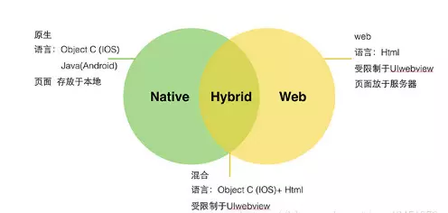
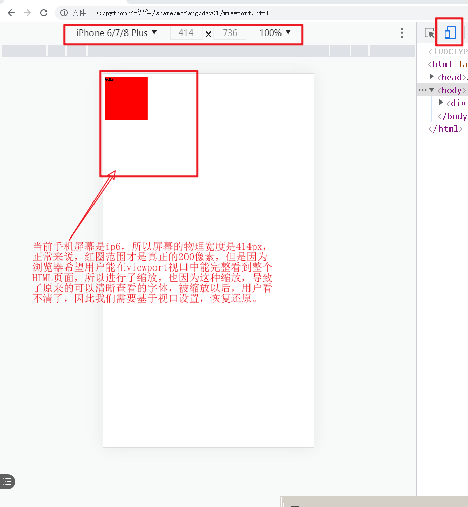
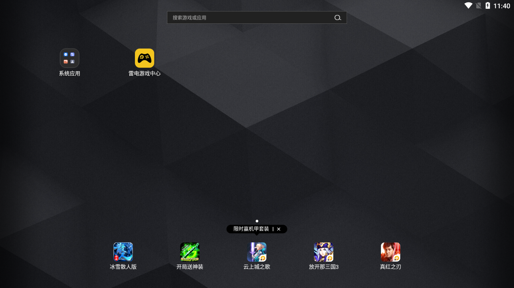

# 移动端开发相关概念


## APP类型



### Native APP

Native APP又称原生APP，就是我们平时说的手机应用软件。

原生APP 是针对IOS、Android、Windows、鸿蒙等不同的手机操作系统要采用不同的语言和框架进行开发出来的，通常是由“服务器数据+APP应用客户端”两部份构成。

实现技术：

```
iOS: swift（雨燕）/ Object-C
Android: java / kotlin
HarmonyOS: JS, Java和C++
```


#### 优缺点

```txt
优点：
		体验好，用户无法上网也可访问APP应用中以前下载的数据
		性能稳定，可调用手机的硬件设备（语音、摄像头、短信、GPS、重力感应等）和本地资源（通讯录，相册等）
		操作速度快，能够实现出色的动效，转场动画完美

缺点：
		开发周期长，开发人员工资起点高。
		用户要使用原生APP，必须通过安装到手机里面才行，而且APP软件体积大，占用较多手机内存容量
		更新缓慢，根据不同平台，提交–审核–上线流程较复杂。
		要获取最新功能，需要升级应用，所以会容易出现有些用户不升级，导致多个不同功能版本出现，维护成本大
		跨平台差，每种平台都需要独立的开发语言。Java(安卓),swift(iOS), HarmonyOS(java、C++、js)等等
```


### Web APP

Web APP本质上是为移动浏览器设计的网站，可以在各种智能设备的浏览器上运行。

实现技术：

```
HTML5+Javascript+CSS3
react.js
vue.js
```


#### 优缺点

```txt
优点：
		一套代码到处运行，可以同时在 PC、Android、iPhone、鸿蒙系统上的浏览器上访问
		开发者不需要发布到应用市场审核，用户不需要下载、安装和更新
		开发周期短，维护成本低
		用户不需用户手动更新，可以自动更新，直接使用最新版本

缺点：
		转场表现略差，要求联网
		用户体验没那么炫。图片和动画支持性不高
		没法在应用市场中下载、无法通过应用下载获得盈利机会
		对手机功能应用缺乏，有限制（蓝牙、网络、本地文件等）
```


### Hybrid APP

Hybrid App就是混合APP，就是Native结合Web的混合开发，就是内部本质是Web网页，使用外壳打包软件给它套一层原生APP的外壳。

实现技术：

```
APICloud
Dcloud的uni-app ->Hbuilder
React Native (react.js+APP外壳程序)

WeX5
phoneGap(cordova+android)
Ionic4
....
```


#### 优缺点

```txt
优点：
		集众家之长，既可以调用丰富的手机设备API，也能拥有Web APP的跨平台能力
		可以在应用商店发布，实现收费下载
		内部是网页结构，可以自主更新，做到开发一次，所有平台生效
		降低开发成本和技术成本，降低维护和开发周期
缺点：
		本质上就是一个Web APP使用了原生APP的壳，所以体验比不上原生APP，但是比webAPP强
		开发难度比Web APP高，有一定的学习成本，开发周期比Web APP长，但是比原生APP肯定要短。
		混合APP发布有可能无法通过审核，需要多次调整，才能发布
		依赖开发框架本身提供的手机设备API，少部分设备功能还是只能借助原生语言进行调用才可以
		对团队技术栈要求相对高，既要懂web开发的，也要懂原生APP开发的
```


## 移动端屏幕介绍


## 移动端自适配方案

目前常用的布局适配方案就3种，分别是`vw`、`像素百分比+flex弹性布局`和`rem+viewport`，后者最流行最容易。

当然，`rem+viewport`这种方案的实现方式也有很多，其中最著名的就是淘宝的**[flexible方案](https://github.com/amfe/article/issues/17)**。


## 元信息（meta）

html中的meta标签，也叫元信息标签。作用就是用来告诉浏览器，当前网页的附加信息。

meta标签主要有2个属性比较重要。

| 属性名     | 属性值                                        | 作用描述             |
| :--------- | :-------------------------------------------- | :------------------- |
| http-equiv | content-type , expires , refresh , set-cookie | 设置 **HTTP 头部**   |
| name       | viewport，author , description , keywords     | 设置网页附加描述信息 |

例子：

```html
<head>
    <meta name="description" content="移动端开发" /> <!-- SEO搜索引擎优化  -->
    <meta name="keywords" content="移动端,APP,flask" /> <!-- SEO搜索引擎优化  -->

	<meta http-equiv="Content-Type" content="text/html; charset=utf-8" />
    <meta charset="utf-8">
	<meta http-equiv="Refresh" content="5;url=http://www.baidu.com" />
	<meta http-equiv="Set-Cookie" Content="name=xiaoming; expires=Fri Sep 17 2021 12:12:45 GMT; path=/">
</head>
```


### 视口（Viewport）

视口是一个相对比较复杂的概念，所以我们可以简单的理解为，viewport就是用户看手机页面时的可视区域，相当于桌面浏览器的窗口。在桌面浏览器中，viewport 就是浏览器窗口的宽度高度。但在移动端设备上就有点太窄了。

关于视口的详细扩展知识可以参看：https://www.w3cplus.com/css/viewports.html

```html
<!DOCTYPE html>
<html lang="en">
<head>
	<meta charset="UTF-8">
	<title>Document</title>
	<style>
	.box{
		width: 200px;
		height: 200px;
		background-color: red;
	}
	</style>
</head>
<body>
	<div class="box">
		<p>hello</p>
	</div>
</body>
</html>
```



视口通过meta标签进行设置

```html
<!-- 移动端网页 -->
<meta name="viewport" content="width=device-width, initial-scale=1.0">
<!-- app设置 -->
<meta name="viewport" content="width=device-width, initial-scala=1.0, maximum-scale=1.0, minimum-scale=1.0, user-scalable=no" />
```


视口参数说明

| 属性名        | 属性值                   |
| ------------- | ------------------------ |
| width         | web网页的css像素宽度     |
| device-width  | 视口设备的物理像素宽度   |
| initial-scale | 初始的缩放比例           |
| minimum-scale | 允许用户缩放到的最小比例 |
| maximum-scale | 允许用户缩放到的最大比例 |
| user-scalable | 用户是否可以手动缩放     |

```html
<!DOCTYPE html>
<html lang="en">
<head>
	<meta charset="UTF-8">
	<title>Document</title>
    <meta name="viewport" content="width=device-width, initial-scala=1.0, maximum-scale=1.0, minimum-scale=1.0, user-scalable=no" />
	<style>
	.box{
		width: 200px;
		height: 200px;
		background-color: red;
	}
	</style>
</head>
<body>
	<div class="box">
		<p>hello</p>
	</div>
</body>
</html>
```


### 像素（pixel）

在移动端上，所谓的像素分为两种。

CSS像素：CSS像素就是我们在编写CSS代码时的像素。

设备像素：设备屏幕的物理像素，任何设备的物理像素的数量都是固定的。


### 媒体查询（media query）

媒体查询是css3的语法属性，它可以根据页面的视口宽度来定义特殊的 CSS 显示规则，一般用于进行移动端适配。

粗浅的理解：媒体查询提供了一个根据条件显示css样式的方式给开发者。让开发者在不同的设备宽度下选择是否执行CSS样式。

```css
/*
 当网页运行在屏幕(screen)下，并且600px <= 视口宽度 <= 900px，则浏览器识别并执行花括号里面的css代码，否则不执行。
 */
<style>
@media screen and (min-width:600px) and (max-width:900px){
  body {
      background-color:#f5f5f5;
  }
}
</style>
```

```html
<!DOCTYPE html>
<html lang="en">
<head>
	<meta charset="UTF-8">
	<title>Document</title>
    <meta name="viewport" content="width=device-width, initial-scala=1.0, maximum-scale=1.0, minimum-scale=1.0, user-scalable=no" />
	<style>
	.box{
		width: 200px;
		height: 200px;
		background-color: red;
	}
	/* @media 相当于 if 判断 */
	/* if 屏幕 and (屏幕宽度最大值: 400px) */
	@media screen and (max-width: 400px) {
		.box{
			width: 100px;
			height: 100px;
			background-color: yellow;
		}
		/* ....	 各种处于当前条件的css语法代码 */
	}

	/* if 屏幕 and (屏幕宽度最小值: 400px) and (屏幕宽度最大值: 980px) */
	@media screen and (min-width: 400px) and (max-width: 980px) {
		.box{
			width: 300px;
			height: 300px;
			background-color: orange;
		}
		/* ....	 各种处于当前条件的css语法代码 */
	}

	/* if 当前网页被屏幕打开 and (屏幕宽度最小值: 1500px)  */
	@media screen and (min-width: 1500px){
		.box{
			width: 600px;
			height: 600px;
			background-color: blue;
		}
		/* ....	 各种处于当前条件的css语法代码 */
	}
	</style>
</head>
<body>
	<div class="box">
		<p>hello</p>
	</div>
</body>
</html>
```

媒体查询结合rem，就可以移动端的适配了。

	rem是一个相对单位，表示以根标签html的字体大小作为参考值的像素单位,
	1rem=1个html的字体大小，
	如果html的font-size设置为20像素，则1rem表示40pox

html，代码：

```html
<!DOCTYPE html>
<html lang="en">
<head>
	<meta charset="UTF-8">
	<title>Document</title>
    <meta name="viewport" content="width=device-width, initial-scala=1.0, maximum-scale=1.0, minimum-scale=1.0, user-scalable=no" />
	<style>
	/* html就是整个网页的根标签（root tag）
       rem 就是相对于html字符大小进行定位取值的长度单位，root em
	 */
	*{
		padding: 0;
		margin: 0;
	}
	html{
		font-size: 15px;
	}
	.box{
		width: 20rem;
		height: 10rem;
		background-color: red;
	}
	.son{
		width: 1rem;
		background: blue;
		word-break: keep-all;/* 让文本的字符不要换行 */
	}
	/* @media 相当于 if 判断 */
	/* if 屏幕 and (屏幕宽度最大值: 400px) */
	@media screen and (max-width: 400px) {
		html{
			font-size: 15px;
		}
	}

	/* if 屏幕 and (屏幕宽度最小值: 400px) and (屏幕宽度最大值: 980px) */
	@media screen and (min-width: 400px) and (max-width: 980px) {
		html{
			font-size: 20px;
		}
	}

	/* if 屏幕 and (屏幕宽度最小值: 400px) and (屏幕宽度最大值: 980px) */
	@media screen and (min-width: 981px) and (max-width: 1499px) {
		html{
			font-size: 30px;
		}
	}


	/* if 当前网页被屏幕打开 and (屏幕宽度最小值: 1500px)  */
	@media screen and (min-width: 1500px){
		html{
			font-size: 40px;
		}
	}
	</style>
</head>
<body>
	<div class="box">
		<div class="son">字字字字字字字字字字字字字字字字字字字字</div>
	</div>
</body>
</html>
```

# 开发准备

我们接下来开发的项目是魔方APP，主要通过Flask+json-rpc+APICloud+vue完成的。


## 注册APICloud帐号

APICloud官网：https://www.apicloud.com

开发文档：https://docs.apicloud.com


## 下载APP开发编辑器

注册成功，登录进入开发控制台，找到页面右下角点击<mark>开发工具</mark>跳转到工具下载页面。


网站地址：https://www.apicloud.com/studio3


安装目录不能有中文！！！打开效果如下：


使用APICloud上注册的账户登录。


接下来开发APP的时候,肯定是要查看代码运行后的效果,所以我们需要安装**安卓模拟器**,当然也可以使用真机调试.

推荐: 市面上大部分的模拟器都差不多,使用人数最多,一般都是: 海马玩模拟器, 夜神模拟器, 雷电模拟器.

我们这里安装和使用雷电模拟器.

官网: https://www.ldmnq.com/

> 如果使用mac os 开发的同学,安装夜神模拟器.
>
> 夜神的官网: https://www.yeshen.com/

安装完成以后:



```
windows下如果同时安装了docker-desktop桌面版的docker和安卓模拟器，那么在系统运行过程中，只能使用其中之一。

# 开启docker，关闭安卓模拟器
bcdedit /set hypervisorlaunchtype auto

# 开启安卓模拟器，关闭docker
bcdedit /set hypervisorlaunchtype off
```


上面这个版面效果是平板的,所以我们调整下版面设置为移动端手机的.


最终效果:


## 下载APP开发调试工具

在前面登录的APICloud开发控制台中，找到页面右下角点击<mark>SDK下载</mark>跳转到工具下载页面。


网址：https://docs.apicloud.com/Download/download

点击<mark>AppLoader</mark>下载APP加载器工具，如扫码无法下载，则手动下载压缩包，通过USB连接电脑拖动到手机中进行安装。


可以在真实手机中安装, 完成效果：


也可以在模拟器中安装, 完成效果:


# 移动端项目搭建

注意：在本地编辑器中创建项目，必须保证联网，并当前电脑已经安装了git。

点击APICloud Studio3编辑器，选择左上角，创建项目。


创建原生应用，空白项目，


## 模拟器运行项目


## 手机真机运行项目

运行项目的前提是：必须通过USB或者测试的手机和当前开发的电脑处于同一个wifi网络中。


# 前端框架

APICloud内置了2个前端框架给我们操作APP页面和展示数据，这2个前端框架也都提供了ajax跨域请求数据功能。

这2个框架分别：APICloud前端框架和AVMJS前端框架

+ APICloud前端框架

  本质上就是一个仿照jQuery编写的一个小工具库，所以并不好用。

  地址：https://docs.apicloud.com/Front-end-Framework/framework-dev-guide

+ AVM前端框架

  本质上就是一个仿照vue编写的组件化开发工具库，语法与vue高度相似。

  地址：https://docs.apicloud.com/apicloud3/

## APICloud前端框架

### 目录结构

```
项目根目录/
  |- index.html   # 默认app配置的入口页面
  |- config.xml   # APP系统配置文件
  |- html/        # APP页面存储目录
  |- css/         # 样式目录
  |- script/      # js脚本目录
  |- image/       # 图片目录
```


### 调用框架

```html
<script src="./script/api.js"></script>
```

APICloud 前端框架引入到HTML以后，会在当前页面提供一个全局对象`$api`，`$api`在源码中提供的40多个操作HTML元素的方法，主要分6类用途：

```
数据操作：
	trim()       trimAll()    isArray()     jsonToStr()  strToJson()  get()
	post()

事件操作：
	one()   addEvt()     rmEvt()

元素查找：
	dom()        domAll()       byId()      first()      last()     eq()     not()        prev()       next()         contains()  closest()

DOM操作：
	remove()     attr()       removeAttr()   hasCls()    addCls()     removeCls()         toggleCls()  val()        prepend()      append()    before()     after()
	html()       text()       offset()       css()       cssVal()

本地存储：
	setStorage() getStorage() rmStorage()    clearStorage()

系统兼容：
	fixIos7Bar() fixStatusBar()
```

APICloud中，所有的代码都必须在其提供的apiready入口函数中执行，才能调用APP系统设备的数据。

### 基本使用

```html
<!doctype html>
<html>

<head>
    <meta charset="utf-8">
    <meta name="viewport" content="maximum-scale=1.0,minimum-scale=1.0,user-scalable=0,initial-scale=1.0,width=device-width" />
    <meta name="format-detection" content="telephone=no,email=no,date=no,address=no">
    <title>Hello APP</title>
    <link rel="stylesheet" type="text/css" href="./css/api.css" />
    <style type="text/css">
        html,
        body {
            height: 100%;
        }

        .wrap {
            display: -webkit-box;
            -webkit-box-orient: vertical;
            -webkit-flex-flow: column;
        }

        header {
            height: 44px;
            width: 100%;
            text-align: center;
            background-color: #81a9c3;
            color: #fff;
            line-height: 44px;
            font-size: 20px;
        }

        .flex-1 {
            -webkit-box-flex: 1;
            -webkit-flex: 1;
        }

        footer {
            height: 30px;
            width: 100%;
            background-color: #81a9c3;
            color: white;
            line-height: 30px;
            text-align: center;
        }
    </style>
</head>

<body class="wrap">
    <header>mofang</header>
    <button>点击按钮</button>
</body>
<script src="./script/api.js"></script>
<script>
    // 全部的js都必须写在一个APICloud提供apiready函数中，否则在调用手机系统的API功能时，会报错！！！
    apiready = ()=>{
        // 获取元素
        let button = $api.dom(document, 'button');
        // 绑定事件
        $api.addEvt(button, 'click', ()=>{
            api.alert({"title":"哈哈哈哈", "msg": "请注意弹出的内容"});
        });
    }
</script>
</html>
```


### 入口函数

```
理论上来说，要调用ApiCloud前端框架提供的方法, 不需要在apiready里面编写，在外面也可以操作到$api对象.
但是APICloud的原生外壳程序中还在系统中提供了另一个api对象，这个api对象就必须写在apiready中，而往往开发中，api对象发挥的作用和使用场景更多，因为api对象提供了页面跳转，打开窗口，访问设备API等功能，所以我们一般会选择把所有代码都写在APICloud提供的apiready入口函数中。

apiready = function(){
	// api对象的操作代码....

}
```


## AVM前端框架

### 目录结构

```bash
app/               // widget代码根目录
 |---components/   // stml组件目录。该目录下stml文件仅被pages目录下页面引用，不单独编译
 |---pages/        // stml页面代码文件目录。该目录中每个文件对应一个页面，将被编译为js或者小程序的3个代码片段
 |---res/          // APP相关的原生资源和配置等放置目录[图片等静态资源]
 |---index.html    // 入口页html
 |---config.xml    // app配置文件
```


### 基本使用

AVM框架的组件的文件后缀是`.stml`。

```vue
<template name="index">
    <view>
        Hello
        <view class="header">
            <text>{title}</text>
        </view>
        <view class="content">
            <text>{content}</text>
        </view>
        <view class="footer" onClick="demoClick">
            <text>{footer}</text>
        </view>
		<view class="item" v-for="item,key in book_list">
        	<text class="item__text">{{item.id}}-{{item.name}}-{{item.price}}</text>
        </view>
		<view class="item" v-if="num > 0">
        	<text class="item__text">num={num}！！！</text>
        </view>
		<view class="item" v-else-if="num == 0">
        	<text class="item__text">num=0</text>
        </view>
		<view class="item" v-else>
        	<text class="item__text">num={{num}}</text>
        </view>
    </view>
</template>

<script>
export default {
    name: 'iondex',
    apiready(){
        console.log("Hello APICloud");
    },
    data(){
        return {
            title: 'Hello App',
            content: 'this is content',
            footer: 'this is footer',
			num: 100,
			book_list: [
				{"id": 1, "name":"图书标题1", "price": 28.90},
				{"id": 1, "name":"图书标题1", "price": 28.90},
				{"id": 1, "name":"图书标题1", "price": 28.90},
				{"id": 1, "name":"图书标题1", "price": 28.90},
				{"id": 1, "name":"图书标题1", "price": 28.90},
			]
        }
    },
	methods:{
		demoClick(){
			api.alert({
				"title": "标题",
				"msg": "内容展示出来了！！！"
			})
		}
	}
}
</script>

<style scoped>
    .header {
      height: 45px;
    }
    .content {
      flex-direction:row;
    }
    .footer {
      height: 55px;
    }
</style>
```


不管AVMJS前端框架还是APICloud前端框架，我们都可以不使用，直接在APICloud引入vue.js直接开发是最方便的。

### 配置文件

文档地址：https://docs.apicloud.com/Dev-Guide/app-config-manual

config.xml，代码：

```xml
<!-- id="A6181657864079" 表示当前项目的唯一标志服，对应着APICloud平台上面的代码地址,所以不能乱改！ -->
<widget id="A6181657864079" version="0.0.1">
    <!-- APP显示在移动端下的软件名称和描述信息 -->
	<name>mofang35</name>

	<description>Example For APICloud.</description>
    <!-- APP的作者信息，一般好就是邮箱、官网地址，作者名 -->
	<author email="developer@apicloud.com" href="http://www.apicloud.com">Developer</author>
    <!-- APP的启动页 -->
	<content src="index.html"/>
    <!-- 跨域设置 -->
	<access origin="*"/>
     <!-- 配置页面是否弹动 -->
	<preference name="pageBounce" value="false"/>
     <!-- 配置App全局背景 -->
	<preference name="appBackground" value="rgba(0,0,0,0.0)"/>
     <!-- 配置Window默认背景 -->
	<preference name="windowBackground" value="rgba(0,0,0,0.0)"/>
    <!-- 配置Frame默认背景 -->
	<preference name="frameBackgroundColor" value="rgba(0,0,0,0.0)"/>
    <!-- 配置页面默认是否显示滚动条  h是横向滚动条 v是竖直滚动条 -->
	<preference name="hScrollBarEnabled" value="false"/>

	<preference name="vScrollBarEnabled" value="false"/>
     <!-- 配置启动页是否自动隐藏 -->
	<preference name="autoLaunch" value="true"/>
    <!-- 配置应用是否全屏运行 -->
	<preference name="fullScreen" value="false"/>
    <!-- 配置应用是否自动检测更新 -->
	<preference name="autoUpdate" value="true"/>
    <!-- 配置应用是否支持增量更新、云修复 -->
	<preference name="smartUpdate" value="false"/>
    <!-- 配置应用开启/关闭调试模式 -->
	<preference name="debug" value="true"/>
    <!-- 配置iOS状态栏和页面是否重合（沉浸式效果） -->
	<preference name="statusBarAppearance" value="true"/>
    <!-- 读取手机状态和身份 -->
	<permission name="readPhoneState"/>
    <!-- 使用拍照和视频 -->
	<permission name="camera"/>
    <!-- 使用录音 -->
	<permission name="record"/>
    <!-- 访问地理位置信息 -->
	<permission name="location"/>
    <!-- 访问文件系统 -->
	<permission name="fileSystem"/>
    <!-- 完全的访问网络权限 -->
	<permission name="internet"/>
    <!-- 开机启动 -->
	<permission name="bootCompleted"/>
    <!-- 控制振动/闪光灯/屏幕休眠等硬件设备 -->
	<permission name="hardware"/>

</widget>
```


### api与$api对象

>   注意：在APICloud中存在2个全局对象，分别是$api和api对象。这两个对象是不同的。
>
>   $api必须是在script标签通过src引入api.js文件以后才出现的对象，api是APP内置的全局对象，不需要引入内容就有的。
>
>   其中api对象主要是由APP系统提供给我们开发者操作和读取设备信息的。
>
>   而`$api`是APICloud模仿了jquery的`$`对象提供给开发者用于操作app页面的对象。
>
>   api对象的操作代码必须写在apiready入口函数中，否则报错！
>
>   而`$api`的部分操作代码，则不会报错，但是强烈建议不管是`$api`还是api都写进入口函数中。

代码：

```html
<!doctype html>
<html>
<head>
    <meta charset="utf-8">
    <meta name="viewport" content="maximum-scale=1.0,minimum-scale=1.0,user-scalable=0,width=device-width,initial-scale=1.0"/>
    <meta name="format-detection" content="telephone=no,email=no,date=no,address=no">
    <title>磨坊 APP</title>

</head>
<body>
    <div id="wrap">
        <div id="header">
            <h1>老男孩 python~~~</h1>
        </div>
        <div id="main" class="flex-con">

        </div>
        <div id="footer">
            <h5>Copyright &copy;<span id="year"></span> </h5>
        </div>
        <div id="info">

        </div>
    </div>
</body>
<script type="text/javascript" src="./js/api.js"></script>
<script type="text/javascript">

    apiready = function(){
        var header = document.querySelector('#header');
        $api.fixStatusBar(header);

        var el = $api.byId("header");
        var h1 = $api.first(el);
        var content = $api.html(h1,"2020-08-27");


        var ver = api.version;
    		var sType = api.systemType;
    		var sVer = api.systemVersion;
    		var id = api.deviceId;
    		var model = api.deviceModel;
    		var name = api.deviceName;
    		var cType = api.connectionType;
    		var winName = api.winName;
    		var winWidth = api.winWidth;
    		var winHeight = api.winHeight;
    		var frameName = api.frameName || '';
    		var frameWidth = api.frameWidth || '';
    		var frameHeight = api.frameHeight || '';

    		var str = '<ul>';
    		str += '<li>引擎版本信息: ' + ver + '</li>';
    		str += '<li>系统类型: ' + sType + '</li>';
    		str += '<li>系统版本: ' + sVer + '</li>';
    		str += '<li>设备标识: ' + id + '</li>';
    		str += '<li>设备型号: ' + model + '</li>';
    		str += '<li>设备名称: ' + name + '</li>';
    		str += '<li>网络状态: ' + cType + '</li>';
    		str += '<li>主窗口名字: ' + winName + '</li>';
    		str += '<li>主窗口宽度: ' + winWidth + '</li>';
    		str += '<li>主窗口高度: ' + winHeight + '</li>';
    		str += '<li>子窗口名字: ' + frameName + '</li>';
    		str += '<li>子窗口宽度: ' + frameWidth + '</li>';
    		str += '<li>子窗口高度: ' + frameHeight + '</li>';
    		str += '</ul>';

        $api.html($api.byId("info"), str);

    };
</script>
</html>
```


## 获取服务端API接口


因为，我们当前开发的APICloud实际将来是运行在了Android系统下，是属于另一个设备下的操作系统。

同时，我们当前开发的服务端flask框架提供的接口代码是在虚拟机下的Ubuntu下面，因此，安卓和ubuntu实际上相互之间是不在一个网络下面的。但是开发过程中，我们必须要让客户端通过http请求，访问到服务端的API接口数据。因此，我们需要让windows实现一个代理访问。让客户端直接请求到windows下，然后windows把客户端请求转发给Ubuntu。


VMWare实际上是直接设置请求代理的。所以配置如下：

点击打开VMWare的菜单栏的“编辑”，点选"虚拟网络编辑器"，打开编辑器的窗口。


先选择上方的NAT模式网络设置，然后点选    NAT设置（s）....


点击添加，表示添加一个端口转发设置。


上面的设置完成以后，就可以在windows下的浏览器中，直接访问本地127.0.0.1:5000也可以访问到Ubuntu下面了。


接下来，后面就可以让安卓模拟器中的APP直接访问到windows下的5000端口，然后VMWare就会进行端口转发了。那么我们就需要让安卓模拟器知道windows的IP地址。因为安卓模拟器和windows处于同一个网络下的，所以我们可以之前安装APPLoader工具的绿色按钮，查看windows的IP地址。


所以，在客户端的代码中，采用上面的IP地址+5000端口，结合API接口的访问地址，就可以在app中获取服务端的数据了。

### api.ajax

获取数据可以使用APICloud前端框架提供的`$api.post()`或者`$api.get()`，当然，也可以使用APP原生提供的提供的`api.ajax`。

基本语法：

```javascript
api.ajax({
      url: 'API接口地址',                 // 必须加上协议
      method: '请求方法',                 // post、get、put、delete、patch
      dataType: "json",                  // 服务端数据响应格式
      cache: true,                       // 缓存数据，若缓存，下次没网络时请求则会使用缓存，
                                         // 仅在get请求有效
      timeout: 30,                       // 超时时间，单位：秒
      headers:{},                        // 请求头，里面的key使用首字母大写的形式，
                                         // 如 Content-Type
      report:false,                      // 是否实时返回上传文件的进度，只有上传时使用
      data: {                            // 提交请求体的数据
          values: {                      // 以表单格式提交数据
              name: 'haha'
          },
          body: "",                      // 以字符串格式提交数据,body和values是冲突的，只能使用其中一个
          files: {                       // ajax上传文件
              file: 'fs://a.gif'         // 文件字段名
          }
      }
  },function(ret, err){                  // 回调函数，参数1是响应内容，参数2是错误信息
      if (ret) {
          alert( JSON.stringify( ret ) );
      } else {
          alert( JSON.stringify( err ) );
      }
  });
```

接下来的开发中,我们需要实现客户端,所以如果基于上面的$api开发的话,非常的影响效率,所以我们可以采用Vue.js来完成app的客户端开发.当然最终代码还是运行在APICloud里面.


### vue+axios

vue.js：https://vuejs.org/js/vue.js

axios.js：https://www.npmjs.com/package/axios

把下载回来的vue.js和axios.js保存到项目的scripts目录下，然后在页面中引入。

```html
<script src="../script/vue.js"></script>
<script src="../script/axios.js"></script>
<script src="../script/main.js"></script>
```

代码：

```html
<!DOCTYPE html>
<html lang="en">
<head>
    <meta charset="UTF-8">
    <meta http-equiv="X-UA-Compatible" content="IE=edge">
    <meta name="viewport" content="width=device-width, initial-scale=1.0">
    <title>Document</title>
    <script src="../script/vue.js"></script> <!-- Alt+Shift+↑/↓ -->
    <script src="../script/axios.js"></script>
</head>
<body>
    <div id="app">
        <h1 @click="getData">{{text}}</h1>
    </div>
    <script>
        apiready = function(){
            var vm = new Vue({
                el: "#app",
                data(){
                    return {
                        text: "点击按钮"
                    }
                },
                methods: {
                    getData(){
                        // 弹窗，提示
                        // api.alert({
                        //     "title": "标题",
                        //     "msg": "hello!!!"
                        // })

                        // 在APICloud中打印数据，不能直接打印，需要转换成json才能打印
                        // data = {"name":"xiaoming"}
                        // console.log(data);  // [object Object] at index.html:26
                        // console.log(JSON.stringify(data)); // {"name":"xiaoming"} at index.html:28

                        // api对象提供的网络请求
                        // api.ajax({
                        //     url:'http://192.168.19.251:5000/home/test'
                        // }, (ret, err)=>{
                        //     console.log(JSON.stringify(ret));
                        // });

                        axios.get("http://192.168.19.251:5000/home/test").then(response=>{
                            console.log(JSON.stringify(response.data));
                        })
                    }
                }
            })
        }
    </script>
</body>
</html>
```

服务端代码，application/apps/home/views.py，代码：

```python
def test():
    return {"title":"测试标题"}
```

路由代码：

```python
from typing import List
from application import path
from . import views

urlpatterns: List = [
    path("/test", views.test, methods=["GET"]),
    path("/test", views.test, methods=["POST"]),
]
```

上面的代码是服务端提供了函数视图，当然，我们也可以提供基于restful的类视图接口。

服务端代码，application/apps/home/views.py，代码：

```python
def test():
    return {"title":"测试标题"}

from flask.views import MethodView

class Home(MethodView):
    def get(self):
        return {"title":"类视图的get代码"}

    def post(self):
        return {"title": "类视图的post代码"}
```

路由代码：

```python
from typing import List
from application import path
from . import views

urlpatterns: List = [
    path("/test", views.test, methods=["GET"]),
    path("/test", views.test, methods=["POST"]),
    path("/home", views.Home.as_view("home")),
]
```

客户端中的html/index.html，代码：

```html
<!DOCTYPE html>
<html lang="en">
<head>
    <meta charset="UTF-8">
    <meta http-equiv="X-UA-Compatible" content="IE=edge">
    <meta name="viewport" content="width=device-width, initial-scale=1.0">
    <title>Document</title>
    <script src="../script/vue.js"></script> <!-- Alt+Shift+↑/↓ -->
    <script src="../script/axios.js"></script>
</head>
<body>
    <div id="app">
        <h1 @click="getData">{{text}}</h1>
    </div>
    <script>
        apiready = function(){
            var vm = new Vue({
                el: "#app",
                data(){
                    return {
                        text: "点击按钮"
                    }
                },
                methods: {
                    getData(){
                        // 弹窗，提示
                        // api.alert({
                        //     "title": "标题",
                        //     "msg": "hello!!!"
                        // })

                        // 在APICloud中打印数据，不能直接打印，需要转换成json才能打印
                        // data = {"name":"xiaoming"}
                        // console.log(data);  // [object Object] at index.html:26
                        // console.log(JSON.stringify(data)); // {"name":"xiaoming"} at index.html:28

                        // api对象提供的网络请求
                        // api.ajax({
                        //     url:'http://192.168.19.251:5000/home/test'
                        // }, (ret, err)=>{
                        //     console.log(JSON.stringify(ret));
                        // });

                        // 发送get请求
                        // axios.get("http://192.168.19.251:5000/home/home").then(response=>{
                        //     console.log(JSON.stringify(response.data));
                        // })

                        // 发送post请求
                        axios.post("http://192.168.19.251:5000/home/home").then(response=>{
                            console.log(JSON.stringify(response.data));
                        })
                    }
                }
            })
        }
    </script>
</body>
</html>
```


